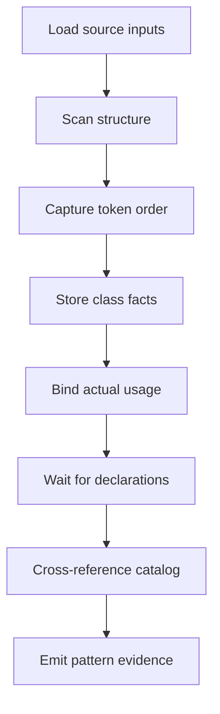

# `core.cpp`

- Folder: `docs/Codebase/Microservice/Modules/Source/Analysis`
- Role: front-half coordination for intake, lexical structure scanning, implementation-use binding, and deferred catalog-driven pattern recognition

## Start Here
- Read this file first for the stage workflow.
- Then read `Input/`, `Lexical/`, `ImplementationUse/`, and `Patterns/` in that order.

## Quick Summary
- This stage emits the structural and usage context that tree generation, catalog recognition, and hash identity consume.
- It answers what code exists, what the important structures are, how ordered class tokens are captured, how actual usage points at declarations, and which catalog patterns match after class declarations are available.

## Why This Stage Is Separate
- `Analysis/` decides structural meaning and usage binding.
- `Trees/` builds declaration-side tree views.
- `Patterns/Catalog/` loads supported pattern definitions after declaration generation has enough class facts.
- `HashingMechanism/` creates propagated identities and lookup chains.
- `Diffing/` can ask this stage to refresh lexical structure for changed source intervals.
- `OutputGeneration/` emits downstream artifacts.

## Major Workflow

## Handoff
- Hands to `../Trees/core.cpp.md` once declaration-side structure needs actual, virtual, or broken tree construction.
- Receives generated declaration facts back into `Patterns/Catalog/` and `Patterns/Middleman/` for automatic recognition.
- Hands to `../HashingMechanism/core.cpp.md` once usage and structure need stable propagated identities.
- Serves `../Diffing/core.cpp.md` during interval checks by re-emitting lexical structural signals for changed regions.

## Local Ownership
- `Input/` owns source intake and argument-facing entry.
- `Lexical/` owns token scanning and structural event extraction.
- `ImplementationUse/` owns scope-aware usage binding such as `p1 -> Person`.
- `Patterns/` owns all-pattern recognition after class declarations and analysis context exist.

## Acceptance Checks
- Structural scanning stays separate from tree generation.
- Actual usage binding is visible before hash-based lookup.
- Ordered class token streams are available before catalog recognition.
- Pattern checks run after class declaration generation instead of during class scanning.
- New supported structures can be added through the pattern catalog before adding custom hook code.
