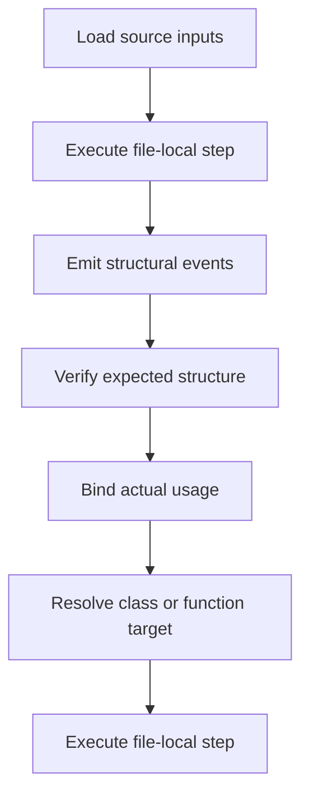

# `core.cpp`

- Folder: `docs/Codebase/Microservice/Modules/Source/Analysis`
- Role: front-half coordination for intake, lexical structure scanning, implementation-use binding, and pattern interpretation

## Start Here
- Read this file first for the stage workflow.
- Then read `Input/`, `Lexical/`, `ImplementationUse/`, and `Patterns/` in that order.

## Quick Summary
- This stage emits the structural and usage context that tree generation and hash identity consume during the same coordinated scan.
- It answers what code exists, what the important structures are, how strict expected-structure checks behave during lexical analysis, and how actual usage points at declarations.

## Why This Stage Is Separate
- `Analysis/` decides structural meaning and usage binding.
- `Trees/` builds declaration-side tree views.
- `HashingMechanism/` creates propagated identities and lookup chains.
- `Diffing/` can ask this stage to refresh lexical structure for changed source intervals.
- `OutputGeneration/` emits downstream artifacts.

## Major Workflow

## Handoff
- Hands to `../Trees/core.cpp.md` once declaration-side structure needs actual, virtual, or broken tree construction.
- Hands to `../HashingMechanism/core.cpp.md` once usage and structure need stable propagated identities.
- Serves `../Diffing/core.cpp.md` during interval checks by re-emitting lexical structural signals for changed regions.

## Local Ownership
- `Input/` owns source intake and argument-facing entry.
- `Lexical/` owns token scanning, structural event extraction, and strict expected-structure verification.
- `ImplementationUse/` owns scope-aware usage binding such as `p1 -> Person`.
- `Patterns/` owns pattern-family reasoning after analysis context exists.

## Acceptance Checks
- Structural scanning stays separate from tree generation.
- Actual usage binding is visible before hash-based lookup.
- Pattern logic appears after structural and usage context is available.
