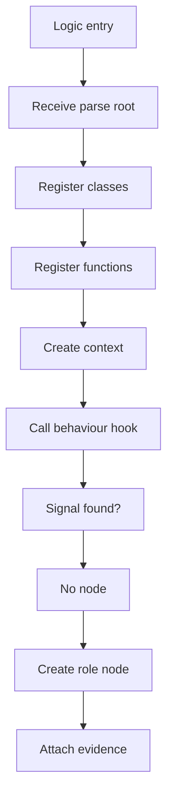
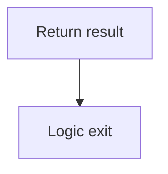
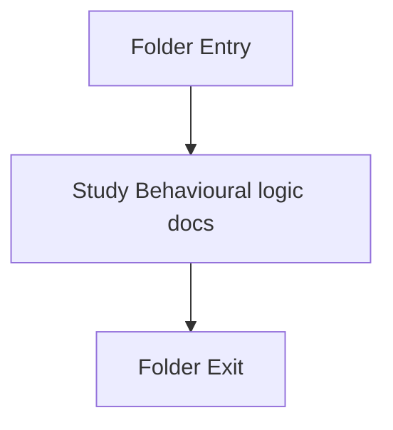

# Logic

- Folder: docs/Codebase/Microservice/Modules/Source/Behavioural/Logic
- Descendant source docs: 2
- Generated on: 2026-04-23

## Logic Summary
Behavioural scaffolding and structural-hook implementation helpers.

## Subsystem Story
This folder is mostly leaf-level. The local documents here carry the main explanation of the subsystem without requiring much extra descent.

## Middleman Contract
This logic layer should be the home for shared behavioural assembly work. It should act as the middleman between the generic parse tree and behavioural-specific algorithms. The middleman should register classes and functions once, build shared context once, and call virtual hooks for Strategy, Observer, scaffold checks, structure checks, or future behavioural patterns.

### Block 1 - Middleman Contract Details
#### Part 1

#### Part 2

## Hook Responsibility
- Shared logic owns class registration.
- Shared logic owns function registration.
- Shared logic owns tree assembly.
- Shared logic owns common traversal.
- Behaviour hooks own pattern-specific checks only.
- Virtual hooks choose Strategy, Observer, or a future behavioural algorithm.

## Folder Flow

## Documents By Logic
### Behavioural Logic
These documents explain the local implementation by covering Implements behavioural detection and structural verification scaffolds..
- behavioural_logic_scaffold.cpp.md : Implements behavioural detection and structural verification scaffolds.
- behavioural_structural_hooks.cpp.md : Implements behavioural detection and structural verification scaffolds.

## Reading Hint
- This folder is mostly leaf-level. Read the local file docs to understand the logic in this area.
