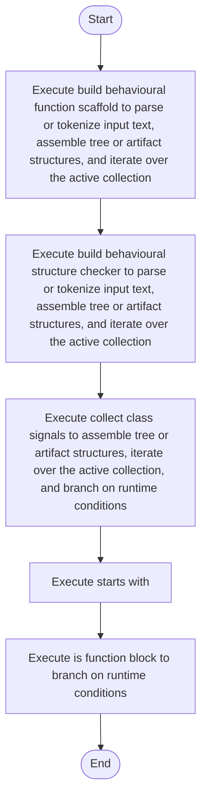

# behavioural_logic_scaffold.cpp

- Source: Microservice/Modules/Source/Behavioural/Logic/behavioural_logic_scaffold.cpp
- Kind: C++ implementation
- Lines: 374
- Role: Implements behavioural detection and structural verification scaffolds.
- Chronology: Runs after the generic parse tree exists so behavioural scaffolds can classify pattern structure.

## Notable Symbols
- BehaviouralClassSignals
- trim
- lower
- lowercase_ascii
- split_words
- starts_with
- class_name_from_signature
- function_name_from_signature
- is_class_block
- is_function_block
- has_keyword
- join_names

## Direct Dependencies
- Logic/behavioural_logic_scaffold.hpp
- Language-and-Structure/language_tokens.hpp
- parse_tree_dependency_utils.hpp
- cctype
- string
- utility
- vector

## File Outline
### Responsibility

This source file implements behavioural-pattern scaffolding or checks on top of the generic parse tree. It contributes one part of the behavioural broken-tree output by scanning for behavioural structure signals.

### Position In The Flow

Runs after the generic parse tree exists so behavioural scaffolds can classify pattern structure.

### Main Surface Area

Implements behavioural detection and structural verification scaffolds. The main surface area is easiest to track through symbols such as BehaviouralClassSignals, trim, lower, and lowercase_ascii. It collaborates directly with Logic/behavioural_logic_scaffold.hpp, Language-and-Structure/language_tokens.hpp, parse_tree_dependency_utils.hpp, and cctype.

## File Activity


## Function Walkthrough

### trim
This helper reshapes small pieces of data so the surrounding code can stay readable. It appears near line 13.

Inside the body, it mainly handles iterate over the active collection.

The implementation iterates over a collection or repeated workload. The caller receives a computed result or status from this step.

Key operations:
- iterate over the active collection

Activity:
```mermaid
flowchart TD
    Start([trim()])
    N0[Enter trim()]
    N1[Iterate over the active collection]
    N2[Return the result to the caller]
    End([Return])
    Start --> N0
    N0 --> N1
    N1 --> N2
    N2 --> End
```

### lower
This routine owns one focused piece of the file's behavior. It appears near line 29.

The caller receives a computed result or status from this step.

Key operations:
- This routine is primarily structural and does not expose obvious runtime operations from static inspection.

Activity:
```mermaid
flowchart TD
    Start([lower()])
    N0[Enter lower()]
    N1[Apply the routine's local logic]
    N2[Return the result to the caller]
    End([Return])
    Start --> N0
    N0 --> N1
    N1 --> N2
    N2 --> End
```

### split_words
This routine owns one focused piece of the file's behavior. It appears near line 34.

Inside the body, it mainly handles assemble tree or artifact structures, iterate over the active collection, and branch on runtime conditions.

The implementation iterates over a collection or repeated workload. It branches on runtime conditions instead of following one fixed path. The caller receives a computed result or status from this step.

Key operations:
- assemble tree or artifact structures
- iterate over the active collection
- branch on runtime conditions

Activity:
```mermaid
flowchart TD
    Start([split_words()])
    N0[Enter split_words()]
    N1[Assemble tree or artifact structures]
    N2[Iterate over the active collection]
    N3[Branch on runtime conditions]
    N4[Return the result to the caller]
    End([Return])
    Start --> N0
    N0 --> N1
    N1 --> N2
    N2 --> N3
    N3 --> N4
    N4 --> End
```

### if
This routine owns one focused piece of the file's behavior. It appears near line 46.

Inside the body, it mainly handles assemble tree or artifact structures.

Key operations:
- assemble tree or artifact structures

Activity:
```mermaid
flowchart TD
    Start([if()])
    N0[Enter if()]
    N1[Assemble tree or artifact structures]
    N2[Hand control back to the caller]
    End([Return])
    Start --> N0
    N0 --> N1
    N1 --> N2
    N2 --> End
```

### starts_with
This routine prepares or drives one of the main execution paths in the file. It appears near line 60.

The caller receives a computed result or status from this step.

Key operations:
- This routine is primarily structural and does not expose obvious runtime operations from static inspection.

Activity:
```mermaid
flowchart TD
    Start([starts_with()])
    N0[Enter starts_with()]
    N1[Apply the routine's local logic]
    N2[Return the result to the caller]
    End([Return])
    Start --> N0
    N0 --> N1
    N1 --> N2
    N2 --> End
```

### class_name_from_signature
This routine owns one focused piece of the file's behavior. It appears near line 65.

Inside the body, it mainly handles iterate over the active collection and branch on runtime conditions.

The implementation iterates over a collection or repeated workload. It branches on runtime conditions instead of following one fixed path. The caller receives a computed result or status from this step.

Key operations:
- iterate over the active collection
- branch on runtime conditions

Activity:
```mermaid
flowchart TD
    Start([class_name_from_signature()])
    N0[Enter class_name_from_signature()]
    N1[Iterate over the active collection]
    N2[Branch on runtime conditions]
    N3[Return the result to the caller]
    End([Return])
    Start --> N0
    N0 --> N1
    N1 --> N2
    N2 --> N3
    N3 --> End
```

### function_name_from_signature
This routine owns one focused piece of the file's behavior. It appears near line 80.

Inside the body, it mainly handles branch on runtime conditions.

It branches on runtime conditions instead of following one fixed path. The caller receives a computed result or status from this step.

Key operations:
- branch on runtime conditions

Activity:
```mermaid
flowchart TD
    Start([function_name_from_signature()])
    N0[Enter function_name_from_signature()]
    N1[Branch on runtime conditions]
    N2[Return the result to the caller]
    End([Return])
    Start --> N0
    N0 --> N1
    N1 --> N2
    N2 --> End
```

### is_class_block
This routine owns one focused piece of the file's behavior. It appears near line 98.

Inside the body, it mainly handles branch on runtime conditions.

It branches on runtime conditions instead of following one fixed path. The caller receives a computed result or status from this step.

Key operations:
- branch on runtime conditions

Activity:
```mermaid
flowchart TD
    Start([is_class_block()])
    N0[Enter is_class_block()]
    N1[Branch on runtime conditions]
    N2[Return the result to the caller]
    End([Return])
    Start --> N0
    N0 --> N1
    N1 --> N2
    N2 --> End
```

### is_function_block
This routine owns one focused piece of the file's behavior. It appears near line 109.

Inside the body, it mainly handles branch on runtime conditions.

It branches on runtime conditions instead of following one fixed path. The caller receives a computed result or status from this step.

Key operations:
- branch on runtime conditions

Activity:
```mermaid
flowchart TD
    Start([is_function_block()])
    N0[Enter is_function_block()]
    N1[Branch on runtime conditions]
    N2[Return the result to the caller]
    End([Return])
    Start --> N0
    N0 --> N1
    N1 --> N2
    N2 --> End
```

### has_keyword
This routine owns one focused piece of the file's behavior. It appears near line 132.

Inside the body, it mainly handles iterate over the active collection and branch on runtime conditions.

The implementation iterates over a collection or repeated workload. It branches on runtime conditions instead of following one fixed path. The caller receives a computed result or status from this step.

Key operations:
- iterate over the active collection
- branch on runtime conditions

Activity:
```mermaid
flowchart TD
    Start([has_keyword()])
    N0[Enter has_keyword()]
    N1[Iterate over the active collection]
    N2[Branch on runtime conditions]
    N3[Return the result to the caller]
    End([Return])
    Start --> N0
    N0 --> N1
    N1 --> N2
    N2 --> N3
    N3 --> End
```

### join_names
This routine owns one focused piece of the file's behavior. It appears near line 145.

Inside the body, it mainly handles iterate over the active collection and branch on runtime conditions.

The implementation iterates over a collection or repeated workload. It branches on runtime conditions instead of following one fixed path. The caller receives a computed result or status from this step.

Key operations:
- iterate over the active collection
- branch on runtime conditions

Activity:
```mermaid
flowchart TD
    Start([join_names()])
    N0[Enter join_names()]
    N1[Iterate over the active collection]
    N2[Branch on runtime conditions]
    N3[Return the result to the caller]
    End([Return])
    Start --> N0
    N0 --> N1
    N1 --> N2
    N2 --> N3
    N3 --> End
```

### subtree_mentions_keyword
This routine owns one focused piece of the file's behavior. It appears near line 159.

Inside the body, it mainly handles assemble tree or artifact structures, iterate over the active collection, and branch on runtime conditions.

The implementation iterates over a collection or repeated workload. It branches on runtime conditions instead of following one fixed path. The caller receives a computed result or status from this step.

Key operations:
- assemble tree or artifact structures
- iterate over the active collection
- branch on runtime conditions

Activity:
```mermaid
flowchart TD
    Start([subtree_mentions_keyword()])
    N0[Enter subtree_mentions_keyword()]
    N1[Assemble tree or artifact structures]
    N2[Iterate over the active collection]
    N3[Branch on runtime conditions]
    N4[Return the result to the caller]
    End([Return])
    Start --> N0
    N0 --> N1
    N1 --> N2
    N2 --> N3
    N3 --> N4
    N4 --> End
```

### collect_class_signals
This routine connects discovered items back into the broader model owned by the file. It appears near line 194.

Inside the body, it mainly handles assemble tree or artifact structures, iterate over the active collection, and branch on runtime conditions.

The implementation iterates over a collection or repeated workload. It branches on runtime conditions instead of following one fixed path. The caller receives a computed result or status from this step.

Key operations:
- assemble tree or artifact structures
- iterate over the active collection
- branch on runtime conditions

Activity:
```mermaid
flowchart TD
    Start([collect_class_signals()])
    N0[Enter collect_class_signals()]
    N1[Assemble tree or artifact structures]
    N2[Iterate over the active collection]
    N3[Branch on runtime conditions]
    N4[Return the result to the caller]
    End([Return])
    Start --> N0
    N0 --> N1
    N1 --> N2
    N2 --> N3
    N3 --> N4
    N4 --> End
```

### build_behavioural_function_scaffold
This routine assembles a larger structure from the inputs it receives. It appears near line 267.

Inside the body, it mainly handles parse or tokenize input text, assemble tree or artifact structures, iterate over the active collection, and branch on runtime conditions.

The implementation iterates over a collection or repeated workload. It branches on runtime conditions instead of following one fixed path. The caller receives a computed result or status from this step.

Key operations:
- parse or tokenize input text
- assemble tree or artifact structures
- iterate over the active collection
- branch on runtime conditions

Activity:
```mermaid
flowchart TD
    Start([build_behavioural_function_scaffold()])
    N0[Enter build_behavioural_function_scaffold()]
    N1[Parse or tokenize input text]
    N2[Assemble tree or artifact structures]
    N3[Iterate over the active collection]
    N4[Branch on runtime conditions]
    N5[Return the result to the caller]
    End([Return])
    Start --> N0
    N0 --> N1
    N1 --> N2
    N2 --> N3
    N3 --> N4
    N4 --> N5
    N5 --> End
```

### build_behavioural_structure_checker
This routine assembles a larger structure from the inputs it receives. It appears near line 290.

Inside the body, it mainly handles parse or tokenize input text, assemble tree or artifact structures, iterate over the active collection, and branch on runtime conditions.

The implementation iterates over a collection or repeated workload. It branches on runtime conditions instead of following one fixed path. The caller receives a computed result or status from this step.

Key operations:
- parse or tokenize input text
- assemble tree or artifact structures
- iterate over the active collection
- branch on runtime conditions

Activity:
```mermaid
flowchart TD
    Start([build_behavioural_structure_checker()])
    N0[Enter build_behavioural_structure_checker()]
    N1[Parse or tokenize input text]
    N2[Assemble tree or artifact structures]
    N3[Iterate over the active collection]
    N4[Branch on runtime conditions]
    N5[Return the result to the caller]
    End([Return])
    Start --> N0
    N0 --> N1
    N1 --> N2
    N2 --> N3
    N3 --> N4
    N4 --> N5
    N5 --> End
```

## Documentation Note
- This markdown file is part of the generated docs/Codebase mirror.
- It was generated from the repository state on 2026-04-23 after reading the existing docs corpus and the current source tree.

