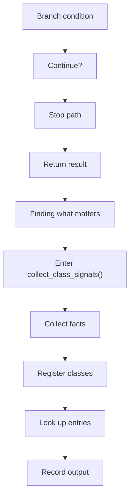
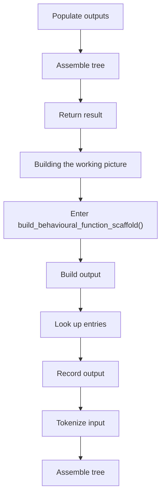
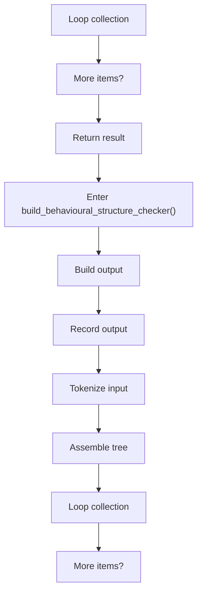
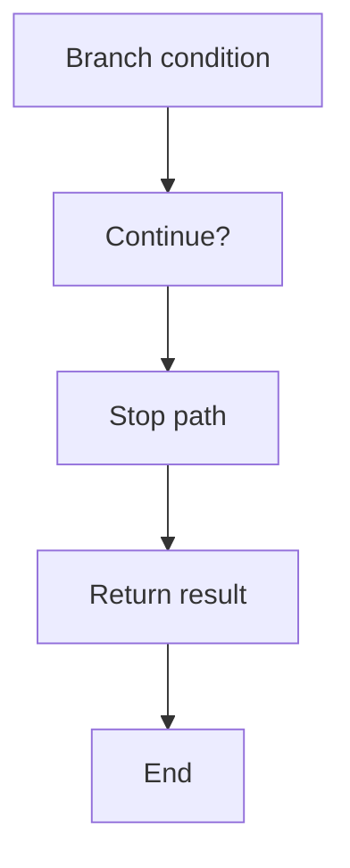

# behavioural_logic_scaffold_program_flow_02.cpp

- Source document: [behavioural_logic_scaffold.cpp.md](../behavioural_logic_scaffold.cpp.md)
- Purpose: decoupled implementation logic for a future code unit.

#### Part 9

#### Part 10

#### Part 11

#### Part 12

