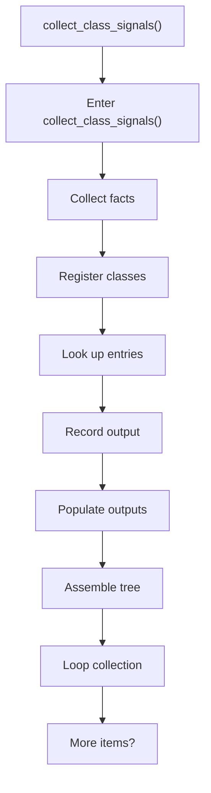
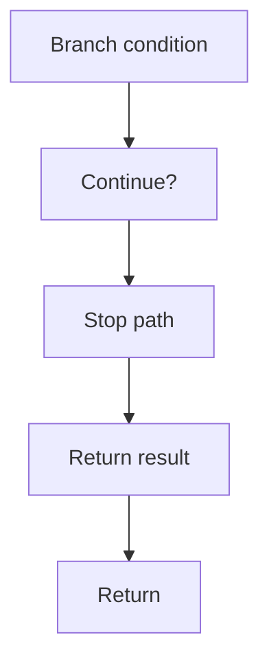

# collect_class_signals.cpp

- Source document: [behavioural_logic_scaffold.cpp.md](../../behavioural_logic_scaffold.cpp.md)
- Purpose: decoupled implementation logic for a future code unit.

### collect_class_signals()
This routine connects discovered items back into the broader model owned by the file. It appears near line 194.

Inside the body, it mainly handles collect derived facts for later stages, inspect or register class-level information, look up entries in previously collected maps or sets, and record derived output into collections.

The implementation iterates over a collection or repeated workload. It branches on runtime conditions instead of following one fixed path. The caller receives a computed result or status from this step.

What it does:
- collect derived facts for later stages
- inspect or register class-level information
- look up entries in previously collected maps or sets
- record derived output into collections
- populate output fields or accumulators
- assemble tree or artifact structures
- iterate over the active collection
- branch on runtime conditions

Flow:

### Block 4 - collect_class_signals() Details
#### Part 1

#### Part 2

