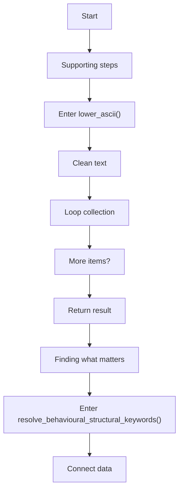
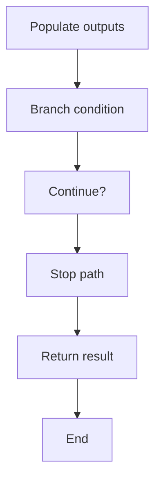
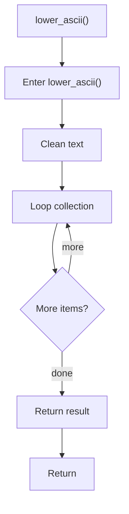
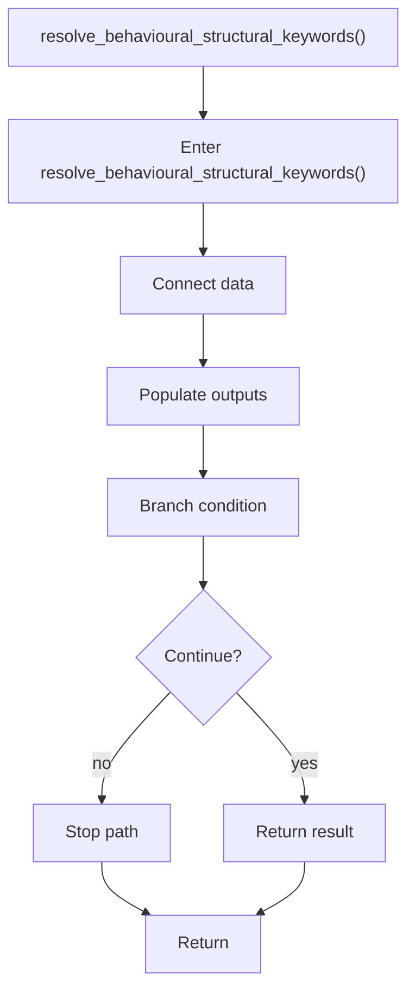

# behavioural_structural_hooks.cpp

- Source: Microservice/Modules/Source/Behavioural/Logic/behavioural_structural_hooks.cpp
- Kind: C++ implementation
- Lines: 41

## Story
### What Happens Here

This source file implements behavioural-pattern scaffolding or checks on top of the generic parse tree. It contributes one part of the behavioural broken-tree output by scanning for behavioural structure signals.

### Why It Matters In The Flow

Runs after the generic parse tree exists so behavioural scaffolds can classify pattern structure.

### What To Watch While Reading

Implements behavioural detection and structural verification scaffolds. The main surface area is easiest to track through symbols such as lower_ascii and resolve_behavioural_structural_keywords. It collaborates directly with Logic/behavioural_structural_hooks.hpp, cctype, string, and vector.

## Program Flow
This diagram follows the action path in plain words. Decision diamonds show where the file can stop, branch, or repeat work instead of simply passing through a straight line.

### Block 1 - Program Flow Details
#### Part 1

#### Part 2

## Reading Map
Read this file as: Implements behavioural detection and structural verification scaffolds.

Where it sits in the run: Runs after the generic parse tree exists so behavioural scaffolds can classify pattern structure.

Names worth recognizing while reading: lower_ascii and resolve_behavioural_structural_keywords.

It leans on nearby contracts or tools such as Logic/behavioural_structural_hooks.hpp, cctype, string, and vector.

## Story Groups

### Finding What Matters
These steps pick out the facts, traces, and relationships that later stages need.
- resolve_behavioural_structural_keywords() (line 19): Connect discovered data back into the shared model, populate output fields or accumulators, and branch on runtime conditions

### Supporting Steps
These steps support the local behavior of the file.
- lower_ascii() (line 9): Normalize raw text before later parsing and iterate over the active collection

## Function Stories

### lower_ascii()
This routine owns one focused piece of the file's behavior. It appears near line 9.

Inside the body, it mainly handles normalize raw text before later parsing and iterate over the active collection.

The implementation iterates over a collection or repeated workload. The caller receives a computed result or status from this step.

What it does:
- normalize raw text before later parsing
- iterate over the active collection

Flow:

### resolve_behavioural_structural_keywords()
This routine connects discovered items back into the broader model owned by the file. It appears near line 19.

Inside the body, it mainly handles connect discovered data back into the shared model, populate output fields or accumulators, and branch on runtime conditions.

It branches on runtime conditions instead of following one fixed path. The caller receives a computed result or status from this step.

What it does:
- connect discovered data back into the shared model
- populate output fields or accumulators
- branch on runtime conditions

Flow:

## Documentation Note
- This markdown file is part of the generated docs/Codebase mirror.
- It was generated from the repository state on 2026-04-23 after reading the existing docs corpus and the current source tree.
