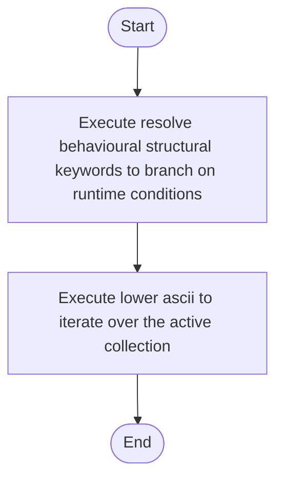

# behavioural_structural_hooks.cpp

- Source: Microservice/Modules/Source/Behavioural/Logic/behavioural_structural_hooks.cpp
- Kind: C++ implementation
- Lines: 41
- Role: Implements behavioural detection and structural verification scaffolds.
- Chronology: Runs after the generic parse tree exists so behavioural scaffolds can classify pattern structure.

## Notable Symbols
- lower_ascii
- resolve_behavioural_structural_keywords

## Direct Dependencies
- Logic/behavioural_structural_hooks.hpp
- cctype
- string
- vector

## Implementation Story
This source file implements behavioural-pattern scaffolding or checks on top of the generic parse tree. It contributes one part of the behavioural broken-tree output by scanning for behavioural structure signals. Implements behavioural detection and structural verification scaffolds. Runs after the generic parse tree exists so behavioural scaffolds can classify pattern structure. The implementation surface is easiest to recognize through symbols such as lower_ascii and resolve_behavioural_structural_keywords. In practice it collaborates directly with Logic/behavioural_structural_hooks.hpp, cctype, string, and vector.

## Activity Diagram

## Documentation Note
- This markdown file is part of the generated docs/Codebase mirror.
- It was generated from the repository state on 2026-04-22 after reading the existing docs corpus and the current source tree.

