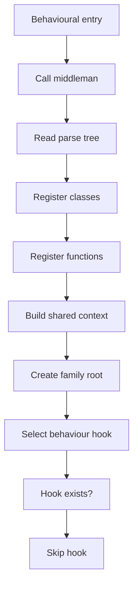
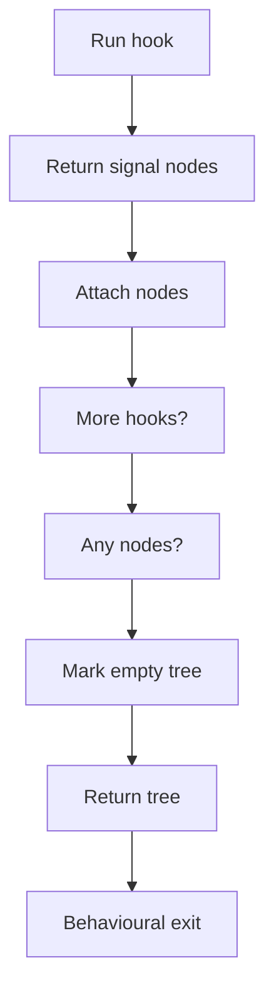
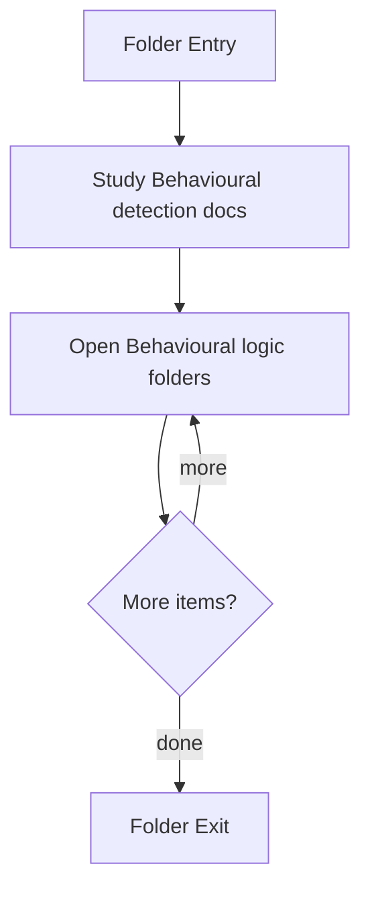

# Behavioural

- Folder: docs/Codebase/Microservice/Modules/Source/Behavioural
- Descendant source docs: 4
- Generated on: 2026-04-23

## Logic Summary
Behavioural pattern detection implementation.

## Subsystem Story
This folder mixes concrete local documents with deeper child subsystems. Read the local docs to understand the visible behavior first, then descend into the child folders for the lower-level detail that supports it.

## Required Tree Assembly Design
Behavioural tree assembly should be owned by a shared middleman, not by each behavioural detector. The middleman handles the repeated work: walking the parse tree, registering classes and functions, preparing shared context, creating the behavioural root, attaching detector output, and reporting an empty tree. Behavioural-specific code should only provide the algorithm that changes between patterns through virtual hooks or function-pointer style dispatch.

Full architecture docs live in [README.md](../PatternMiddlemanArchitecture/README.md), with the implementation-shaped middleman flow in [pattern_middleman.cpp.md](../PatternMiddlemanArchitecture/Middleman/pattern_middleman.cpp.md).

### Block 1 - Required Tree Assembly Design Details
#### Part 1

#### Part 2

## Delegation Boundary
- Middleman owns traversal, class/function registration, shared context, tree-root creation, child-node attachment, empty-result handling, and output shape.
- Strategy, Observer, scaffold, and structure-check logic should own only the algorithmic test that changes per pattern.
- Behavioural-specific code should not duplicate the same class registration or tree assembly workflow.
- New behavioural patterns should plug into the same middleman by implementing the virtual hook contract.

## Folder Flow

## Child Folders By Logic
### Behavioural Logic
These child folders continue the subsystem by covering Behavioural scaffolding and structural-hook implementation helpers..
- Logic/ : Behavioural scaffolding and structural-hook implementation helpers.

## Documents By Logic
### Behavioural Detection
These documents explain the local implementation by covering Implements behavioural detection and structural verification scaffolds..
- behavioural_broken_tree.cpp.md : Implements behavioural detection and structural verification scaffolds.
- behavioural_symbol_test.cpp.md : Implements behavioural detection and structural verification scaffolds.

## Reading Hint
- Read the local file docs first for concrete behavior, then descend into the child folders for narrower subsystem details.
