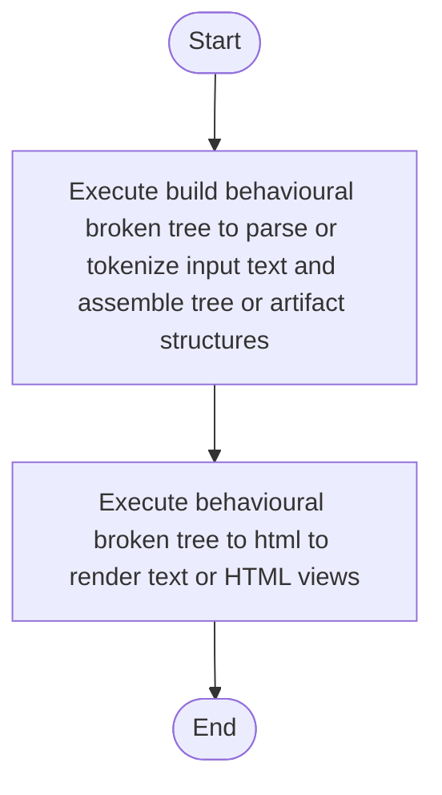

# behavioural_broken_tree.cpp

- Source: Microservice/Modules/Source/Behavioural/behavioural_broken_tree.cpp
- Kind: C++ implementation
- Lines: 91
- Role: Implements behavioural detection and structural verification scaffolds.
- Chronology: Runs after the generic parse tree exists so behavioural scaffolds can classify pattern structure.

## Notable Symbols
- BehaviouralFunctionScaffoldDetector
- BehaviouralStructureCheckerDetector
- DefaultBehaviouralTreeCreator
- detect
- build_behavioural_function_scaffold
- build_behavioural_structure_checker
- create
- build_behavioural_broken_tree
- behavioural_broken_tree_to_html
- render_tree_html

## Direct Dependencies
- behavioural_broken_tree.hpp
- Logic/behavioural_logic_scaffold.hpp
- Output-and-Rendering/tree_html_renderer.hpp
- utility
- vector

## File Outline
### Responsibility

This source file implements behavioural-pattern scaffolding or checks on top of the generic parse tree. It contributes one part of the behavioural broken-tree output by scanning for behavioural structure signals.

### Position In The Flow

Runs after the generic parse tree exists so behavioural scaffolds can classify pattern structure.

### Main Surface Area

Implements behavioural detection and structural verification scaffolds. The main surface area is easiest to track through symbols such as BehaviouralFunctionScaffoldDetector, BehaviouralStructureCheckerDetector, DefaultBehaviouralTreeCreator, and detect. It collaborates directly with behavioural_broken_tree.hpp, Logic/behavioural_logic_scaffold.hpp, Output-and-Rendering/tree_html_renderer.hpp, and utility.

## File Activity


## Function Walkthrough

### build_behavioural_broken_tree
This routine assembles a larger structure from the inputs it receives. It appears near line 61.

Inside the body, it mainly handles parse or tokenize input text and assemble tree or artifact structures.

The caller receives a computed result or status from this step.

Key operations:
- parse or tokenize input text
- assemble tree or artifact structures

Activity:
```mermaid
flowchart TD
    Start([build_behavioural_broken_tree()])
    N0[Enter build_behavioural_broken_tree()]
    N1[Parse or tokenize input text]
    N2[Assemble tree or artifact structures]
    N3[Return the result to the caller]
    End([Return])
    Start --> N0
    N0 --> N1
    N1 --> N2
    N2 --> N3
    N3 --> End
```

### behavioural_broken_tree_to_html
This routine owns one focused piece of the file's behavior. It appears near line 83.

Inside the body, it mainly handles render text or HTML views.

The caller receives a computed result or status from this step.

Key operations:
- render text or HTML views

Activity:
```mermaid
flowchart TD
    Start([behavioural_broken_tree_to_html()])
    N0[Enter behavioural_broken_tree_to_html()]
    N1[Render text or HTML views]
    N2[Return the result to the caller]
    End([Return])
    Start --> N0
    N0 --> N1
    N1 --> N2
    N2 --> End
```

## Documentation Note
- This markdown file is part of the generated docs/Codebase mirror.
- It was generated from the repository state on 2026-04-23 after reading the existing docs corpus and the current source tree.

