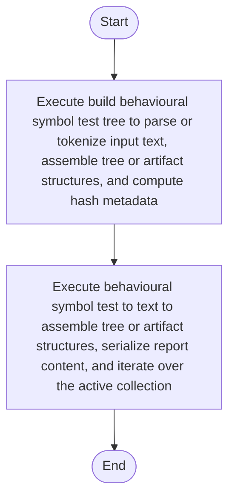

# behavioural_symbol_test.cpp

- Source: Microservice/Modules/Source/Behavioural/behavioural_symbol_test.cpp
- Kind: C++ implementation
- Lines: 55
- Role: Implements behavioural detection and structural verification scaffolds.
- Chronology: Runs after the generic parse tree exists so behavioural scaffolds can classify pattern structure.

## Notable Symbols
- build_behavioural_symbol_test_tree
- behavioural_symbol_test_to_text
- std::string

## Direct Dependencies
- behavioural_symbol_test.hpp
- parse_tree_symbols.hpp
- functional
- sstream
- string

## File Outline
### Responsibility

This source file implements behavioural-pattern scaffolding or checks on top of the generic parse tree. It contributes one part of the behavioural broken-tree output by scanning for behavioural structure signals.

### Position In The Flow

Runs after the generic parse tree exists so behavioural scaffolds can classify pattern structure.

### Main Surface Area

Implements behavioural detection and structural verification scaffolds. The main surface area is easiest to track through symbols such as build_behavioural_symbol_test_tree, behavioural_symbol_test_to_text, and std::string. It collaborates directly with behavioural_symbol_test.hpp, parse_tree_symbols.hpp, functional, and sstream.

## File Activity


## Function Walkthrough

### build_behavioural_symbol_test_tree
This routine assembles a larger structure from the inputs it receives. It appears near line 8.

Inside the body, it mainly handles parse or tokenize input text, assemble tree or artifact structures, compute hash metadata, and iterate over the active collection.

The implementation iterates over a collection or repeated workload. The caller receives a computed result or status from this step.

Key operations:
- parse or tokenize input text
- assemble tree or artifact structures
- compute hash metadata
- iterate over the active collection

Activity:
```mermaid
flowchart TD
    Start([build_behavioural_symbol_test_tree()])
    N0[Enter build_behavioural_symbol_test_tree()]
    N1[Parse or tokenize input text]
    N2[Assemble tree or artifact structures]
    N3[Compute hash metadata]
    N4[Iterate over the active collection]
    N5[Return the result to the caller]
    End([Return])
    Start --> N0
    N0 --> N1
    N1 --> N2
    N2 --> N3
    N3 --> N4
    N4 --> N5
    N5 --> End
```

### behavioural_symbol_test_to_text
This routine owns one focused piece of the file's behavior. It appears near line 33.

Inside the body, it mainly handles assemble tree or artifact structures, serialize report content, iterate over the active collection, and branch on runtime conditions.

The implementation iterates over a collection or repeated workload. It branches on runtime conditions instead of following one fixed path. The caller receives a computed result or status from this step.

Key operations:
- assemble tree or artifact structures
- serialize report content
- iterate over the active collection
- branch on runtime conditions

Activity:
```mermaid
flowchart TD
    Start([behavioural_symbol_test_to_text()])
    N0[Enter behavioural_symbol_test_to_text()]
    N1[Assemble tree or artifact structures]
    N2[Serialize report content]
    N3[Iterate over the active collection]
    N4[Branch on runtime conditions]
    N5[Return the result to the caller]
    End([Return])
    Start --> N0
    N0 --> N1
    N1 --> N2
    N2 --> N3
    N3 --> N4
    N4 --> N5
    N5 --> End
```

## Documentation Note
- This markdown file is part of the generated docs/Codebase mirror.
- It was generated from the repository state on 2026-04-23 after reading the existing docs corpus and the current source tree.

