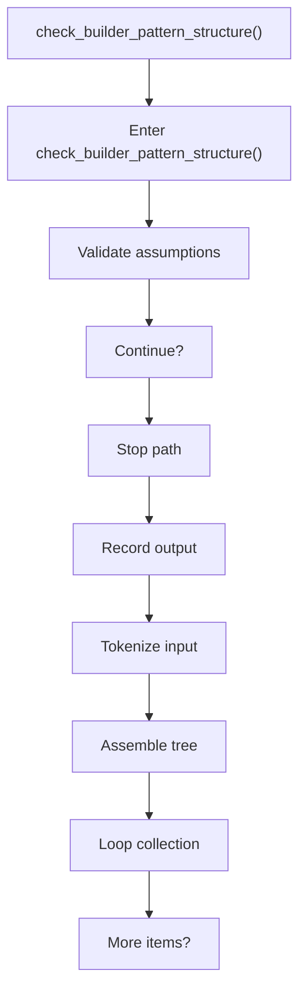
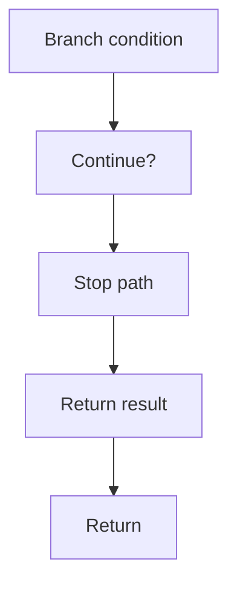

# check_builder_pattern_structure.cpp

- Source document: [builder_pattern_logic.cpp.md](../../builder_pattern_logic.cpp.md)
- Purpose: decoupled implementation logic for a future code unit.

### check_builder_pattern_structure()
This routine acts as a guard step before later logic is allowed to continue. It appears near line 180.

Inside the body, it mainly handles validate assumptions before continuing, record derived output into collections, parse or tokenize input text, and assemble tree or artifact structures.

The implementation iterates over a collection or repeated workload. It branches on runtime conditions instead of following one fixed path. The caller receives a computed result or status from this step.

What it does:
- validate assumptions before continuing
- record derived output into collections
- parse or tokenize input text
- assemble tree or artifact structures
- iterate over the active collection
- branch on runtime conditions

Flow:

### Block 4 - check_builder_pattern_structure() Details
#### Part 1

#### Part 2

