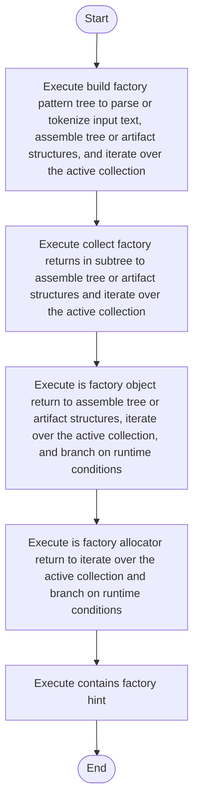

# factory_pattern_logic.cpp

- Source: Microservice/Modules/Source/Creational/Factory/factory_pattern_logic.cpp
- Kind: C++ implementation
- Lines: 575
- Role: Implements creational pattern detection over the generic parse tree.
- Chronology: Runs after the generic parse tree exists so creational detection or transformation can operate on it.

## Notable Symbols
- trim
- to_lower
- lowercase_ascii
- split_words
- starts_with
- class_name_from_signature
- function_name_from_signature
- is_class_block
- is_function_block
- is_conditional_block
- extract_return_expr
- extract_type_in_angle_brackets

## Direct Dependencies
- Factory/factory_pattern_logic.hpp
- Language-and-Structure/language_tokens.hpp
- parse_tree_symbols.hpp
- cctype
- string
- unordered_map
- vector

## File Outline
### Responsibility

This source file implements creational-pattern analysis over the generic parse tree. It inspects parsed structure, applies pattern-specific rules, and emits detector results that later appear in the creational tree or transform decisions.

### Position In The Flow

Runs after the generic parse tree exists so creational detection or transformation can operate on it.

### Main Surface Area

Implements creational pattern detection over the generic parse tree. The main surface area is easiest to track through symbols such as trim, to_lower, lowercase_ascii, and split_words. It collaborates directly with Factory/factory_pattern_logic.hpp, Language-and-Structure/language_tokens.hpp, parse_tree_symbols.hpp, and cctype.

## File Activity


## Function Walkthrough

### trim
This helper reshapes small pieces of data so the surrounding code can stay readable. It appears near line 13.

Inside the body, it mainly handles iterate over the active collection.

The implementation iterates over a collection or repeated workload. The caller receives a computed result or status from this step.

Key operations:
- iterate over the active collection

Activity:
```mermaid
flowchart TD
    Start([trim()])
    N0[Enter trim()]
    N1[Iterate over the active collection]
    N2[Return the result to the caller]
    End([Return])
    Start --> N0
    N0 --> N1
    N1 --> N2
    N2 --> End
```

### to_lower
This routine owns one focused piece of the file's behavior. It appears near line 29.

The caller receives a computed result or status from this step.

Key operations:
- This routine is primarily structural and does not expose obvious runtime operations from static inspection.

Activity:
```mermaid
flowchart TD
    Start([to_lower()])
    N0[Enter to_lower()]
    N1[Apply the routine's local logic]
    N2[Return the result to the caller]
    End([Return])
    Start --> N0
    N0 --> N1
    N1 --> N2
    N2 --> End
```

### split_words
This routine owns one focused piece of the file's behavior. It appears near line 34.

Inside the body, it mainly handles assemble tree or artifact structures, iterate over the active collection, and branch on runtime conditions.

The implementation iterates over a collection or repeated workload. It branches on runtime conditions instead of following one fixed path. The caller receives a computed result or status from this step.

Key operations:
- assemble tree or artifact structures
- iterate over the active collection
- branch on runtime conditions

Activity:
```mermaid
flowchart TD
    Start([split_words()])
    N0[Enter split_words()]
    N1[Assemble tree or artifact structures]
    N2[Iterate over the active collection]
    N3[Branch on runtime conditions]
    N4[Return the result to the caller]
    End([Return])
    Start --> N0
    N0 --> N1
    N1 --> N2
    N2 --> N3
    N3 --> N4
    N4 --> End
```

### if
This routine owns one focused piece of the file's behavior. It appears near line 46.

Inside the body, it mainly handles assemble tree or artifact structures.

Key operations:
- assemble tree or artifact structures

Activity:
```mermaid
flowchart TD
    Start([if()])
    N0[Enter if()]
    N1[Assemble tree or artifact structures]
    N2[Hand control back to the caller]
    End([Return])
    Start --> N0
    N0 --> N1
    N1 --> N2
    N2 --> End
```

### starts_with
This routine prepares or drives one of the main execution paths in the file. It appears near line 60.

The caller receives a computed result or status from this step.

Key operations:
- This routine is primarily structural and does not expose obvious runtime operations from static inspection.

Activity:
```mermaid
flowchart TD
    Start([starts_with()])
    N0[Enter starts_with()]
    N1[Apply the routine's local logic]
    N2[Return the result to the caller]
    End([Return])
    Start --> N0
    N0 --> N1
    N1 --> N2
    N2 --> End
```

### class_name_from_signature
This routine owns one focused piece of the file's behavior. It appears near line 65.

Inside the body, it mainly handles iterate over the active collection and branch on runtime conditions.

The implementation iterates over a collection or repeated workload. It branches on runtime conditions instead of following one fixed path. The caller receives a computed result or status from this step.

Key operations:
- iterate over the active collection
- branch on runtime conditions

Activity:
```mermaid
flowchart TD
    Start([class_name_from_signature()])
    N0[Enter class_name_from_signature()]
    N1[Iterate over the active collection]
    N2[Branch on runtime conditions]
    N3[Return the result to the caller]
    End([Return])
    Start --> N0
    N0 --> N1
    N1 --> N2
    N2 --> N3
    N3 --> End
```

### function_name_from_signature
This routine owns one focused piece of the file's behavior. It appears near line 79.

Inside the body, it mainly handles branch on runtime conditions.

It branches on runtime conditions instead of following one fixed path. The caller receives a computed result or status from this step.

Key operations:
- branch on runtime conditions

Activity:
```mermaid
flowchart TD
    Start([function_name_from_signature()])
    N0[Enter function_name_from_signature()]
    N1[Branch on runtime conditions]
    N2[Return the result to the caller]
    End([Return])
    Start --> N0
    N0 --> N1
    N1 --> N2
    N2 --> End
```

### is_class_block
This routine owns one focused piece of the file's behavior. It appears near line 97.

Inside the body, it mainly handles branch on runtime conditions.

It branches on runtime conditions instead of following one fixed path. The caller receives a computed result or status from this step.

Key operations:
- branch on runtime conditions

Activity:
```mermaid
flowchart TD
    Start([is_class_block()])
    N0[Enter is_class_block()]
    N1[Branch on runtime conditions]
    N2[Return the result to the caller]
    End([Return])
    Start --> N0
    N0 --> N1
    N1 --> N2
    N2 --> End
```

### is_function_block
This routine owns one focused piece of the file's behavior. It appears near line 108.

Inside the body, it mainly handles branch on runtime conditions.

It branches on runtime conditions instead of following one fixed path. The caller receives a computed result or status from this step.

Key operations:
- branch on runtime conditions

Activity:
```mermaid
flowchart TD
    Start([is_function_block()])
    N0[Enter is_function_block()]
    N1[Branch on runtime conditions]
    N2[Return the result to the caller]
    End([Return])
    Start --> N0
    N0 --> N1
    N1 --> N2
    N2 --> End
```

### is_conditional_block
This routine owns one focused piece of the file's behavior. It appears near line 132.

Inside the body, it mainly handles branch on runtime conditions.

It branches on runtime conditions instead of following one fixed path. The caller receives a computed result or status from this step.

Key operations:
- branch on runtime conditions

Activity:
```mermaid
flowchart TD
    Start([is_conditional_block()])
    N0[Enter is_conditional_block()]
    N1[Branch on runtime conditions]
    N2[Return the result to the caller]
    End([Return])
    Start --> N0
    N0 --> N1
    N1 --> N2
    N2 --> End
```

### extract_return_expr
This routine owns one focused piece of the file's behavior. It appears near line 146.

Inside the body, it mainly handles branch on runtime conditions.

It branches on runtime conditions instead of following one fixed path. The caller receives a computed result or status from this step.

Key operations:
- branch on runtime conditions

Activity:
```mermaid
flowchart TD
    Start([extract_return_expr()])
    N0[Enter extract_return_expr()]
    N1[Branch on runtime conditions]
    N2[Return the result to the caller]
    End([Return])
    Start --> N0
    N0 --> N1
    N1 --> N2
    N2 --> End
```

### extract_type_in_angle_brackets
This routine owns one focused piece of the file's behavior. It appears near line 157.

Inside the body, it mainly handles branch on runtime conditions.

It branches on runtime conditions instead of following one fixed path. The caller receives a computed result or status from this step.

Key operations:
- branch on runtime conditions

Activity:
```mermaid
flowchart TD
    Start([extract_type_in_angle_brackets()])
    N0[Enter extract_type_in_angle_brackets()]
    N1[Branch on runtime conditions]
    N2[Return the result to the caller]
    End([Return])
    Start --> N0
    N0 --> N1
    N1 --> N2
    N2 --> End
```

### remove_spaces
This routine owns one focused piece of the file's behavior. It appears near line 168.

Inside the body, it mainly handles assemble tree or artifact structures, iterate over the active collection, and branch on runtime conditions.

The implementation iterates over a collection or repeated workload. It branches on runtime conditions instead of following one fixed path. The caller receives a computed result or status from this step.

Key operations:
- assemble tree or artifact structures
- iterate over the active collection
- branch on runtime conditions

Activity:
```mermaid
flowchart TD
    Start([remove_spaces()])
    N0[Enter remove_spaces()]
    N1[Assemble tree or artifact structures]
    N2[Iterate over the active collection]
    N3[Branch on runtime conditions]
    N4[Return the result to the caller]
    End([Return])
    Start --> N0
    N0 --> N1
    N1 --> N2
    N2 --> N3
    N3 --> N4
    N4 --> End
```

### is_identifier_token
This routine owns one focused piece of the file's behavior. It appears near line 182.

Inside the body, it mainly handles iterate over the active collection and branch on runtime conditions.

The implementation iterates over a collection or repeated workload. It branches on runtime conditions instead of following one fixed path. The caller receives a computed result or status from this step.

Key operations:
- iterate over the active collection
- branch on runtime conditions

Activity:
```mermaid
flowchart TD
    Start([is_identifier_token()])
    N0[Enter is_identifier_token()]
    N1[Iterate over the active collection]
    N2[Branch on runtime conditions]
    N3[Return the result to the caller]
    End([Return])
    Start --> N0
    N0 --> N1
    N1 --> N2
    N2 --> N3
    N3 --> End
```

### contains_factory_hint
This routine owns one focused piece of the file's behavior. It appears near line 206.

The caller receives a computed result or status from this step.

Key operations:
- This routine is primarily structural and does not expose obvious runtime operations from static inspection.

Activity:
```mermaid
flowchart TD
    Start([contains_factory_hint()])
    N0[Enter contains_factory_hint()]
    N1[Apply the routine's local logic]
    N2[Return the result to the caller]
    End([Return])
    Start --> N0
    N0 --> N1
    N1 --> N2
    N2 --> End
```

### is_factory_allocator_return
This routine owns one focused piece of the file's behavior. It appears near line 216.

Inside the body, it mainly handles iterate over the active collection and branch on runtime conditions.

The implementation iterates over a collection or repeated workload. It branches on runtime conditions instead of following one fixed path. The caller receives a computed result or status from this step.

Key operations:
- iterate over the active collection
- branch on runtime conditions

Activity:
```mermaid
flowchart TD
    Start([is_factory_allocator_return()])
    N0[Enter is_factory_allocator_return()]
    N1[Iterate over the active collection]
    N2[Branch on runtime conditions]
    N3[Return the result to the caller]
    End([Return])
    Start --> N0
    N0 --> N1
    N1 --> N2
    N2 --> N3
    N3 --> End
```

### function_contains_allocator_return
This routine owns one focused piece of the file's behavior. It appears near line 252.

Inside the body, it mainly handles assemble tree or artifact structures, iterate over the active collection, and branch on runtime conditions.

The implementation iterates over a collection or repeated workload. It branches on runtime conditions instead of following one fixed path. The caller receives a computed result or status from this step.

Key operations:
- assemble tree or artifact structures
- iterate over the active collection
- branch on runtime conditions

Activity:
```mermaid
flowchart TD
    Start([function_contains_allocator_return()])
    N0[Enter function_contains_allocator_return()]
    N1[Assemble tree or artifact structures]
    N2[Iterate over the active collection]
    N3[Branch on runtime conditions]
    N4[Return the result to the caller]
    End([Return])
    Start --> N0
    N0 --> N1
    N1 --> N2
    N2 --> N3
    N3 --> N4
    N4 --> End
```

### function_return_class_name
This routine owns one focused piece of the file's behavior. It appears near line 281.

Inside the body, it mainly handles iterate over the active collection and branch on runtime conditions.

The implementation iterates over a collection or repeated workload. It branches on runtime conditions instead of following one fixed path. The caller receives a computed result or status from this step.

Key operations:
- iterate over the active collection
- branch on runtime conditions

Activity:
```mermaid
flowchart TD
    Start([function_return_class_name()])
    N0[Enter function_return_class_name()]
    N1[Iterate over the active collection]
    N2[Branch on runtime conditions]
    N3[Return the result to the caller]
    End([Return])
    Start --> N0
    N0 --> N1
    N1 --> N2
    N2 --> N3
    N3 --> End
```

### is_factory_object_return
This routine owns one focused piece of the file's behavior. It appears near line 351.

Inside the body, it mainly handles assemble tree or artifact structures, iterate over the active collection, and branch on runtime conditions.

The implementation iterates over a collection or repeated workload. It branches on runtime conditions instead of following one fixed path. The caller receives a computed result or status from this step.

Key operations:
- assemble tree or artifact structures
- iterate over the active collection
- branch on runtime conditions

Activity:
```mermaid
flowchart TD
    Start([is_factory_object_return()])
    N0[Enter is_factory_object_return()]
    N1[Assemble tree or artifact structures]
    N2[Iterate over the active collection]
    N3[Branch on runtime conditions]
    N4[Return the result to the caller]
    End([Return])
    Start --> N0
    N0 --> N1
    N1 --> N2
    N2 --> N3
    N3 --> N4
    N4 --> End
```

### append_factory_return_if_matched
This helper reshapes small pieces of data so the surrounding code can stay readable. It appears near line 405.

Inside the body, it mainly handles assemble tree or artifact structures and branch on runtime conditions.

It branches on runtime conditions instead of following one fixed path. The caller receives a computed result or status from this step.

Key operations:
- assemble tree or artifact structures
- branch on runtime conditions

Activity:
```mermaid
flowchart TD
    Start([append_factory_return_if_matched()])
    N0[Enter append_factory_return_if_matched()]
    N1[Assemble tree or artifact structures]
    N2[Branch on runtime conditions]
    N3[Return the result to the caller]
    End([Return])
    Start --> N0
    N0 --> N1
    N1 --> N2
    N2 --> N3
    N3 --> End
```

### collect_factory_returns_in_subtree
This routine connects discovered items back into the broader model owned by the file. It appears near line 441.

Inside the body, it mainly handles assemble tree or artifact structures and iterate over the active collection.

The implementation iterates over a collection or repeated workload. The caller receives a computed result or status from this step.

Key operations:
- assemble tree or artifact structures
- iterate over the active collection

Activity:
```mermaid
flowchart TD
    Start([collect_factory_returns_in_subtree()])
    N0[Enter collect_factory_returns_in_subtree()]
    N1[Assemble tree or artifact structures]
    N2[Iterate over the active collection]
    N3[Return the result to the caller]
    End([Return])
    Start --> N0
    N0 --> N1
    N1 --> N2
    N2 --> N3
    N3 --> End
```

### build_factory_pattern_tree
This routine assembles a larger structure from the inputs it receives. It appears near line 471.

Inside the body, it mainly handles parse or tokenize input text, assemble tree or artifact structures, iterate over the active collection, and branch on runtime conditions.

The implementation iterates over a collection or repeated workload. It branches on runtime conditions instead of following one fixed path. The caller receives a computed result or status from this step.

Key operations:
- parse or tokenize input text
- assemble tree or artifact structures
- iterate over the active collection
- branch on runtime conditions

Activity:
```mermaid
flowchart TD
    Start([build_factory_pattern_tree()])
    N0[Enter build_factory_pattern_tree()]
    N1[Parse or tokenize input text]
    N2[Assemble tree or artifact structures]
    N3[Iterate over the active collection]
    N4[Branch on runtime conditions]
    N5[Return the result to the caller]
    End([Return])
    Start --> N0
    N0 --> N1
    N1 --> N2
    N2 --> N3
    N3 --> N4
    N4 --> N5
    N5 --> End
```

## Documentation Note
- This markdown file is part of the generated docs/Codebase mirror.
- It was generated from the repository state on 2026-04-23 after reading the existing docs corpus and the current source tree.

