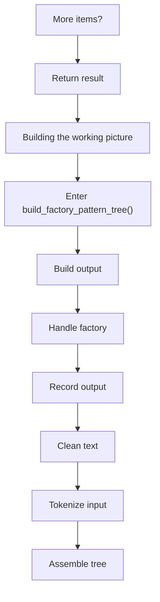
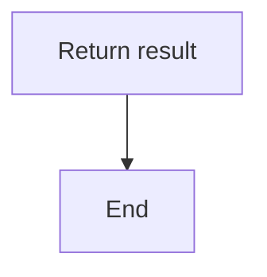

# factory_pattern_logic_program_flow_03.cpp

- Source document: [factory_pattern_logic.cpp.md](../factory_pattern_logic.cpp.md)
- Purpose: decoupled implementation logic for a future code unit.

#### Part 17

#### Part 18

