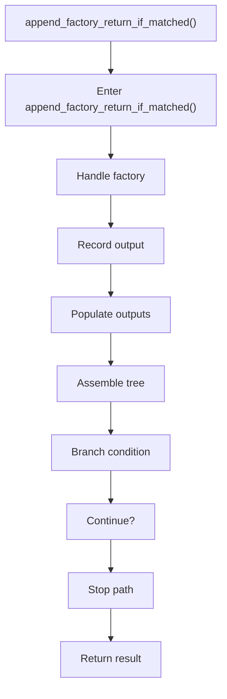

# append_factory_return_if_matched.cpp

- Source document: [factory_pattern_logic.cpp.md](../../factory_pattern_logic.cpp.md)
- Purpose: decoupled implementation logic for a future code unit.

### append_factory_return_if_matched()
This helper reshapes small pieces of data so the surrounding code can stay readable. It appears near line 405.

Inside the body, it mainly handles handle factory-specific detection or rewrite logic, record derived output into collections, populate output fields or accumulators, and assemble tree or artifact structures.

It branches on runtime conditions instead of following one fixed path. The caller receives a computed result or status from this step.

What it does:
- handle factory-specific detection or rewrite logic
- record derived output into collections
- populate output fields or accumulators
- assemble tree or artifact structures
- branch on runtime conditions

Flow:

### Block 9 - append_factory_return_if_matched() Details
#### Part 1

#### Part 2

