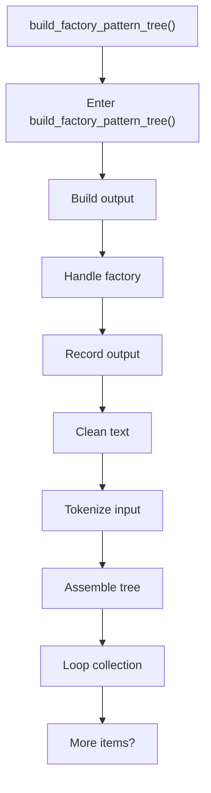
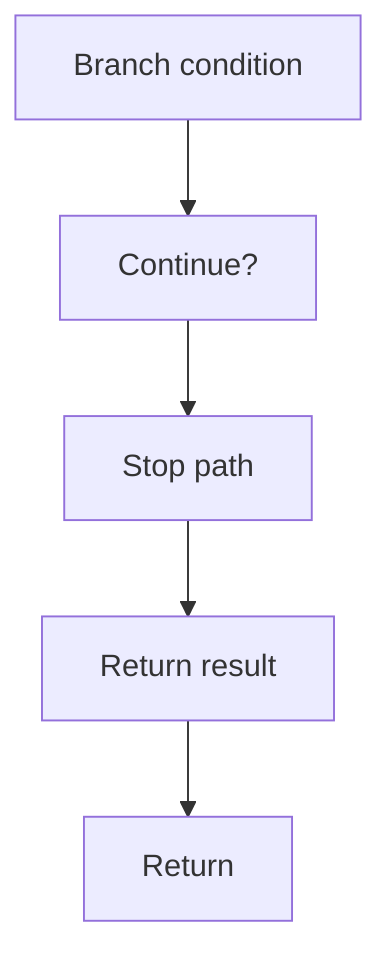

# build_factory_pattern_tree.cpp

- Source document: [factory_pattern_logic.cpp.md](../../factory_pattern_logic.cpp.md)
- Purpose: decoupled implementation logic for a future code unit.

### build_factory_pattern_tree()
This routine assembles a larger structure from the inputs it receives. It appears near line 471.

Inside the body, it mainly handles build or append the next output structure, handle factory-specific detection or rewrite logic, record derived output into collections, and normalize raw text before later parsing.

The implementation iterates over a collection or repeated workload. It branches on runtime conditions instead of following one fixed path. The caller receives a computed result or status from this step.

What it does:
- build or append the next output structure
- handle factory-specific detection or rewrite logic
- record derived output into collections
- normalize raw text before later parsing
- parse or tokenize input text
- assemble tree or artifact structures
- iterate over the active collection
- branch on runtime conditions

Flow:

### Block 11 - build_factory_pattern_tree() Details
#### Part 1

#### Part 2

