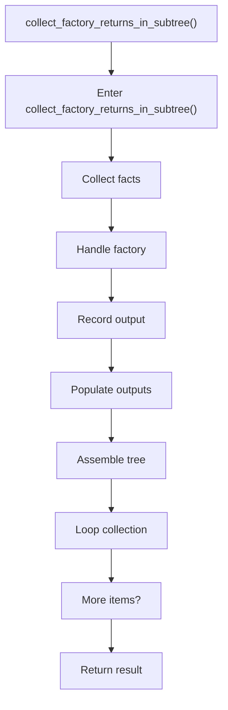

# collect_factory_returns_in_subtree.cpp

- Source document: [factory_pattern_logic.cpp.md](../../factory_pattern_logic.cpp.md)
- Purpose: decoupled implementation logic for a future code unit.

### collect_factory_returns_in_subtree()
This routine connects discovered items back into the broader model owned by the file. It appears near line 441.

Inside the body, it mainly handles collect derived facts for later stages, handle factory-specific detection or rewrite logic, record derived output into collections, and populate output fields or accumulators.

The implementation iterates over a collection or repeated workload. The caller receives a computed result or status from this step.

What it does:
- collect derived facts for later stages
- handle factory-specific detection or rewrite logic
- record derived output into collections
- populate output fields or accumulators
- assemble tree or artifact structures
- iterate over the active collection

Flow:

### Block 10 - collect_factory_returns_in_subtree() Details
#### Part 1

#### Part 2

