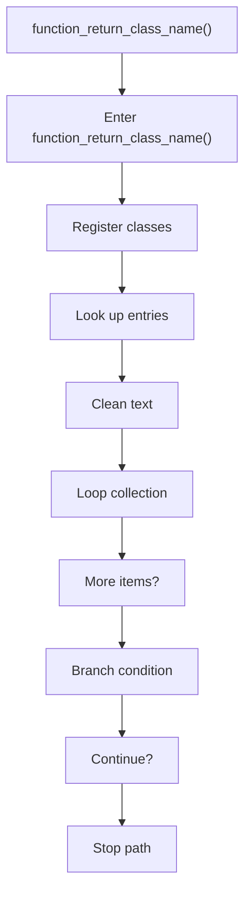
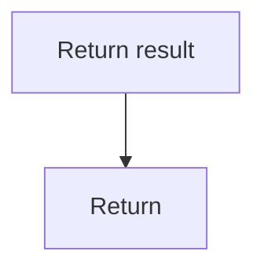

# function_return_class_name.cpp

- Source document: [factory_pattern_logic.cpp.md](../../factory_pattern_logic.cpp.md)
- Purpose: decoupled implementation logic for a future code unit.

### function_return_class_name()
This routine owns one focused piece of the file's behavior. It appears near line 281.

Inside the body, it mainly handles inspect or register class-level information, look up entries in previously collected maps or sets, normalize raw text before later parsing, and iterate over the active collection.

The implementation iterates over a collection or repeated workload. It branches on runtime conditions instead of following one fixed path. The caller receives a computed result or status from this step.

What it does:
- inspect or register class-level information
- look up entries in previously collected maps or sets
- normalize raw text before later parsing
- iterate over the active collection
- branch on runtime conditions

Flow:

### Block 7 - function_return_class_name() Details
#### Part 1

#### Part 2

