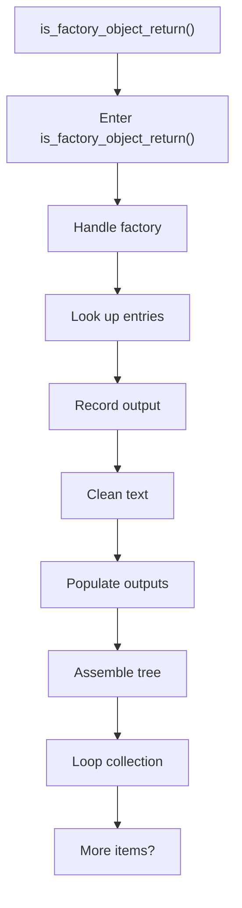
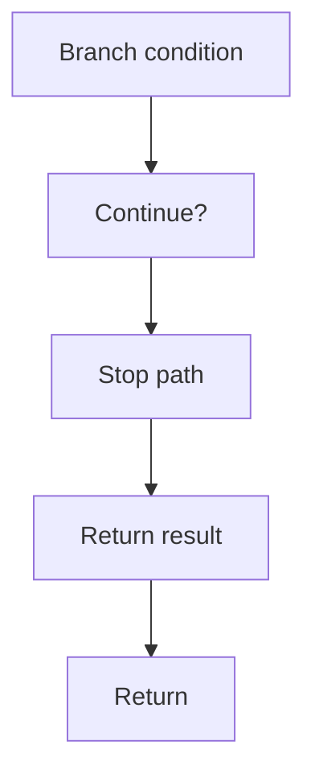

# is_factory_object_return.cpp

- Source document: [factory_pattern_logic.cpp.md](../../factory_pattern_logic.cpp.md)
- Purpose: decoupled implementation logic for a future code unit.

### is_factory_object_return()
This routine owns one focused piece of the file's behavior. It appears near line 351.

Inside the body, it mainly handles handle factory-specific detection or rewrite logic, look up entries in previously collected maps or sets, record derived output into collections, and normalize raw text before later parsing.

The implementation iterates over a collection or repeated workload. It branches on runtime conditions instead of following one fixed path. The caller receives a computed result or status from this step.

What it does:
- handle factory-specific detection or rewrite logic
- look up entries in previously collected maps or sets
- record derived output into collections
- normalize raw text before later parsing
- populate output fields or accumulators
- assemble tree or artifact structures
- iterate over the active collection
- branch on runtime conditions

Flow:

### Block 8 - is_factory_object_return() Details
#### Part 1

#### Part 2

