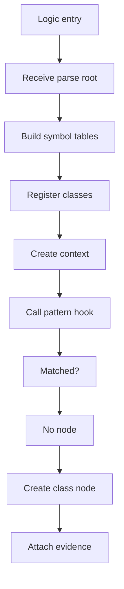
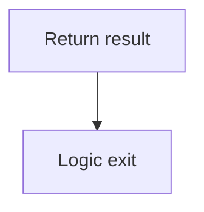
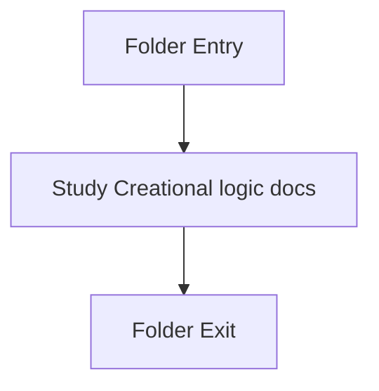

# Logic

- Folder: docs/Codebase/Microservice/Modules/Source/Creational/Logic
- Descendant source docs: 2
- Generated on: 2026-04-23

## Logic Summary
Shared creational logic helpers and keyword providers.

## Subsystem Story
This folder is mostly leaf-level. The local documents here carry the main explanation of the subsystem without requiring much extra descent.

## Middleman Contract
This logic layer should be the home for shared creational assembly work. It should act as the middleman between the generic parse tree and the pattern-specific algorithms. The middleman should register classes once, build shared symbol context once, and call pattern-specific virtual hooks for Factory, Singleton, Builder, or future creational patterns.

### Block 1 - Middleman Contract Details
#### Part 1

#### Part 2

## Hook Responsibility
- Shared logic owns class registration.
- Shared logic owns tree assembly.
- Shared logic owns common traversal.
- Pattern hooks own detection details only.
- Virtual hooks choose Factory, Singleton, Builder, or a new pattern algorithm.

## Folder Flow

## Documents By Logic
### Creational Logic
These documents explain the local implementation by covering Implements creational pattern detection over the generic parse tree..
- creational_logic_scaffold.cpp.md : Implements creational pattern detection over the generic parse tree.
- creational_structural_hooks.cpp.md : Implements creational pattern detection over the generic parse tree.

## Reading Hint
- This folder is mostly leaf-level. Read the local file docs to understand the logic in this area.
