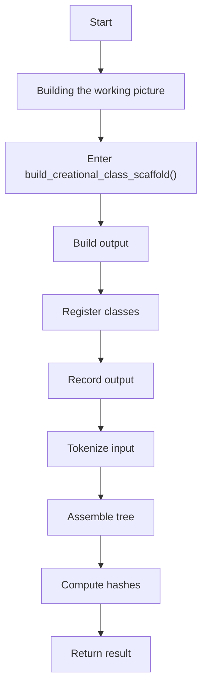
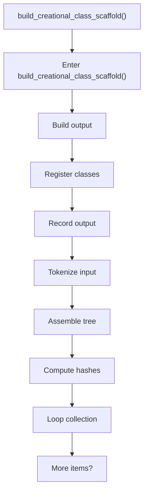
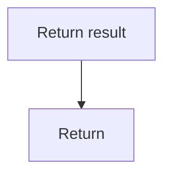

# creational_logic_scaffold.cpp

- Source: Microservice/Modules/Source/Creational/Logic/creational_logic_scaffold.cpp
- Kind: C++ implementation
- Lines: 23

## Story
### What Happens Here

This source file implements creational-pattern analysis over the generic parse tree. It inspects parsed structure, applies pattern-specific rules, and emits detector results that later appear in the creational tree or documentation tags.

### Why It Matters In The Flow

Runs after the generic parse tree exists so creational detection can label the structure.

### What To Watch While Reading

Implements creational pattern detection over the generic parse tree. The main surface area is easiest to track through symbols such as build_creational_class_scaffold. It collaborates directly with Logic/creational_logic_scaffold.hpp, parse_tree_dependency_utils.hpp, string, and utility.

## Program Flow
This diagram follows the action path in plain words. Decision diamonds show where the file can stop, branch, or repeat work instead of simply passing through a straight line.

### Block 1 - Program Flow Details
#### Part 1

#### Part 2

## Reading Map
Read this file as: Implements creational pattern detection over the generic parse tree.

Where it sits in the run: Runs after the generic parse tree exists so creational detection can label the structure.

Names worth recognizing while reading: build_creational_class_scaffold.

It leans on nearby contracts or tools such as Logic/creational_logic_scaffold.hpp, parse_tree_dependency_utils.hpp, string, and utility.

## Story Groups

### Building The Working Picture
These steps assemble the trees, models, or bundles used by the rest of the file.
- build_creational_class_scaffold() (line 7): Build or append the next output structure, inspect or register class-level information, and record derived output into collections

## Function Stories

### build_creational_class_scaffold()
This routine assembles a larger structure from the inputs it receives. It appears near line 7.

Inside the body, it mainly handles build or append the next output structure, inspect or register class-level information, record derived output into collections, and parse or tokenize input text.

The implementation iterates over a collection or repeated workload. The caller receives a computed result or status from this step.

What it does:
- build or append the next output structure
- inspect or register class-level information
- record derived output into collections
- parse or tokenize input text
- assemble tree or artifact structures
- compute hash metadata
- iterate over the active collection

Flow:

### Block 2 - build_creational_class_scaffold() Details
#### Part 1

#### Part 2

## Documentation Note
- This markdown file is part of the generated docs/Codebase mirror.
- It was generated from the repository state on 2026-04-23 after reading the existing docs corpus and the current source tree.
