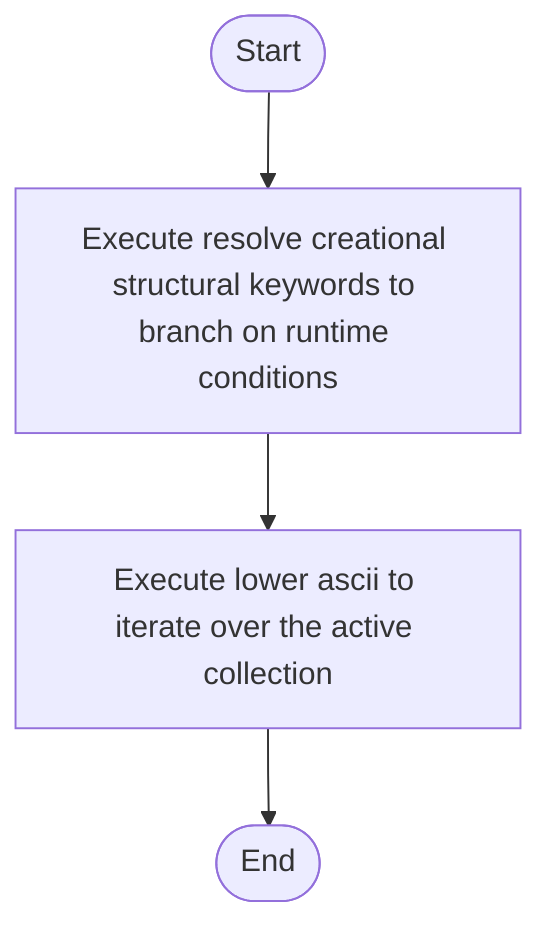

# creational_structural_hooks.cpp

- Source: Microservice/Modules/Source/Creational/Logic/creational_structural_hooks.cpp
- Kind: C++ implementation
- Lines: 47
- Role: Implements creational pattern detection over the generic parse tree.
- Chronology: Runs after the generic parse tree exists so creational detection or transformation can operate on it.

## Notable Symbols
- lower_ascii
- resolve_creational_structural_keywords

## Direct Dependencies
- Logic/creational_structural_hooks.hpp
- cctype
- string
- vector

## File Outline
### Responsibility

This source file implements creational-pattern analysis over the generic parse tree. It inspects parsed structure, applies pattern-specific rules, and emits detector results that later appear in the creational tree or transform decisions.

### Position In The Flow

Runs after the generic parse tree exists so creational detection or transformation can operate on it.

### Main Surface Area

Implements creational pattern detection over the generic parse tree. The main surface area is easiest to track through symbols such as lower_ascii and resolve_creational_structural_keywords. It collaborates directly with Logic/creational_structural_hooks.hpp, cctype, string, and vector.

## File Activity


## Function Walkthrough

### lower_ascii
This routine owns one focused piece of the file's behavior. It appears near line 9.

Inside the body, it mainly handles iterate over the active collection.

The implementation iterates over a collection or repeated workload. The caller receives a computed result or status from this step.

Key operations:
- iterate over the active collection

Activity:
```mermaid
flowchart TD
    Start([lower_ascii()])
    N0[Enter lower_ascii()]
    N1[Iterate over the active collection]
    N2[Return the result to the caller]
    End([Return])
    Start --> N0
    N0 --> N1
    N1 --> N2
    N2 --> End
```

### resolve_creational_structural_keywords
This routine connects discovered items back into the broader model owned by the file. It appears near line 19.

Inside the body, it mainly handles branch on runtime conditions.

It branches on runtime conditions instead of following one fixed path. The caller receives a computed result or status from this step.

Key operations:
- branch on runtime conditions

Activity:
```mermaid
flowchart TD
    Start([resolve_creational_structural_keywords()])
    N0[Enter resolve_creational_structural_keywords()]
    N1[Branch on runtime conditions]
    N2[Return the result to the caller]
    End([Return])
    Start --> N0
    N0 --> N1
    N1 --> N2
    N2 --> End
```

## Documentation Note
- This markdown file is part of the generated docs/Codebase mirror.
- It was generated from the repository state on 2026-04-23 after reading the existing docs corpus and the current source tree.

