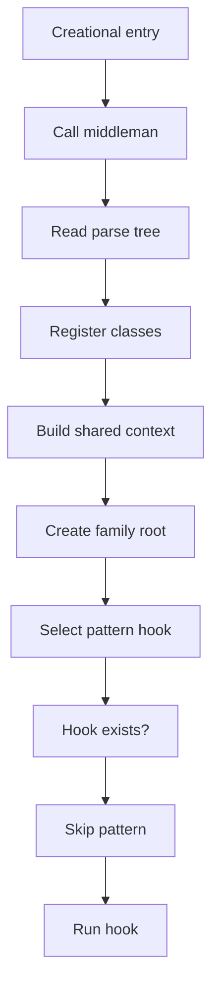
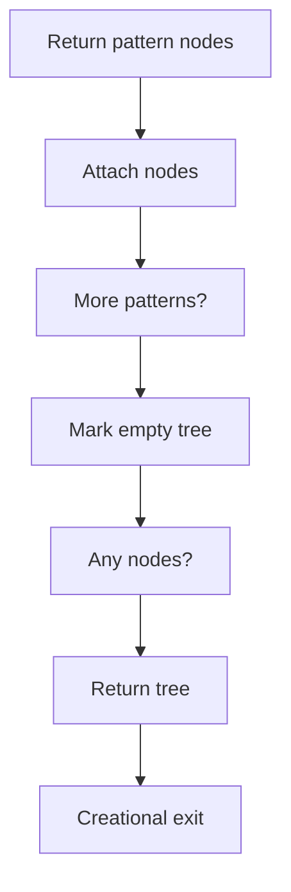
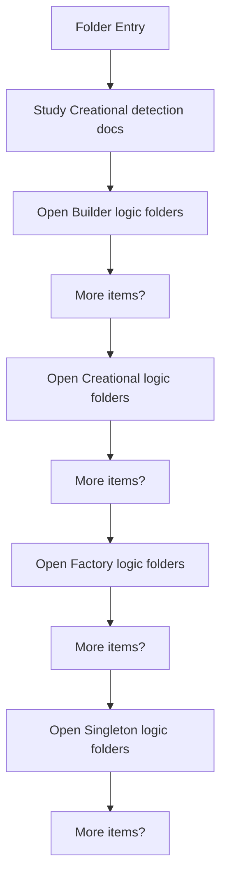
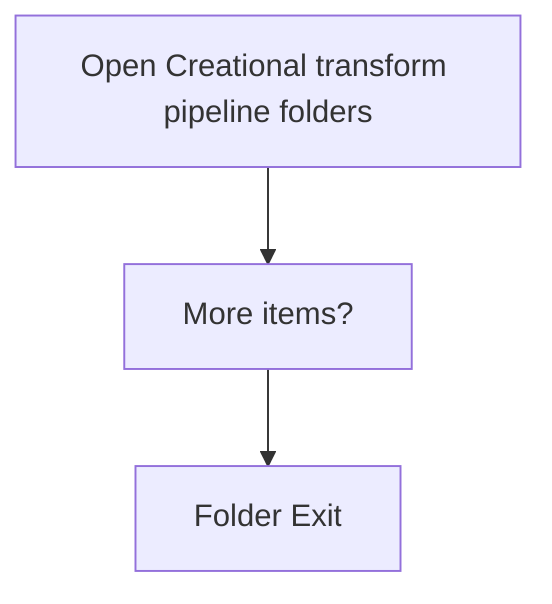

# Creational

- Folder: docs/Codebase/Microservice/Modules/Source/Creational
- Descendant source docs: 25
- Generated on: 2026-04-23

## Logic Summary
Creational pattern detection over the generic parse tree.

## Subsystem Story
This folder mixes concrete local documents with deeper child subsystems. Read the local docs to understand the visible behavior first, then descend into the child folders for the lower-level detail that supports it.

## Required Tree Assembly Design
Creational tree assembly should be owned by a shared middleman, not by each individual design-pattern detector. The middleman is responsible for the repeated work: reading the parse tree, registering classes, preparing shared context, creating the family root, attaching pattern results, and handling empty results. Pattern-specific files should only supply the variable algorithm through a virtual hook or function-pointer style interface.

Full architecture docs live in [README.md](../PatternMiddlemanArchitecture/README.md), with the implementation-shaped middleman flow in [pattern_middleman.cpp.md](../PatternMiddlemanArchitecture/Middleman/pattern_middleman.cpp.md).

### Block 1 - Required Tree Assembly Design Details
#### Part 1

#### Part 2

## Delegation Boundary
- Middleman owns traversal, class registration, shared symbol tables, tree-root creation, child-node attachment, empty-result handling, and output shape.
- Factory, Singleton, and Builder logic own only their detection algorithm.
- Pattern-specific code should not rebuild the same class registry or assemble the same tree skeleton.
- New creational patterns should plug into the same middleman by implementing the virtual hook contract.

## Folder Flow

### Block 2 - Folder Flow Details
#### Part 1

#### Part 2

## Child Folders By Logic
### Builder Logic
These child folders continue the subsystem by covering Builder-pattern specific detection logic..
- Builder/ : Builder-pattern specific detection logic.

### Creational Logic
These child folders continue the subsystem by covering Shared creational logic helpers and keyword providers..
- Logic/ : Shared creational logic helpers and keyword providers.

### Factory Logic
These child folders continue the subsystem by covering Factory-pattern specific detection logic..
- Factory/ : Factory-pattern specific detection logic.

### Singleton Logic
These child folders continue the subsystem by covering Singleton-pattern specific detection logic..
- Singleton/ : Singleton-pattern specific detection logic.

### Creational Transform Pipeline
These child folders continue the subsystem by covering Older creational transform and evidence helpers kept separate from the current tagging runtime path..
- Transform/ : Older creational transform and evidence helpers kept separate from the current tagging runtime path.

## Documents By Logic
### Creational Detection
These documents explain the local implementation by covering Implements creational pattern detection over the generic parse tree..
- creational_broken_tree.cpp.md : Implements creational pattern detection over the generic parse tree.
- creational_symbol_test.cpp.md : Implements creational pattern detection over the generic parse tree.

## Reading Hint
- Read the local file docs first for concrete behavior, then descend into the child folders for narrower subsystem details.
