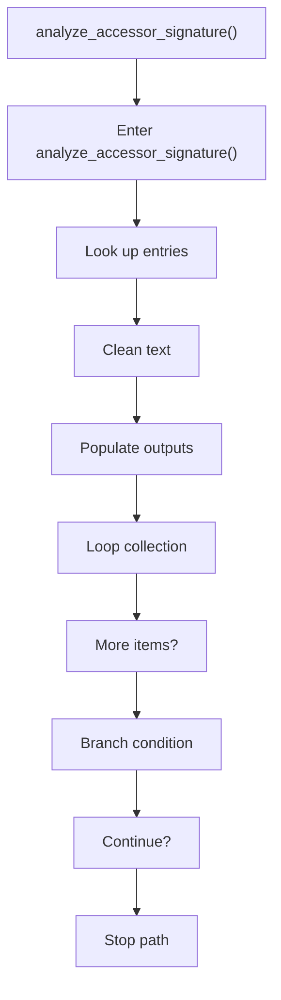
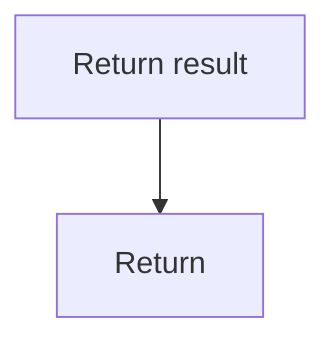

# analyze_accessor_signature.cpp

- Source document: [singleton_pattern_logic.cpp.md](../../singleton_pattern_logic.cpp.md)
- Purpose: decoupled implementation logic for a future code unit.

### analyze_accessor_signature()
This routine owns one focused piece of the file's behavior. It appears near line 169.

Inside the body, it mainly handles look up entries in previously collected maps or sets, normalize raw text before later parsing, populate output fields or accumulators, and iterate over the active collection.

The implementation iterates over a collection or repeated workload. It branches on runtime conditions instead of following one fixed path. The caller receives a computed result or status from this step.

What it does:
- look up entries in previously collected maps or sets
- normalize raw text before later parsing
- populate output fields or accumulators
- iterate over the active collection
- branch on runtime conditions

Flow:

### Block 3 - analyze_accessor_signature() Details
#### Part 1

#### Part 2

