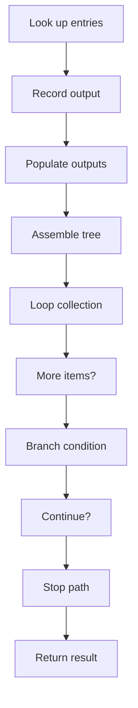
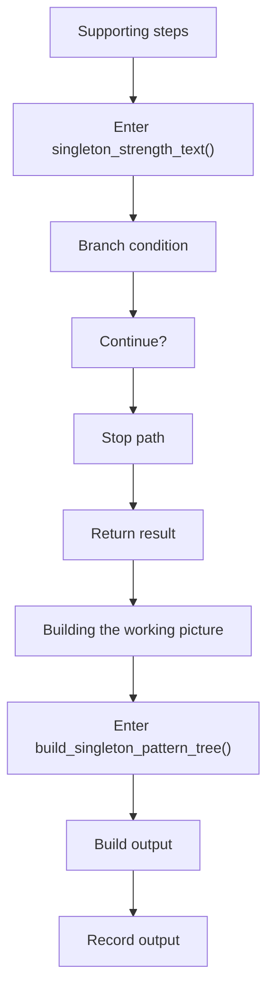
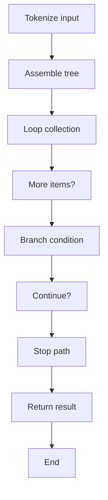

# singleton_pattern_logic_program_flow_02.cpp

- Source document: [singleton_pattern_logic.cpp.md](../singleton_pattern_logic.cpp.md)
- Purpose: decoupled implementation logic for a future code unit.

#### Part 9

#### Part 10

#### Part 11

