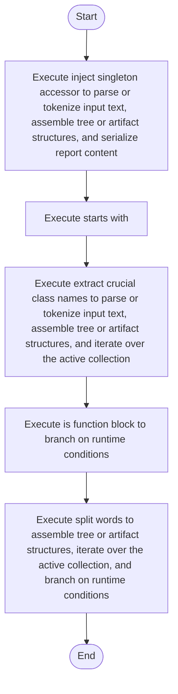

# creational_code_generator_internal.cpp

- Source: Microservice/Modules/Source/Creational/Transform/creational_code_generator_internal.cpp
- Kind: C++ implementation
- Lines: 494
- Role: Implements creational transform dispatch, evidence rendering, and rewrite helpers.
- Chronology: Runs after the generic parse tree exists so creational detection or transformation can operate on it.

## Notable Symbols
- lower
- lowercase_ascii
- trim
- split_words
- starts_with
- find_matching_brace
- is_class_block
- is_function_block
- class_name_from_signature
- function_name_from_signature
- inject_singleton_accessor
- rewrite_class_instantiations_to_singleton_references

## Direct Dependencies
- Transform/creational_code_generator_internal.hpp
- Language-and-Structure/language_tokens.hpp
- cctype
- regex
- sstream
- string
- unordered_map
- unordered_set
- vector

## File Outline
### Responsibility

This source file implements a creational transform or evidence-rendering stage. It runs after the generic parse tree has been built and focuses on turning detected structure into rewritten code or explanatory evidence views. This source file implements creational-pattern analysis over the generic parse tree. It inspects parsed structure, applies pattern-specific rules, and emits detector results that later appear in the creational tree or transform decisions.

### Position In The Flow

Runs after the generic parse tree exists so creational detection or transformation can operate on it.

### Main Surface Area

Implements creational transform dispatch, evidence rendering, and rewrite helpers. The main surface area is easiest to track through symbols such as lower, lowercase_ascii, trim, and split_words. It collaborates directly with Transform/creational_code_generator_internal.hpp, Language-and-Structure/language_tokens.hpp, cctype, and regex.

## File Activity


## Function Walkthrough

### lower
This routine owns one focused piece of the file's behavior. It appears near line 16.

The caller receives a computed result or status from this step.

Key operations:
- This routine is primarily structural and does not expose obvious runtime operations from static inspection.

Activity:
```mermaid
flowchart TD
    Start([lower()])
    N0[Enter lower()]
    N1[Apply the routine's local logic]
    N2[Return the result to the caller]
    End([Return])
    Start --> N0
    N0 --> N1
    N1 --> N2
    N2 --> End
```

### trim
This helper reshapes small pieces of data so the surrounding code can stay readable. It appears near line 21.

Inside the body, it mainly handles iterate over the active collection.

The implementation iterates over a collection or repeated workload. The caller receives a computed result or status from this step.

Key operations:
- iterate over the active collection

Activity:
```mermaid
flowchart TD
    Start([trim()])
    N0[Enter trim()]
    N1[Iterate over the active collection]
    N2[Return the result to the caller]
    End([Return])
    Start --> N0
    N0 --> N1
    N1 --> N2
    N2 --> End
```

### split_words
This routine owns one focused piece of the file's behavior. It appears near line 38.

Inside the body, it mainly handles assemble tree or artifact structures, iterate over the active collection, and branch on runtime conditions.

The implementation iterates over a collection or repeated workload. It branches on runtime conditions instead of following one fixed path. The caller receives a computed result or status from this step.

Key operations:
- assemble tree or artifact structures
- iterate over the active collection
- branch on runtime conditions

Activity:
```mermaid
flowchart TD
    Start([split_words()])
    N0[Enter split_words()]
    N1[Assemble tree or artifact structures]
    N2[Iterate over the active collection]
    N3[Branch on runtime conditions]
    N4[Return the result to the caller]
    End([Return])
    Start --> N0
    N0 --> N1
    N1 --> N2
    N2 --> N3
    N3 --> N4
    N4 --> End
```

### if
This routine owns one focused piece of the file's behavior. It appears near line 50.

Inside the body, it mainly handles assemble tree or artifact structures.

Key operations:
- assemble tree or artifact structures

Activity:
```mermaid
flowchart TD
    Start([if()])
    N0[Enter if()]
    N1[Assemble tree or artifact structures]
    N2[Hand control back to the caller]
    End([Return])
    Start --> N0
    N0 --> N1
    N1 --> N2
    N2 --> End
```

### starts_with
This routine prepares or drives one of the main execution paths in the file. It appears near line 64.

The caller receives a computed result or status from this step.

Key operations:
- This routine is primarily structural and does not expose obvious runtime operations from static inspection.

Activity:
```mermaid
flowchart TD
    Start([starts_with()])
    N0[Enter starts_with()]
    N1[Apply the routine's local logic]
    N2[Return the result to the caller]
    End([Return])
    Start --> N0
    N0 --> N1
    N1 --> N2
    N2 --> End
```

### find_matching_brace
This routine owns one focused piece of the file's behavior. It appears near line 69.

Key operations:
- This routine is primarily structural and does not expose obvious runtime operations from static inspection.

Activity:
```mermaid
flowchart TD
    Start([find_matching_brace()])
    N0[Enter find_matching_brace()]
    N1[Apply the routine's local logic]
    N2[Hand control back to the caller]
    End([Return])
    Start --> N0
    N0 --> N1
    N1 --> N2
    N2 --> End
```

### is_class_block
This routine owns one focused piece of the file's behavior. It appears near line 96.

Inside the body, it mainly handles iterate over the active collection and branch on runtime conditions.

The implementation iterates over a collection or repeated workload. It branches on runtime conditions instead of following one fixed path. The caller receives a computed result or status from this step.

Key operations:
- iterate over the active collection
- branch on runtime conditions

Activity:
```mermaid
flowchart TD
    Start([is_class_block()])
    N0[Enter is_class_block()]
    N1[Iterate over the active collection]
    N2[Branch on runtime conditions]
    N3[Return the result to the caller]
    End([Return])
    Start --> N0
    N0 --> N1
    N1 --> N2
    N2 --> N3
    N3 --> End
```

### is_function_block
This routine owns one focused piece of the file's behavior. It appears near line 115.

Inside the body, it mainly handles branch on runtime conditions.

It branches on runtime conditions instead of following one fixed path. The caller receives a computed result or status from this step.

Key operations:
- branch on runtime conditions

Activity:
```mermaid
flowchart TD
    Start([is_function_block()])
    N0[Enter is_function_block()]
    N1[Branch on runtime conditions]
    N2[Return the result to the caller]
    End([Return])
    Start --> N0
    N0 --> N1
    N1 --> N2
    N2 --> End
```

### class_name_from_signature
This routine owns one focused piece of the file's behavior. It appears near line 139.

Inside the body, it mainly handles iterate over the active collection and branch on runtime conditions.

The implementation iterates over a collection or repeated workload. It branches on runtime conditions instead of following one fixed path. The caller receives a computed result or status from this step.

Key operations:
- iterate over the active collection
- branch on runtime conditions

Activity:
```mermaid
flowchart TD
    Start([class_name_from_signature()])
    N0[Enter class_name_from_signature()]
    N1[Iterate over the active collection]
    N2[Branch on runtime conditions]
    N3[Return the result to the caller]
    End([Return])
    Start --> N0
    N0 --> N1
    N1 --> N2
    N2 --> N3
    N3 --> End
```

### function_name_from_signature
This routine owns one focused piece of the file's behavior. It appears near line 153.

Inside the body, it mainly handles branch on runtime conditions.

It branches on runtime conditions instead of following one fixed path. The caller receives a computed result or status from this step.

Key operations:
- branch on runtime conditions

Activity:
```mermaid
flowchart TD
    Start([function_name_from_signature()])
    N0[Enter function_name_from_signature()]
    N1[Branch on runtime conditions]
    N2[Return the result to the caller]
    End([Return])
    Start --> N0
    N0 --> N1
    N1 --> N2
    N2 --> End
```

### inject_singleton_accessor
This routine owns one focused piece of the file's behavior. It appears near line 171.

Inside the body, it mainly handles parse or tokenize input text, assemble tree or artifact structures, serialize report content, and iterate over the active collection.

The implementation iterates over a collection or repeated workload. It branches on runtime conditions instead of following one fixed path. The caller receives a computed result or status from this step.

Key operations:
- parse or tokenize input text
- assemble tree or artifact structures
- serialize report content
- iterate over the active collection
- branch on runtime conditions

Activity:
```mermaid
flowchart TD
    Start([inject_singleton_accessor()])
    N0[Enter inject_singleton_accessor()]
    N1[Parse or tokenize input text]
    N2[Assemble tree or artifact structures]
    N3[Serialize report content]
    N4[Iterate over the active collection]
    N5[Branch on runtime conditions]
    N6[Return the result to the caller]
    End([Return])
    Start --> N0
    N0 --> N1
    N1 --> N2
    N2 --> N3
    N3 --> N4
    N4 --> N5
    N5 --> N6
    N6 --> End
```

### rewrite_class_instantiations_to_singleton_references
This routine owns one focused piece of the file's behavior. It appears near line 222.

Key operations:
- This routine is primarily structural and does not expose obvious runtime operations from static inspection.

Activity:
```mermaid
flowchart TD
    Start([rewrite_class_instantiations_to_singleton_references()])
    N0[Enter rewrite_class_instantiations_to_singleton_references()]
    N1[Apply the routine's local logic]
    N2[Hand control back to the caller]
    End([Return])
    Start --> N0
    N0 --> N1
    N1 --> N2
    N2 --> End
```

### extract_crucial_class_names
This routine owns one focused piece of the file's behavior. It appears near line 240.

Inside the body, it mainly handles parse or tokenize input text, assemble tree or artifact structures, iterate over the active collection, and branch on runtime conditions.

The implementation iterates over a collection or repeated workload. It branches on runtime conditions instead of following one fixed path. The caller receives a computed result or status from this step.

Key operations:
- parse or tokenize input text
- assemble tree or artifact structures
- iterate over the active collection
- branch on runtime conditions

Activity:
```mermaid
flowchart TD
    Start([extract_crucial_class_names()])
    N0[Enter extract_crucial_class_names()]
    N1[Parse or tokenize input text]
    N2[Assemble tree or artifact structures]
    N3[Iterate over the active collection]
    N4[Branch on runtime conditions]
    N5[Return the result to the caller]
    End([Return])
    Start --> N0
    N0 --> N1
    N1 --> N2
    N2 --> N3
    N3 --> N4
    N4 --> N5
    N5 --> End
```

### ensure_decision
This routine owns one focused piece of the file's behavior. It appears near line 271.

Inside the body, it mainly handles branch on runtime conditions.

It branches on runtime conditions instead of following one fixed path. The caller receives a computed result or status from this step.

Key operations:
- branch on runtime conditions

Activity:
```mermaid
flowchart TD
    Start([ensure_decision()])
    N0[Enter ensure_decision()]
    N1[Branch on runtime conditions]
    N2[Return the result to the caller]
    End([Return])
    Start --> N0
    N0 --> N1
    N1 --> N2
    N2 --> End
```

### add_reason_if_missing
This routine owns one focused piece of the file's behavior. It appears near line 287.

Inside the body, it mainly handles assemble tree or artifact structures, iterate over the active collection, and branch on runtime conditions.

The implementation iterates over a collection or repeated workload. It branches on runtime conditions instead of following one fixed path. The caller receives a computed result or status from this step.

Key operations:
- assemble tree or artifact structures
- iterate over the active collection
- branch on runtime conditions

Activity:
```mermaid
flowchart TD
    Start([add_reason_if_missing()])
    N0[Enter add_reason_if_missing()]
    N1[Assemble tree or artifact structures]
    N2[Iterate over the active collection]
    N3[Branch on runtime conditions]
    N4[Return the result to the caller]
    End([Return])
    Start --> N0
    N0 --> N1
    N1 --> N2
    N2 --> N3
    N3 --> N4
    N4 --> End
```

### split_lines
This routine owns one focused piece of the file's behavior. It appears near line 299.

Inside the body, it mainly handles assemble tree or artifact structures, iterate over the active collection, and branch on runtime conditions.

The implementation iterates over a collection or repeated workload. It branches on runtime conditions instead of following one fixed path. The caller receives a computed result or status from this step.

Key operations:
- assemble tree or artifact structures
- iterate over the active collection
- branch on runtime conditions

Activity:
```mermaid
flowchart TD
    Start([split_lines()])
    N0[Enter split_lines()]
    N1[Assemble tree or artifact structures]
    N2[Iterate over the active collection]
    N3[Branch on runtime conditions]
    N4[Return the result to the caller]
    End([Return])
    Start --> N0
    N0 --> N1
    N1 --> N2
    N2 --> N3
    N3 --> N4
    N4 --> End
```

### join_lines
This routine owns one focused piece of the file's behavior. It appears near line 320.

Inside the body, it mainly handles serialize report content, iterate over the active collection, and branch on runtime conditions.

The implementation iterates over a collection or repeated workload. It branches on runtime conditions instead of following one fixed path. The caller receives a computed result or status from this step.

Key operations:
- serialize report content
- iterate over the active collection
- branch on runtime conditions

Activity:
```mermaid
flowchart TD
    Start([join_lines()])
    N0[Enter join_lines()]
    N1[Serialize report content]
    N2[Iterate over the active collection]
    N3[Branch on runtime conditions]
    N4[Return the result to the caller]
    End([Return])
    Start --> N0
    N0 --> N1
    N1 --> N2
    N2 --> N3
    N3 --> N4
    N4 --> End
```

### is_config_method_name
This routine owns one focused piece of the file's behavior. It appears near line 385.

The caller receives a computed result or status from this step.

Key operations:
- This routine is primarily structural and does not expose obvious runtime operations from static inspection.

Activity:
```mermaid
flowchart TD
    Start([is_config_method_name()])
    N0[Enter is_config_method_name()]
    N1[Apply the routine's local logic]
    N2[Return the result to the caller]
    End([Return])
    Start --> N0
    N0 --> N1
    N1 --> N2
    N2 --> End
```

### is_monolithic_config_method_name
This routine owns one focused piece of the file's behavior. It appears near line 395.

The caller receives a computed result or status from this step.

Key operations:
- This routine is primarily structural and does not expose obvious runtime operations from static inspection.

Activity:
```mermaid
flowchart TD
    Start([is_monolithic_config_method_name()])
    N0[Enter is_monolithic_config_method_name()]
    N1[Apply the routine's local logic]
    N2[Return the result to the caller]
    End([Return])
    Start --> N0
    N0 --> N1
    N1 --> N2
    N2 --> End
```

### is_monolithic_build_method_name
This routine owns one focused piece of the file's behavior. It appears near line 404.

The caller receives a computed result or status from this step.

Key operations:
- This routine is primarily structural and does not expose obvious runtime operations from static inspection.

Activity:
```mermaid
flowchart TD
    Start([is_monolithic_build_method_name()])
    N0[Enter is_monolithic_build_method_name()]
    N1[Apply the routine's local logic]
    N2[Return the result to the caller]
    End([Return])
    Start --> N0
    N0 --> N1
    N1 --> N2
    N2 --> End
```

### is_build_method_name
This routine owns one focused piece of the file's behavior. It appears near line 414.

The caller receives a computed result or status from this step.

Key operations:
- This routine is primarily structural and does not expose obvious runtime operations from static inspection.

Activity:
```mermaid
flowchart TD
    Start([is_build_method_name()])
    N0[Enter is_build_method_name()]
    N1[Apply the routine's local logic]
    N2[Return the result to the caller]
    End([Return])
    Start --> N0
    N0 --> N1
    N1 --> N2
    N2 --> End
```

### is_operational_method_name
This routine owns one focused piece of the file's behavior. It appears near line 424.

Inside the body, it mainly handles assemble tree or artifact structures.

The caller receives a computed result or status from this step.

Key operations:
- assemble tree or artifact structures

Activity:
```mermaid
flowchart TD
    Start([is_operational_method_name()])
    N0[Enter is_operational_method_name()]
    N1[Assemble tree or artifact structures]
    N2[Return the result to the caller]
    End([Return])
    Start --> N0
    N0 --> N1
    N1 --> N2
    N2 --> End
```

### ends_with
This routine owns one focused piece of the file's behavior. It appears near line 432.

The caller receives a computed result or status from this step.

Key operations:
- This routine is primarily structural and does not expose obvious runtime operations from static inspection.

Activity:
```mermaid
flowchart TD
    Start([ends_with()])
    N0[Enter ends_with()]
    N1[Apply the routine's local logic]
    N2[Return the result to the caller]
    End([Return])
    Start --> N0
    N0 --> N1
    N1 --> N2
    N2 --> End
```

### strip_builder_suffix
This routine owns one focused piece of the file's behavior. It appears near line 438.

Inside the body, it mainly handles branch on runtime conditions.

It branches on runtime conditions instead of following one fixed path. The caller receives a computed result or status from this step.

Key operations:
- branch on runtime conditions

Activity:
```mermaid
flowchart TD
    Start([strip_builder_suffix()])
    N0[Enter strip_builder_suffix()]
    N1[Branch on runtime conditions]
    N2[Return the result to the caller]
    End([Return])
    Start --> N0
    N0 --> N1
    N1 --> N2
    N2 --> End
```

### append_unique_token
This helper reshapes small pieces of data so the surrounding code can stay readable. It appears near line 447.

Inside the body, it mainly handles assemble tree or artifact structures, iterate over the active collection, and branch on runtime conditions.

The implementation iterates over a collection or repeated workload. It branches on runtime conditions instead of following one fixed path. The caller receives a computed result or status from this step.

Key operations:
- assemble tree or artifact structures
- iterate over the active collection
- branch on runtime conditions

Activity:
```mermaid
flowchart TD
    Start([append_unique_token()])
    N0[Enter append_unique_token()]
    N1[Assemble tree or artifact structures]
    N2[Iterate over the active collection]
    N3[Branch on runtime conditions]
    N4[Return the result to the caller]
    End([Return])
    Start --> N0
    N0 --> N1
    N1 --> N2
    N2 --> N3
    N3 --> N4
    N4 --> End
```

### append_unique_line
This helper reshapes small pieces of data so the surrounding code can stay readable. It appears near line 463.

Inside the body, it mainly handles assemble tree or artifact structures and branch on runtime conditions.

It branches on runtime conditions instead of following one fixed path. The caller receives a computed result or status from this step.

Key operations:
- assemble tree or artifact structures
- branch on runtime conditions

Activity:
```mermaid
flowchart TD
    Start([append_unique_line()])
    N0[Enter append_unique_line()]
    N1[Assemble tree or artifact structures]
    N2[Branch on runtime conditions]
    N3[Return the result to the caller]
    End([Return])
    Start --> N0
    N0 --> N1
    N1 --> N2
    N2 --> N3
    N3 --> End
```

### append_unique_lines
This helper reshapes small pieces of data so the surrounding code can stay readable. It appears near line 473.

Inside the body, it mainly handles assemble tree or artifact structures and iterate over the active collection.

The implementation iterates over a collection or repeated workload.

Key operations:
- assemble tree or artifact structures
- iterate over the active collection

Activity:
```mermaid
flowchart TD
    Start([append_unique_lines()])
    N0[Enter append_unique_lines()]
    N1[Assemble tree or artifact structures]
    N2[Iterate over the active collection]
    N3[Hand control back to the caller]
    End([Return])
    Start --> N0
    N0 --> N1
    N1 --> N2
    N2 --> N3
    N3 --> End
```

### regex_capture_or_empty
This routine owns one focused piece of the file's behavior. It appears near line 481.

Inside the body, it mainly handles branch on runtime conditions.

It branches on runtime conditions instead of following one fixed path. The caller receives a computed result or status from this step.

Key operations:
- branch on runtime conditions

Activity:
```mermaid
flowchart TD
    Start([regex_capture_or_empty()])
    N0[Enter regex_capture_or_empty()]
    N1[Branch on runtime conditions]
    N2[Return the result to the caller]
    End([Return])
    Start --> N0
    N0 --> N1
    N1 --> N2
    N2 --> End
```

## Documentation Note
- This markdown file is part of the generated docs/Codebase mirror.
- It was generated from the repository state on 2026-04-23 after reading the existing docs corpus and the current source tree.

