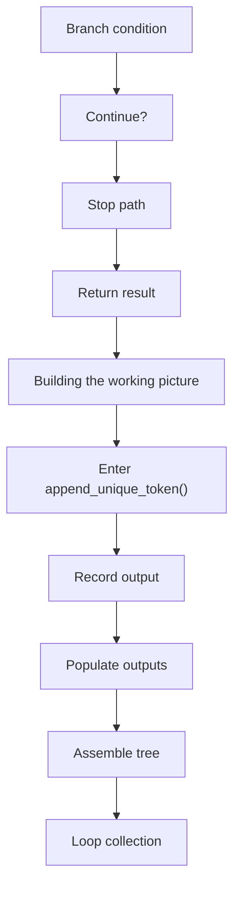
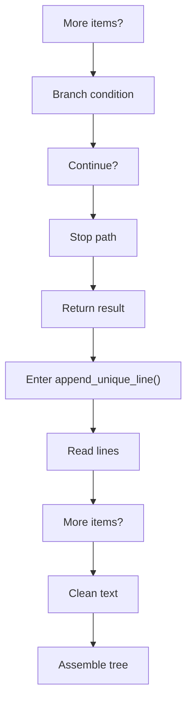
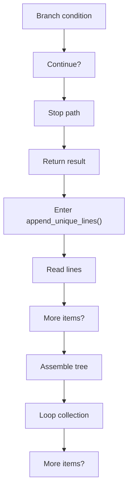
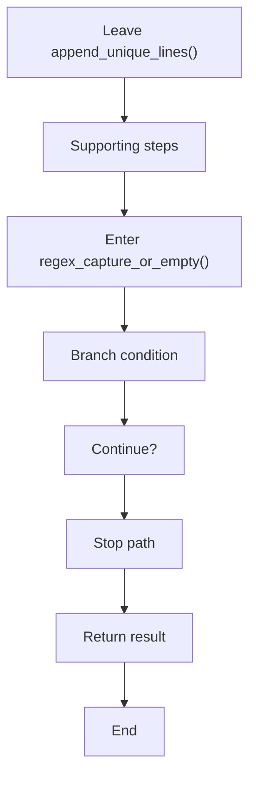

# creational_code_generator_internal_program_flow_03.cpp

- Source document: [creational_code_generator_internal.cpp.md](../creational_code_generator_internal.cpp.md)
- Purpose: decoupled implementation logic for a future code unit.

#### Part 17

#### Part 18

#### Part 19

#### Part 20

