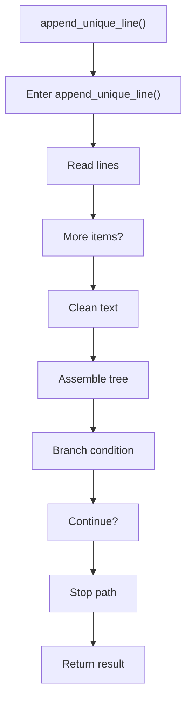

# append_unique_line.cpp

- Source document: [creational_code_generator_internal.cpp.md](../../creational_code_generator_internal.cpp.md)
- Purpose: decoupled implementation logic for a future code unit.

### append_unique_line()
This helper reshapes small pieces of data so the surrounding code can stay readable. It appears near line 463.

Inside the body, it mainly handles work one source line at a time, normalize raw text before later parsing, assemble tree or artifact structures, and branch on runtime conditions.

It branches on runtime conditions instead of following one fixed path. The caller receives a computed result or status from this step.

What it does:
- work one source line at a time
- normalize raw text before later parsing
- assemble tree or artifact structures
- branch on runtime conditions

Flow:

### Block 11 - append_unique_line() Details
#### Part 1

#### Part 2

