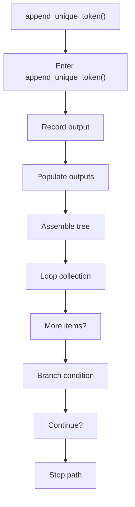
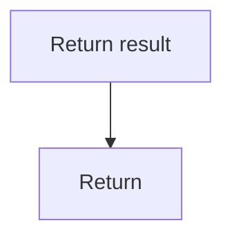

# append_unique_token.cpp

- Source document: [creational_code_generator_internal.cpp.md](../../creational_code_generator_internal.cpp.md)
- Purpose: decoupled implementation logic for a future code unit.

### append_unique_token()
This helper reshapes small pieces of data so the surrounding code can stay readable. It appears near line 447.

Inside the body, it mainly handles record derived output into collections, populate output fields or accumulators, assemble tree or artifact structures, and iterate over the active collection.

The implementation iterates over a collection or repeated workload. It branches on runtime conditions instead of following one fixed path. The caller receives a computed result or status from this step.

What it does:
- record derived output into collections
- populate output fields or accumulators
- assemble tree or artifact structures
- iterate over the active collection
- branch on runtime conditions

Flow:

### Block 10 - append_unique_token() Details
#### Part 1

#### Part 2

