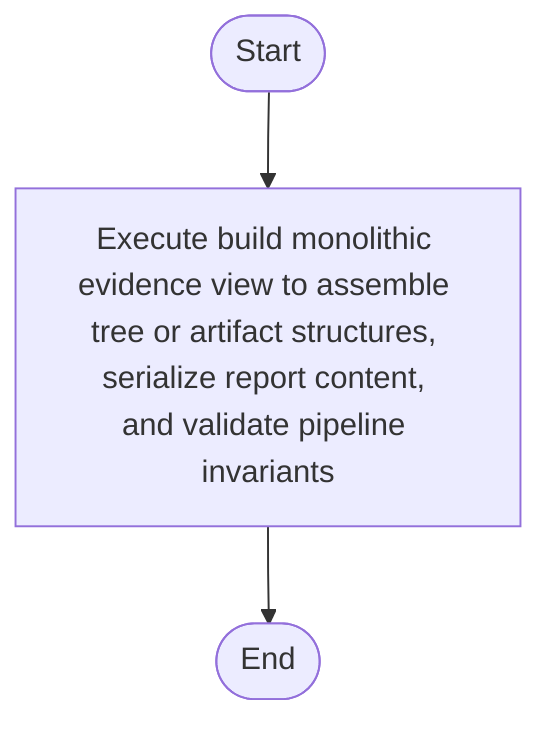

# creational_transform_evidence.cpp

- Source: Microservice/Modules/Source/Creational/Transform/creational_transform_evidence.cpp
- Kind: C++ implementation
- Lines: 80
- Role: Implements creational transform dispatch, evidence rendering, and rewrite helpers.
- Chronology: Runs after the generic parse tree exists so creational detection or transformation can operate on it.

## Notable Symbols
- build_monolithic_evidence_view
- retain_single_main_function
- build_source_type_skeleton_lines
- build_source_callsite_skeleton_lines

## Direct Dependencies
- internal/creational_transform_evidence_internal.hpp

## File Outline
### Responsibility

This source file implements a creational transform or evidence-rendering stage. It runs after the generic parse tree has been built and focuses on turning detected structure into rewritten code or explanatory evidence views. This source file implements creational-pattern analysis over the generic parse tree. It inspects parsed structure, applies pattern-specific rules, and emits detector results that later appear in the creational tree or transform decisions.

### Position In The Flow

Runs after the generic parse tree exists so creational detection or transformation can operate on it.

### Main Surface Area

Implements creational transform dispatch, evidence rendering, and rewrite helpers. The main surface area is easiest to track through symbols such as build_monolithic_evidence_view, retain_single_main_function, build_source_type_skeleton_lines, and build_source_callsite_skeleton_lines. It collaborates directly with internal/creational_transform_evidence_internal.hpp.

## File Activity


## Function Walkthrough

### build_monolithic_evidence_view
This routine assembles a larger structure from the inputs it receives. It appears near line 5.

Inside the body, it mainly handles assemble tree or artifact structures, serialize report content, validate pipeline invariants, and branch on runtime conditions.

It branches on runtime conditions instead of following one fixed path. The caller receives a computed result or status from this step.

Key operations:
- assemble tree or artifact structures
- serialize report content
- validate pipeline invariants
- branch on runtime conditions

Activity:
```mermaid
flowchart TD
    Start([build_monolithic_evidence_view()])
    N0[Enter build_monolithic_evidence_view()]
    N1[Assemble tree or artifact structures]
    N2[Serialize report content]
    N3[Validate pipeline invariants]
    N4[Branch on runtime conditions]
    N5[Return the result to the caller]
    End([Return])
    Start --> N0
    N0 --> N1
    N1 --> N2
    N2 --> N3
    N3 --> N4
    N4 --> N5
    N5 --> End
```

## Documentation Note
- This markdown file is part of the generated docs/Codebase mirror.
- It was generated from the repository state on 2026-04-23 after reading the existing docs corpus and the current source tree.

