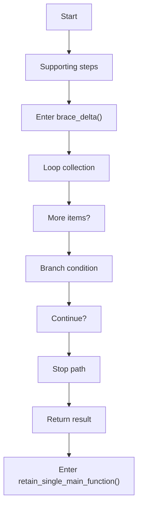
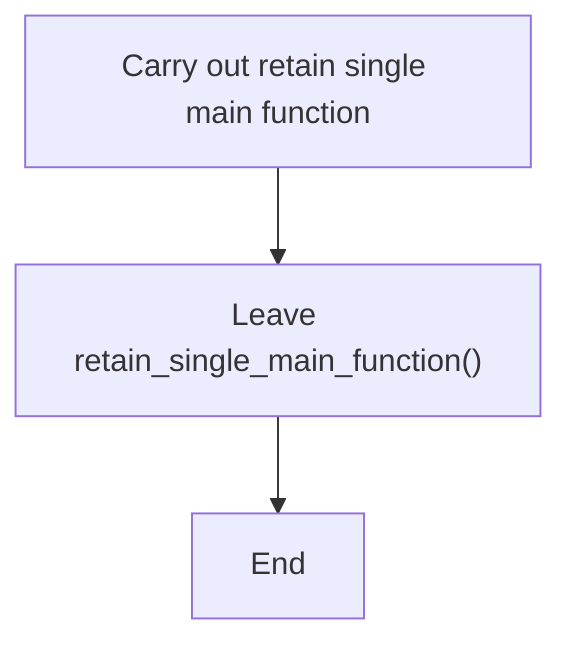
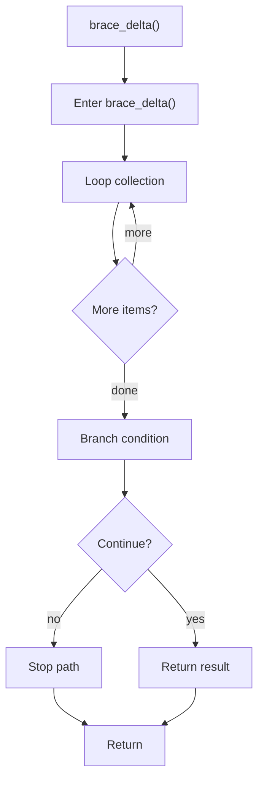
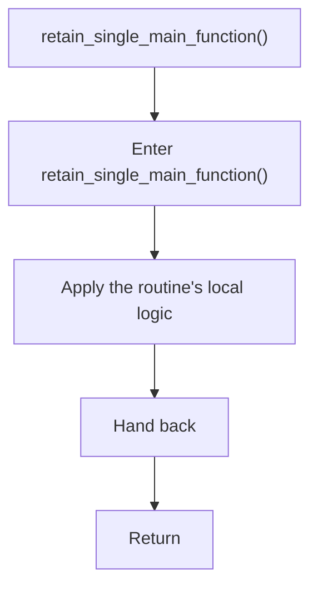

# creational_transform_evidence_main_retention.cpp

- Source: Microservice/Modules/Source/Creational/Transform/creational_transform_evidence_main_retention.cpp
- Kind: C++ implementation
- Lines: 147

## Story
### What Happens Here

This source file belongs to the older creational transform support path. It is useful for understanding previous rewrite behavior, but the current analyzer runtime focuses on tagging evidence instead of generating replacement code. This source file implements creational-pattern analysis over the generic parse tree. It inspects parsed structure, applies pattern-specific rules, and emits detector results that later appear in the creational tree or documentation tags.

### Why It Matters In The Flow

Runs after the generic parse tree exists so creational detection can label the structure.

### What To Watch While Reading

Implements creational transform dispatch, evidence rendering, and rewrite helpers. The main surface area is easiest to track through symbols such as MainOccurrence, brace_delta, retain_single_main_function, and main_signature_regex. It collaborates directly with internal/creational_transform_evidence_internal.hpp and regex.

## Program Flow
This diagram follows the action path in plain words. Decision diamonds show where the file can stop, branch, or repeat work instead of simply passing through a straight line.

### Block 1 - Program Flow Details
#### Part 1

#### Part 2

## Reading Map
Read this file as: Implements creational transform dispatch, evidence rendering, and rewrite helpers.

Where it sits in the run: Runs after the generic parse tree exists so creational detection can label the structure.

Names worth recognizing while reading: MainOccurrence, brace_delta, retain_single_main_function, main_signature_regex, file_marker_regex, and join_lines.

It leans on nearby contracts or tools such as internal/creational_transform_evidence_internal.hpp and regex.

## Story Groups

### Supporting Steps
These steps support the local behavior of the file.
- brace_delta() (line 7): Iterate over the active collection and branch on runtime conditions
- retain_single_main_function() (line 23): Owns a focused local responsibility.

## Function Stories

### brace_delta()
This routine owns one focused piece of the file's behavior. It appears near line 7.

Inside the body, it mainly handles iterate over the active collection and branch on runtime conditions.

The implementation iterates over a collection or repeated workload. It branches on runtime conditions instead of following one fixed path. The caller receives a computed result or status from this step.

What it does:
- iterate over the active collection
- branch on runtime conditions

Flow:

### retain_single_main_function()
This routine owns one focused piece of the file's behavior. It appears near line 23.

What it does:
- This routine is primarily structural and does not expose obvious runtime operations from static inspection.

Flow:

## Documentation Note
- This markdown file is part of the generated docs/Codebase mirror.
- It was generated from the repository state on 2026-04-23 after reading the existing docs corpus and the current source tree.
