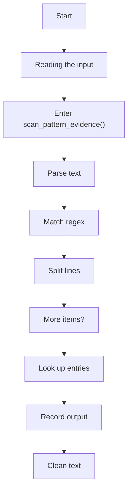
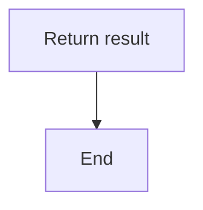
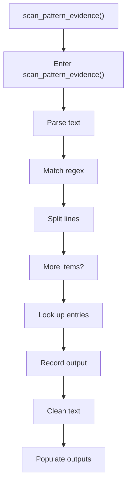
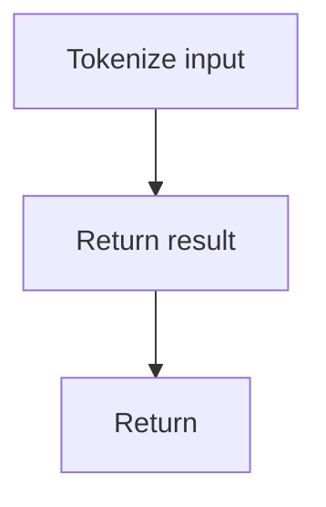

# creational_transform_evidence_scan.cpp

- Source: Microservice/Modules/Source/Creational/Transform/creational_transform_evidence_scan.cpp
- Kind: C++ implementation
- Lines: 264

## Story
### What Happens Here

This source file belongs to the older creational transform support path. It is useful for understanding previous rewrite behavior, but the current analyzer runtime focuses on tagging evidence instead of generating replacement code. This source file implements creational-pattern analysis over the generic parse tree. It inspects parsed structure, applies pattern-specific rules, and emits detector results that later appear in the creational tree or documentation tags.

### Why It Matters In The Flow

Runs after the generic parse tree exists so creational detection can label the structure.

### What To Watch While Reading

Implements creational transform dispatch, evidence rendering, and rewrite helpers. The main surface area is easiest to track through symbols such as scan_pattern_evidence, singleton_accessor_regex, singleton_call_regex, and builder_class_regex. It collaborates directly with internal/creational_transform_evidence_internal.hpp, regex, unordered_set, and utility.

## Program Flow
This diagram follows the action path in plain words. Decision diamonds show where the file can stop, branch, or repeat work instead of simply passing through a straight line.

### Block 1 - Program Flow Details
#### Part 1

#### Part 2

## Reading Map
Read this file as: Implements creational transform dispatch, evidence rendering, and rewrite helpers.

Where it sits in the run: Runs after the generic parse tree exists so creational detection can label the structure.

Names worth recognizing while reading: scan_pattern_evidence, singleton_accessor_regex, singleton_call_regex, builder_class_regex, builder_step_regex, and build_method_regex.

It leans on nearby contracts or tools such as internal/creational_transform_evidence_internal.hpp, regex, unordered_set, and utility.

## Story Groups

### Reading The Input
These steps turn raw text or arguments into something the program can follow.
- scan_pattern_evidence() (line 9): Parse source text into structured values, match source text with regular expressions, and split the source into individual lines

## Function Stories

### scan_pattern_evidence()
This routine ingests source content and turns it into a more useful structured form. It appears near line 9.

Inside the body, it mainly handles parse source text into structured values, match source text with regular expressions, split the source into individual lines, and look up entries in previously collected maps or sets.

The implementation iterates over a collection or repeated workload. It branches on runtime conditions instead of following one fixed path. The caller receives a computed result or status from this step.

What it does:
- parse source text into structured values
- match source text with regular expressions
- split the source into individual lines
- look up entries in previously collected maps or sets
- record derived output into collections
- normalize raw text before later parsing
- populate output fields or accumulators
- parse or tokenize input text
- assemble tree or artifact structures
- iterate over the active collection
- branch on runtime conditions

Flow:

### Block 2 - scan_pattern_evidence() Details
#### Part 1

#### Part 2

## Documentation Note
- This markdown file is part of the generated docs/Codebase mirror.
- It was generated from the repository state on 2026-04-23 after reading the existing docs corpus and the current source tree.
