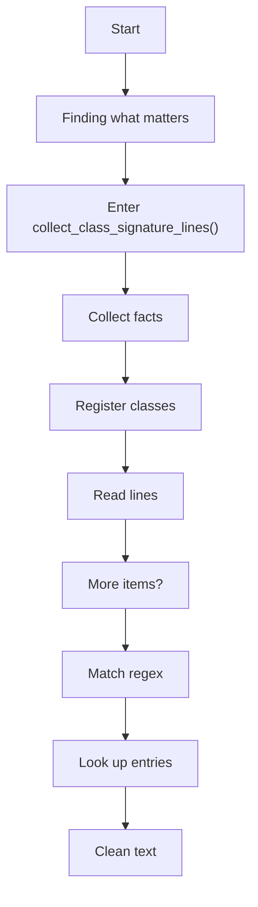
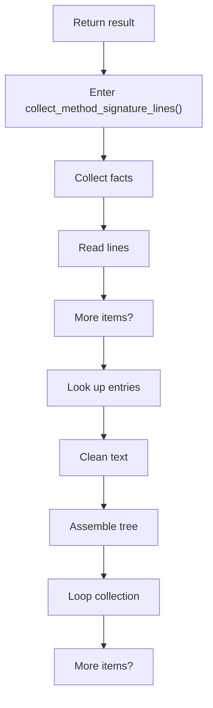
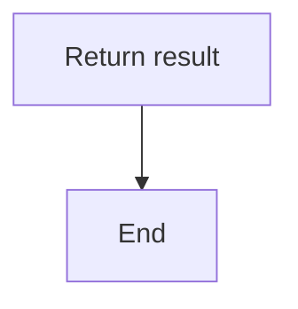
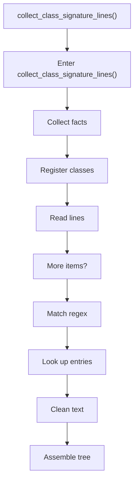
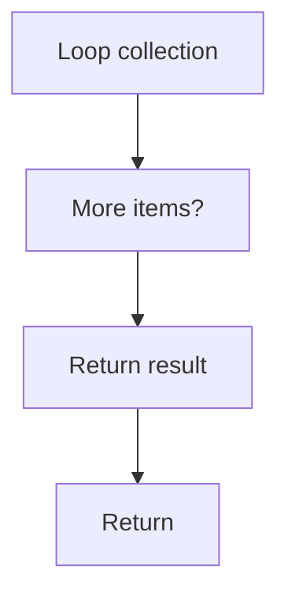
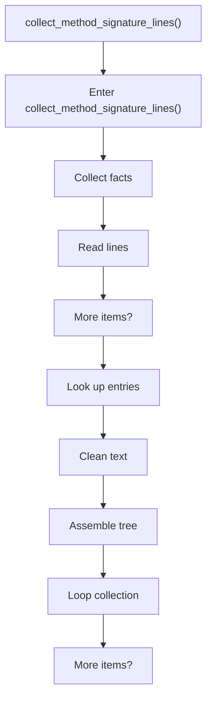
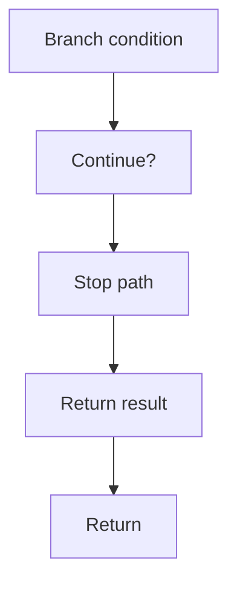

# creational_transform_evidence_signatures.cpp

- Source: Microservice/Modules/Source/Creational/Transform/creational_transform_evidence_signatures.cpp
- Kind: C++ implementation
- Lines: 77

## Story
### What Happens Here

This source file belongs to the older creational transform support path. It is useful for understanding previous rewrite behavior, but the current analyzer runtime focuses on tagging evidence instead of generating replacement code. This source file implements creational-pattern analysis over the generic parse tree. It inspects parsed structure, applies pattern-specific rules, and emits detector results that later appear in the creational tree or documentation tags.

### Why It Matters In The Flow

Runs after the generic parse tree exists so creational detection can label the structure.

### What To Watch While Reading

Implements creational transform dispatch, evidence rendering, and rewrite helpers. The main surface area is easiest to track through symbols such as collect_class_signature_lines, wanted, class_decl_regex, and collect_method_signature_lines. It collaborates directly with internal/creational_transform_evidence_internal.hpp, regex, and unordered_set.

## Program Flow
This diagram follows the action path in plain words. Decision diamonds show where the file can stop, branch, or repeat work instead of simply passing through a straight line.

### Block 1 - Program Flow Details
#### Part 1

#### Part 2

#### Part 3

## Reading Map
Read this file as: Implements creational transform dispatch, evidence rendering, and rewrite helpers.

Where it sits in the run: Runs after the generic parse tree exists so creational detection can label the structure.

Names worth recognizing while reading: collect_class_signature_lines, wanted, class_decl_regex, and collect_method_signature_lines.

It leans on nearby contracts or tools such as internal/creational_transform_evidence_internal.hpp, regex, and unordered_set.

## Story Groups

### Finding What Matters
These steps pick out the facts, traces, and relationships that later stages need.
- collect_class_signature_lines() (line 8): Collect derived facts for later stages, inspect or register class-level information, and work one source line at a time
- collect_method_signature_lines() (line 37): Collect derived facts for later stages, work one source line at a time, and look up entries in previously collected maps or sets

## Function Stories

### collect_class_signature_lines()
This routine connects discovered items back into the broader model owned by the file. It appears near line 8.

Inside the body, it mainly handles collect derived facts for later stages, inspect or register class-level information, work one source line at a time, and match source text with regular expressions.

The implementation iterates over a collection or repeated workload. It branches on runtime conditions instead of following one fixed path. The caller receives a computed result or status from this step.

What it does:
- collect derived facts for later stages
- inspect or register class-level information
- work one source line at a time
- match source text with regular expressions
- look up entries in previously collected maps or sets
- normalize raw text before later parsing
- assemble tree or artifact structures
- iterate over the active collection
- branch on runtime conditions

Flow:

### Block 2 - collect_class_signature_lines() Details
#### Part 1

#### Part 2

### collect_method_signature_lines()
This routine connects discovered items back into the broader model owned by the file. It appears near line 37.

Inside the body, it mainly handles collect derived facts for later stages, work one source line at a time, look up entries in previously collected maps or sets, and normalize raw text before later parsing.

The implementation iterates over a collection or repeated workload. It branches on runtime conditions instead of following one fixed path. The caller receives a computed result or status from this step.

What it does:
- collect derived facts for later stages
- work one source line at a time
- look up entries in previously collected maps or sets
- normalize raw text before later parsing
- assemble tree or artifact structures
- iterate over the active collection
- branch on runtime conditions

Flow:

### Block 3 - collect_method_signature_lines() Details
#### Part 1

#### Part 2

## Documentation Note
- This markdown file is part of the generated docs/Codebase mirror.
- It was generated from the repository state on 2026-04-23 after reading the existing docs corpus and the current source tree.
