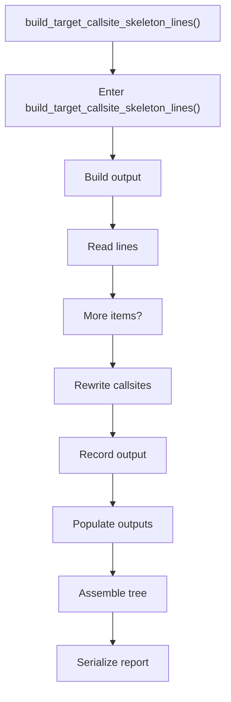
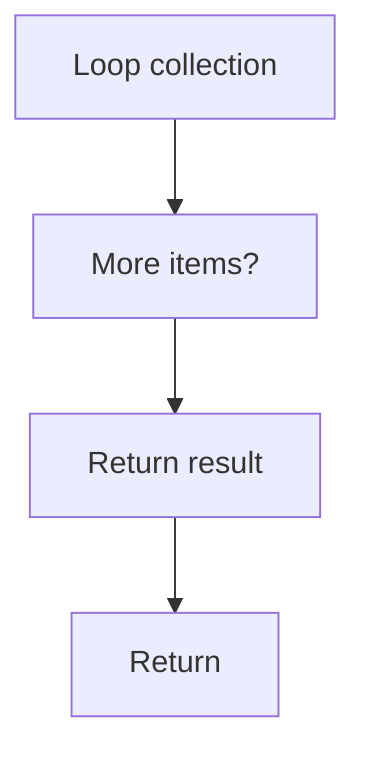

# build_target_callsite_skeleton_lines.cpp

- Source document: [creational_transform_evidence_skeleton.cpp.md](../../creational_transform_evidence_skeleton.cpp.md)
- Purpose: decoupled implementation logic for a future code unit.

### build_target_callsite_skeleton_lines()
This routine assembles a larger structure from the inputs it receives. It appears near line 97.

Inside the body, it mainly handles build or append the next output structure, work one source line at a time, recognize or rewrite callsite structure, and record derived output into collections.

The implementation iterates over a collection or repeated workload. It branches on runtime conditions instead of following one fixed path. The caller receives a computed result or status from this step.

What it does:
- build or append the next output structure
- work one source line at a time
- recognize or rewrite callsite structure
- record derived output into collections
- populate output fields or accumulators
- assemble tree or artifact structures
- serialize report content
- iterate over the active collection
- branch on runtime conditions

Flow:

### Block 5 - build_target_callsite_skeleton_lines() Details
#### Part 1

#### Part 2

