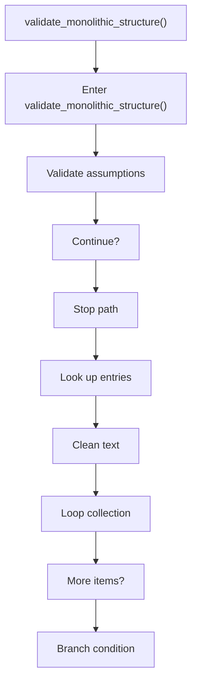
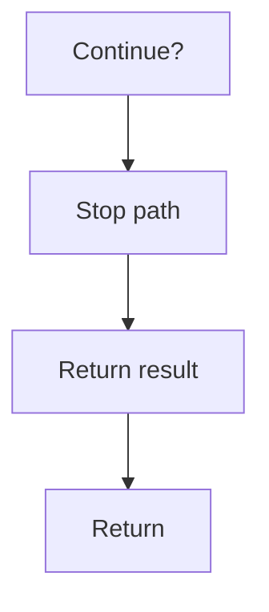

# validate_monolithic_structure.cpp

- Source document: [creational_transform_evidence_skeleton.cpp.md](../../creational_transform_evidence_skeleton.cpp.md)
- Purpose: decoupled implementation logic for a future code unit.

### validate_monolithic_structure()
This routine acts as a guard step before later logic is allowed to continue. It appears near line 143.

Inside the body, it mainly handles validate assumptions before continuing, look up entries in previously collected maps or sets, normalize raw text before later parsing, and iterate over the active collection.

The implementation iterates over a collection or repeated workload. It branches on runtime conditions instead of following one fixed path. The caller receives a computed result or status from this step.

What it does:
- validate assumptions before continuing
- look up entries in previously collected maps or sets
- normalize raw text before later parsing
- iterate over the active collection
- branch on runtime conditions

Flow:

### Block 6 - validate_monolithic_structure() Details
#### Part 1

#### Part 2

