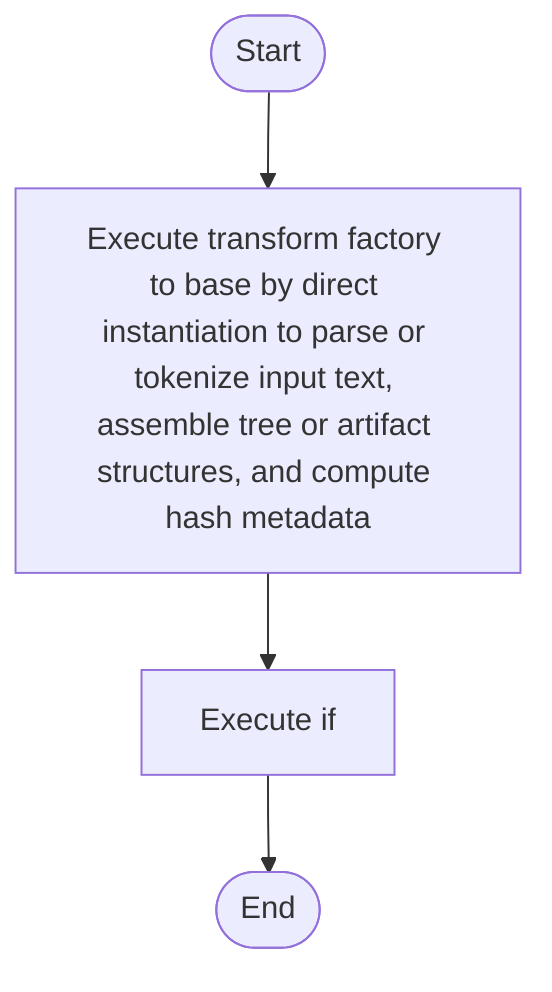

# creational_transform_factory_reverse.cpp

- Source: Microservice/Modules/Source/Creational/Transform/creational_transform_factory_reverse.cpp
- Kind: C++ implementation
- Lines: 326
- Role: Implements creational transform dispatch, evidence rendering, and rewrite helpers.
- Chronology: Runs after the generic parse tree exists so creational detection or transformation can operate on it.

## Notable Symbols
- transform_factory_to_base_by_direct_instantiation

## Direct Dependencies
- Transform/creational_transform_factory_reverse.hpp
- Transform/creational_code_generator_internal.hpp
- internal/creational_transform_factory_reverse_internal.hpp
- algorithm
- string
- unordered_map
- unordered_set
- vector

## File Outline
### Responsibility

This source file implements a creational transform or evidence-rendering stage. It runs after the generic parse tree has been built and focuses on turning detected structure into rewritten code or explanatory evidence views. This source file implements creational-pattern analysis over the generic parse tree. It inspects parsed structure, applies pattern-specific rules, and emits detector results that later appear in the creational tree or transform decisions.

### Position In The Flow

Runs after the generic parse tree exists so creational detection or transformation can operate on it.

### Main Surface Area

Implements creational transform dispatch, evidence rendering, and rewrite helpers. The main surface area is easiest to track through symbols such as transform_factory_to_base_by_direct_instantiation. It collaborates directly with Transform/creational_transform_factory_reverse.hpp, Transform/creational_code_generator_internal.hpp, internal/creational_transform_factory_reverse_internal.hpp, and algorithm.

## File Activity


## Function Walkthrough

### transform_factory_to_base_by_direct_instantiation
This routine owns one focused piece of the file's behavior. It appears near line 13.

Inside the body, it mainly handles parse or tokenize input text, assemble tree or artifact structures, compute hash metadata, and iterate over the active collection.

The implementation iterates over a collection or repeated workload. It branches on runtime conditions instead of following one fixed path. The caller receives a computed result or status from this step.

Key operations:
- parse or tokenize input text
- assemble tree or artifact structures
- compute hash metadata
- iterate over the active collection
- branch on runtime conditions

Activity:
```mermaid
flowchart TD
    Start([transform_factory_to_base_by_direct_instantiation()])
    N0[Enter transform_factory_to_base_by_direct_instantiation()]
    N1[Parse or tokenize input text]
    N2[Assemble tree or artifact structures]
    N3[Compute hash metadata]
    N4[Iterate over the active collection]
    N5[Branch on runtime conditions]
    N6[Return the result to the caller]
    End([Return])
    Start --> N0
    N0 --> N1
    N1 --> N2
    N2 --> N3
    N3 --> N4
    N4 --> N5
    N5 --> N6
    N6 --> End
```

### if
This routine owns one focused piece of the file's behavior. It appears near line 152.

Key operations:
- This routine is primarily structural and does not expose obvious runtime operations from static inspection.

Activity:
```mermaid
flowchart TD
    Start([if()])
    N0[Enter if()]
    N1[Apply the routine's local logic]
    N2[Hand control back to the caller]
    End([Return])
    Start --> N0
    N0 --> N1
    N1 --> N2
    N2 --> End
```

## Documentation Note
- This markdown file is part of the generated docs/Codebase mirror.
- It was generated from the repository state on 2026-04-23 after reading the existing docs corpus and the current source tree.

