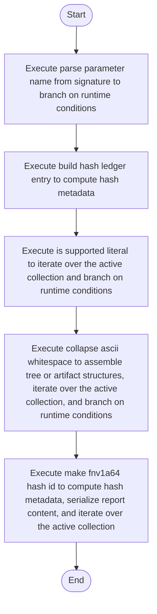

# creational_transform_factory_reverse_parse_literals.cpp

- Source: Microservice/Modules/Source/Creational/Transform/creational_transform_factory_reverse_parse_literals.cpp
- Kind: C++ implementation
- Lines: 298
- Role: Implements creational transform dispatch, evidence rendering, and rewrite helpers.
- Chronology: Runs after the generic parse tree exists so creational detection or transformation can operate on it.

## Notable Symbols
- escape_regex_literal
- find_matching_paren
- is_supported_literal
- normalize_literal
- trim
- collapse_ascii_whitespace
- make_vital_part_hash_id
- make_fnv1a64_hash_id
- std::setfill
- build_hash_ledger_entry
- first_return_expression
- return_regex

## Direct Dependencies
- internal/creational_transform_factory_reverse_internal.hpp
- Transform/creational_code_generator_internal.hpp
- cctype
- iomanip
- regex
- sstream
- string

## File Outline
### Responsibility

This source file implements a creational transform or evidence-rendering stage. It runs after the generic parse tree has been built and focuses on turning detected structure into rewritten code or explanatory evidence views. This source file implements creational-pattern analysis over the generic parse tree. It inspects parsed structure, applies pattern-specific rules, and emits detector results that later appear in the creational tree or transform decisions.

### Position In The Flow

Runs after the generic parse tree exists so creational detection or transformation can operate on it.

### Main Surface Area

Implements creational transform dispatch, evidence rendering, and rewrite helpers. The main surface area is easiest to track through symbols such as escape_regex_literal, find_matching_paren, is_supported_literal, and normalize_literal. It collaborates directly with internal/creational_transform_factory_reverse_internal.hpp, Transform/creational_code_generator_internal.hpp, cctype, and iomanip.

## File Activity


## Function Walkthrough

### escape_regex_literal
This helper reshapes small pieces of data so the surrounding code can stay readable. It appears near line 12.

Inside the body, it mainly handles assemble tree or artifact structures and iterate over the active collection.

The implementation iterates over a collection or repeated workload. The caller receives a computed result or status from this step.

Key operations:
- assemble tree or artifact structures
- iterate over the active collection

Activity:
```mermaid
flowchart TD
    Start([escape_regex_literal()])
    N0[Enter escape_regex_literal()]
    N1[Assemble tree or artifact structures]
    N2[Iterate over the active collection]
    N3[Return the result to the caller]
    End([Return])
    Start --> N0
    N0 --> N1
    N1 --> N2
    N2 --> N3
    N3 --> End
```

### find_matching_paren
This routine owns one focused piece of the file's behavior. It appears near line 46.

Inside the body, it mainly handles iterate over the active collection and branch on runtime conditions.

The implementation iterates over a collection or repeated workload. It branches on runtime conditions instead of following one fixed path. The caller receives a computed result or status from this step.

Key operations:
- iterate over the active collection
- branch on runtime conditions

Activity:
```mermaid
flowchart TD
    Start([find_matching_paren()])
    N0[Enter find_matching_paren()]
    N1[Iterate over the active collection]
    N2[Branch on runtime conditions]
    N3[Return the result to the caller]
    End([Return])
    Start --> N0
    N0 --> N1
    N1 --> N2
    N2 --> N3
    N3 --> End
```

### if
This routine owns one focused piece of the file's behavior. It appears near line 61.

Inside the body, it mainly handles branch on runtime conditions.

It branches on runtime conditions instead of following one fixed path. The caller receives a computed result or status from this step.

Key operations:
- branch on runtime conditions

Activity:
```mermaid
flowchart TD
    Start([if()])
    N0[Enter if()]
    N1[Branch on runtime conditions]
    N2[Return the result to the caller]
    End([Return])
    Start --> N0
    N0 --> N1
    N1 --> N2
    N2 --> End
```

### is_supported_literal
This routine owns one focused piece of the file's behavior. It appears near line 73.

Inside the body, it mainly handles iterate over the active collection and branch on runtime conditions.

The implementation iterates over a collection or repeated workload. It branches on runtime conditions instead of following one fixed path. The caller receives a computed result or status from this step.

Key operations:
- iterate over the active collection
- branch on runtime conditions

Activity:
```mermaid
flowchart TD
    Start([is_supported_literal()])
    N0[Enter is_supported_literal()]
    N1[Iterate over the active collection]
    N2[Branch on runtime conditions]
    N3[Return the result to the caller]
    End([Return])
    Start --> N0
    N0 --> N1
    N1 --> N2
    N2 --> N3
    N3 --> End
```

### normalize_literal
This helper reshapes small pieces of data so the surrounding code can stay readable. It appears near line 120.

The caller receives a computed result or status from this step.

Key operations:
- This routine is primarily structural and does not expose obvious runtime operations from static inspection.

Activity:
```mermaid
flowchart TD
    Start([normalize_literal()])
    N0[Enter normalize_literal()]
    N1[Apply the routine's local logic]
    N2[Return the result to the caller]
    End([Return])
    Start --> N0
    N0 --> N1
    N1 --> N2
    N2 --> End
```

### collapse_ascii_whitespace
This routine owns one focused piece of the file's behavior. It appears near line 125.

Inside the body, it mainly handles assemble tree or artifact structures, iterate over the active collection, and branch on runtime conditions.

The implementation iterates over a collection or repeated workload. It branches on runtime conditions instead of following one fixed path. The caller receives a computed result or status from this step.

Key operations:
- assemble tree or artifact structures
- iterate over the active collection
- branch on runtime conditions

Activity:
```mermaid
flowchart TD
    Start([collapse_ascii_whitespace()])
    N0[Enter collapse_ascii_whitespace()]
    N1[Assemble tree or artifact structures]
    N2[Iterate over the active collection]
    N3[Branch on runtime conditions]
    N4[Return the result to the caller]
    End([Return])
    Start --> N0
    N0 --> N1
    N1 --> N2
    N2 --> N3
    N3 --> N4
    N4 --> End
```

### make_vital_part_hash_id
This routine assembles a larger structure from the inputs it receives. It appears near line 150.

Inside the body, it mainly handles compute hash metadata.

The caller receives a computed result or status from this step.

Key operations:
- compute hash metadata

Activity:
```mermaid
flowchart TD
    Start([make_vital_part_hash_id()])
    N0[Enter make_vital_part_hash_id()]
    N1[Compute hash metadata]
    N2[Return the result to the caller]
    End([Return])
    Start --> N0
    N0 --> N1
    N1 --> N2
    N2 --> End
```

### make_fnv1a64_hash_id
This routine assembles a larger structure from the inputs it receives. It appears near line 155.

Inside the body, it mainly handles compute hash metadata, serialize report content, and iterate over the active collection.

The implementation iterates over a collection or repeated workload. The caller receives a computed result or status from this step.

Key operations:
- compute hash metadata
- serialize report content
- iterate over the active collection

Activity:
```mermaid
flowchart TD
    Start([make_fnv1a64_hash_id()])
    N0[Enter make_fnv1a64_hash_id()]
    N1[Compute hash metadata]
    N2[Serialize report content]
    N3[Iterate over the active collection]
    N4[Return the result to the caller]
    End([Return])
    Start --> N0
    N0 --> N1
    N1 --> N2
    N2 --> N3
    N3 --> N4
    N4 --> End
```

### build_hash_ledger_entry
This routine assembles a larger structure from the inputs it receives. It appears near line 173.

Inside the body, it mainly handles compute hash metadata.

The caller receives a computed result or status from this step.

Key operations:
- compute hash metadata

Activity:
```mermaid
flowchart TD
    Start([build_hash_ledger_entry()])
    N0[Enter build_hash_ledger_entry()]
    N1[Compute hash metadata]
    N2[Return the result to the caller]
    End([Return])
    Start --> N0
    N0 --> N1
    N1 --> N2
    N2 --> End
```

### first_return_expression
This routine owns one focused piece of the file's behavior. It appears near line 182.

Inside the body, it mainly handles branch on runtime conditions.

It branches on runtime conditions instead of following one fixed path. The caller receives a computed result or status from this step.

Key operations:
- branch on runtime conditions

Activity:
```mermaid
flowchart TD
    Start([first_return_expression()])
    N0[Enter first_return_expression()]
    N1[Branch on runtime conditions]
    N2[Return the result to the caller]
    End([Return])
    Start --> N0
    N0 --> N1
    N1 --> N2
    N2 --> End
```

### parse_parameter_name_from_signature
This routine ingests source content and turns it into a more useful structured form. It appears near line 193.

Inside the body, it mainly handles branch on runtime conditions.

It branches on runtime conditions instead of following one fixed path. The caller receives a computed result or status from this step.

Key operations:
- branch on runtime conditions

Activity:
```mermaid
flowchart TD
    Start([parse_parameter_name_from_signature()])
    N0[Enter parse_parameter_name_from_signature()]
    N1[Branch on runtime conditions]
    N2[Return the result to the caller]
    End([Return])
    Start --> N0
    N0 --> N1
    N1 --> N2
    N2 --> End
```

### literal_from_condition
This routine owns one focused piece of the file's behavior. It appears near line 218.

Inside the body, it mainly handles branch on runtime conditions.

It branches on runtime conditions instead of following one fixed path. The caller receives a computed result or status from this step.

Key operations:
- branch on runtime conditions

Activity:
```mermaid
flowchart TD
    Start([literal_from_condition()])
    N0[Enter literal_from_condition()]
    N1[Branch on runtime conditions]
    N2[Return the result to the caller]
    End([Return])
    Start --> N0
    N0 --> N1
    N1 --> N2
    N2 --> End
```

### statement_after_condition
This routine owns one focused piece of the file's behavior. It appears near line 258.

Inside the body, it mainly handles iterate over the active collection and branch on runtime conditions.

The implementation iterates over a collection or repeated workload. It branches on runtime conditions instead of following one fixed path. The caller receives a computed result or status from this step.

Key operations:
- iterate over the active collection
- branch on runtime conditions

Activity:
```mermaid
flowchart TD
    Start([statement_after_condition()])
    N0[Enter statement_after_condition()]
    N1[Iterate over the active collection]
    N2[Branch on runtime conditions]
    N3[Return the result to the caller]
    End([Return])
    Start --> N0
    N0 --> N1
    N1 --> N2
    N2 --> N3
    N3 --> End
```

## Documentation Note
- This markdown file is part of the generated docs/Codebase mirror.
- It was generated from the repository state on 2026-04-23 after reading the existing docs corpus and the current source tree.

