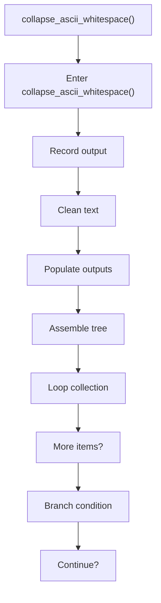
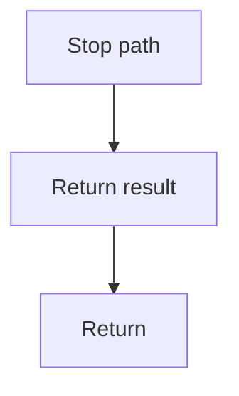

# collapse_ascii_whitespace.cpp

- Source document: [creational_transform_factory_reverse_parse_literals.cpp.md](../../creational_transform_factory_reverse_parse_literals.cpp.md)
- Purpose: decoupled implementation logic for a future code unit.

### collapse_ascii_whitespace()
This routine owns one focused piece of the file's behavior. It appears near line 125.

Inside the body, it mainly handles record derived output into collections, normalize raw text before later parsing, populate output fields or accumulators, and assemble tree or artifact structures.

The implementation iterates over a collection or repeated workload. It branches on runtime conditions instead of following one fixed path. The caller receives a computed result or status from this step.

What it does:
- record derived output into collections
- normalize raw text before later parsing
- populate output fields or accumulators
- assemble tree or artifact structures
- iterate over the active collection
- branch on runtime conditions

Flow:

### Block 2 - collapse_ascii_whitespace() Details
#### Part 1

#### Part 2

