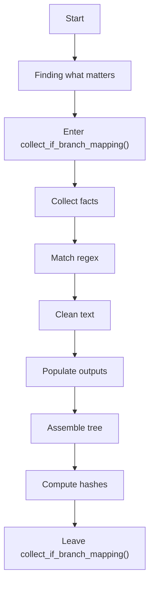
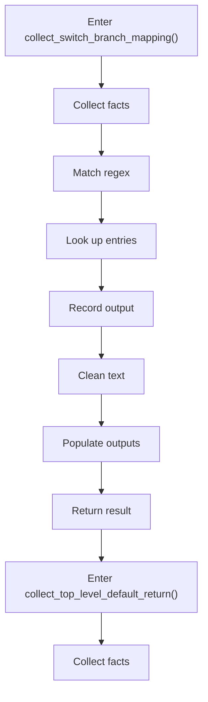
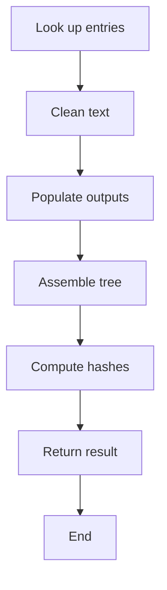
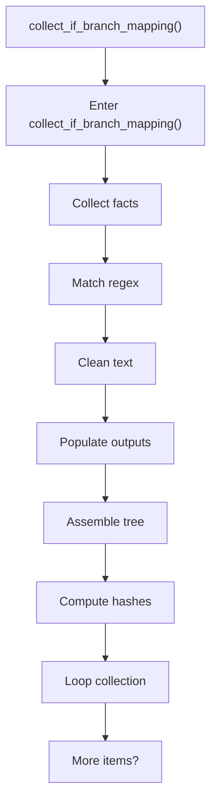
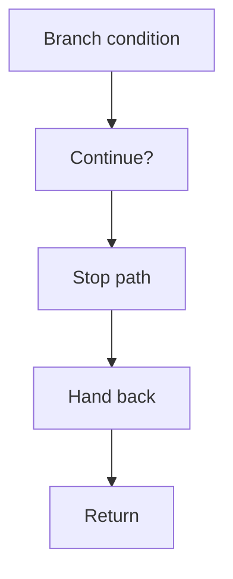
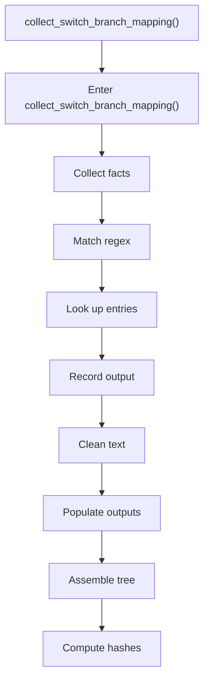
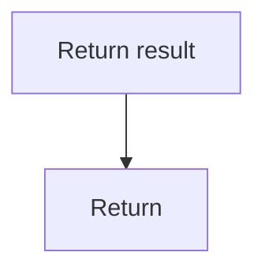
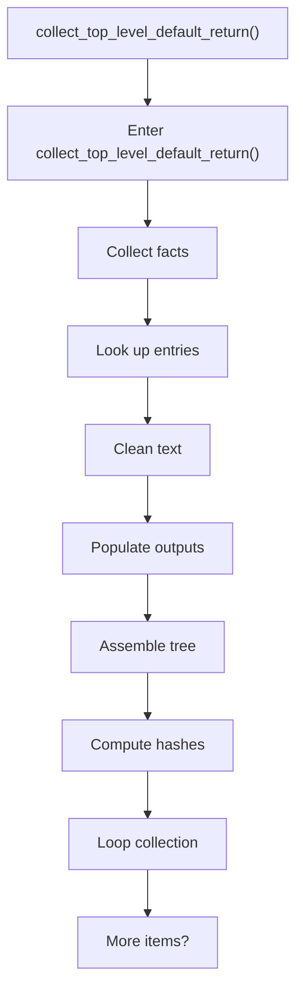
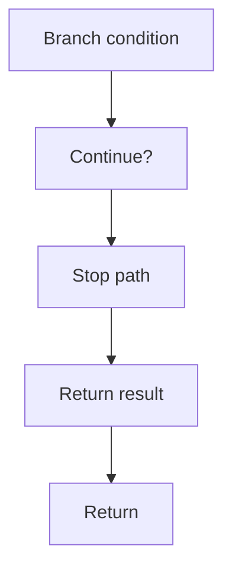

# creational_transform_factory_reverse_parse_mapping.cpp

- Source: Microservice/Modules/Source/Creational/Transform/creational_transform_factory_reverse_parse_mapping.cpp
- Kind: C++ implementation
- Lines: 226

## Story
### What Happens Here

This source file belongs to the older creational transform support path. It is useful for understanding previous rewrite behavior, but the current analyzer runtime focuses on tagging evidence instead of generating replacement code. This source file implements creational-pattern analysis over the generic parse tree. It inspects parsed structure, applies pattern-specific rules, and emits detector results that later appear in the creational tree or documentation tags.

### Why It Matters In The Flow

Runs after the generic parse tree exists so creational detection can label the structure.

### What To Watch While Reading

Implements creational transform dispatch, evidence rendering, and rewrite helpers. The main surface area is easiest to track through symbols such as SwitchLabel, collect_if_branch_mapping, if_condition_regex, and collect_switch_branch_mapping. It collaborates directly with internal/creational_transform_factory_reverse_internal.hpp, Transform/creational_code_generator_internal.hpp, cctype, and regex.

## Program Flow
This diagram follows the action path in plain words. Decision diamonds show where the file can stop, branch, or repeat work instead of simply passing through a straight line.

### Block 1 - Program Flow Details
#### Part 1

#### Part 2

#### Part 3

## Reading Map
Read this file as: Implements creational transform dispatch, evidence rendering, and rewrite helpers.

Where it sits in the run: Runs after the generic parse tree exists so creational detection can label the structure.

Names worth recognizing while reading: SwitchLabel, collect_if_branch_mapping, if_condition_regex, collect_switch_branch_mapping, switch_regex, and label_regex.

It leans on nearby contracts or tools such as internal/creational_transform_factory_reverse_internal.hpp, Transform/creational_code_generator_internal.hpp, cctype, regex, string, and vector.

## Story Groups

### Finding What Matters
These steps pick out the facts, traces, and relationships that later stages need.
- collect_if_branch_mapping() (line 11): Collect derived facts for later stages, match source text with regular expressions, and normalize raw text before later parsing
- collect_switch_branch_mapping() (line 56): Collect derived facts for later stages, match source text with regular expressions, and look up entries in previously collected maps or sets
- collect_top_level_default_return() (line 168): Collect derived facts for later stages, look up entries in previously collected maps or sets, and normalize raw text before later parsing

## Function Stories

### collect_if_branch_mapping()
This routine connects discovered items back into the broader model owned by the file. It appears near line 11.

Inside the body, it mainly handles collect derived facts for later stages, match source text with regular expressions, normalize raw text before later parsing, and populate output fields or accumulators.

The implementation iterates over a collection or repeated workload. It branches on runtime conditions instead of following one fixed path.

What it does:
- collect derived facts for later stages
- match source text with regular expressions
- normalize raw text before later parsing
- populate output fields or accumulators
- assemble tree or artifact structures
- compute hash metadata
- iterate over the active collection
- branch on runtime conditions

Flow:

### Block 2 - collect_if_branch_mapping() Details
#### Part 1

#### Part 2

### collect_switch_branch_mapping()
This routine connects discovered items back into the broader model owned by the file. It appears near line 56.

Inside the body, it mainly handles collect derived facts for later stages, match source text with regular expressions, look up entries in previously collected maps or sets, and record derived output into collections.

The implementation iterates over a collection or repeated workload. It branches on runtime conditions instead of following one fixed path. The caller receives a computed result or status from this step.

What it does:
- collect derived facts for later stages
- match source text with regular expressions
- look up entries in previously collected maps or sets
- record derived output into collections
- normalize raw text before later parsing
- populate output fields or accumulators
- assemble tree or artifact structures
- compute hash metadata
- iterate over the active collection
- branch on runtime conditions

Flow:

### Block 3 - collect_switch_branch_mapping() Details
#### Part 1

#### Part 2

### collect_top_level_default_return()
This routine connects discovered items back into the broader model owned by the file. It appears near line 168.

Inside the body, it mainly handles collect derived facts for later stages, look up entries in previously collected maps or sets, normalize raw text before later parsing, and populate output fields or accumulators.

The implementation iterates over a collection or repeated workload. It branches on runtime conditions instead of following one fixed path. The caller receives a computed result or status from this step.

What it does:
- collect derived facts for later stages
- look up entries in previously collected maps or sets
- normalize raw text before later parsing
- populate output fields or accumulators
- assemble tree or artifact structures
- compute hash metadata
- iterate over the active collection
- branch on runtime conditions

Flow:

### Block 4 - collect_top_level_default_return() Details
#### Part 1

#### Part 2

## Documentation Note
- This markdown file is part of the generated docs/Codebase mirror.
- It was generated from the repository state on 2026-04-23 after reading the existing docs corpus and the current source tree.
