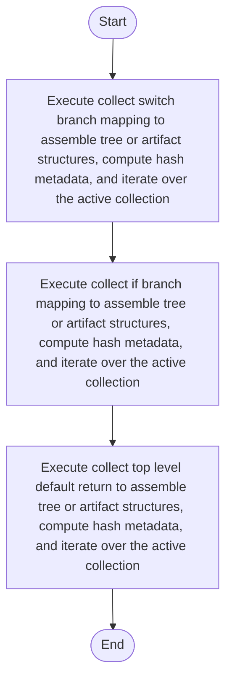

# creational_transform_factory_reverse_parse_mapping.cpp

- Source: Microservice/Modules/Source/Creational/Transform/creational_transform_factory_reverse_parse_mapping.cpp
- Kind: C++ implementation
- Lines: 226
- Role: Implements creational transform dispatch, evidence rendering, and rewrite helpers.
- Chronology: Runs after the generic parse tree exists so creational detection or transformation can operate on it.

## Notable Symbols
- SwitchLabel
- collect_if_branch_mapping
- if_condition_regex
- collect_switch_branch_mapping
- switch_regex
- label_regex
- it
- collect_top_level_default_return

## Direct Dependencies
- internal/creational_transform_factory_reverse_internal.hpp
- Transform/creational_code_generator_internal.hpp
- cctype
- regex
- string
- vector

## File Outline
### Responsibility

This source file implements a creational transform or evidence-rendering stage. It runs after the generic parse tree has been built and focuses on turning detected structure into rewritten code or explanatory evidence views. This source file implements creational-pattern analysis over the generic parse tree. It inspects parsed structure, applies pattern-specific rules, and emits detector results that later appear in the creational tree or transform decisions.

### Position In The Flow

Runs after the generic parse tree exists so creational detection or transformation can operate on it.

### Main Surface Area

Implements creational transform dispatch, evidence rendering, and rewrite helpers. The main surface area is easiest to track through symbols such as SwitchLabel, collect_if_branch_mapping, if_condition_regex, and collect_switch_branch_mapping. It collaborates directly with internal/creational_transform_factory_reverse_internal.hpp, Transform/creational_code_generator_internal.hpp, cctype, and regex.

## File Activity


## Function Walkthrough

### collect_if_branch_mapping
This routine connects discovered items back into the broader model owned by the file. It appears near line 11.

Inside the body, it mainly handles assemble tree or artifact structures, compute hash metadata, iterate over the active collection, and branch on runtime conditions.

The implementation iterates over a collection or repeated workload. It branches on runtime conditions instead of following one fixed path.

Key operations:
- assemble tree or artifact structures
- compute hash metadata
- iterate over the active collection
- branch on runtime conditions

Activity:
```mermaid
flowchart TD
    Start([collect_if_branch_mapping()])
    N0[Enter collect_if_branch_mapping()]
    N1[Assemble tree or artifact structures]
    N2[Compute hash metadata]
    N3[Iterate over the active collection]
    N4[Branch on runtime conditions]
    N5[Hand control back to the caller]
    End([Return])
    Start --> N0
    N0 --> N1
    N1 --> N2
    N2 --> N3
    N3 --> N4
    N4 --> N5
    N5 --> End
```

### collect_switch_branch_mapping
This routine connects discovered items back into the broader model owned by the file. It appears near line 56.

Inside the body, it mainly handles assemble tree or artifact structures, compute hash metadata, iterate over the active collection, and branch on runtime conditions.

The implementation iterates over a collection or repeated workload. It branches on runtime conditions instead of following one fixed path. The caller receives a computed result or status from this step.

Key operations:
- assemble tree or artifact structures
- compute hash metadata
- iterate over the active collection
- branch on runtime conditions

Activity:
```mermaid
flowchart TD
    Start([collect_switch_branch_mapping()])
    N0[Enter collect_switch_branch_mapping()]
    N1[Assemble tree or artifact structures]
    N2[Compute hash metadata]
    N3[Iterate over the active collection]
    N4[Branch on runtime conditions]
    N5[Return the result to the caller]
    End([Return])
    Start --> N0
    N0 --> N1
    N1 --> N2
    N2 --> N3
    N3 --> N4
    N4 --> N5
    N5 --> End
```

### collect_top_level_default_return
This routine connects discovered items back into the broader model owned by the file. It appears near line 168.

Inside the body, it mainly handles assemble tree or artifact structures, compute hash metadata, iterate over the active collection, and branch on runtime conditions.

The implementation iterates over a collection or repeated workload. It branches on runtime conditions instead of following one fixed path. The caller receives a computed result or status from this step.

Key operations:
- assemble tree or artifact structures
- compute hash metadata
- iterate over the active collection
- branch on runtime conditions

Activity:
```mermaid
flowchart TD
    Start([collect_top_level_default_return()])
    N0[Enter collect_top_level_default_return()]
    N1[Assemble tree or artifact structures]
    N2[Compute hash metadata]
    N3[Iterate over the active collection]
    N4[Branch on runtime conditions]
    N5[Return the result to the caller]
    End([Return])
    Start --> N0
    N0 --> N1
    N1 --> N2
    N2 --> N3
    N3 --> N4
    N4 --> N5
    N5 --> End
```

## Documentation Note
- This markdown file is part of the generated docs/Codebase mirror.
- It was generated from the repository state on 2026-04-23 after reading the existing docs corpus and the current source tree.

