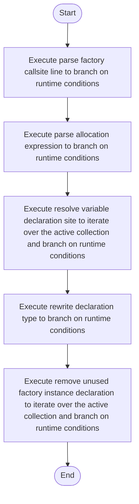

# creational_transform_factory_reverse_rewrite.cpp

- Source: Microservice/Modules/Source/Creational/Transform/creational_transform_factory_reverse_rewrite.cpp
- Kind: C++ implementation
- Lines: 508
- Role: Implements creational transform dispatch, evidence rendering, and rewrite helpers.
- Chronology: Runs after the generic parse tree exists so creational detection or transformation can operate on it.

## Notable Symbols
- match_instance_declaration_for_class
- declaration_regex
- match_simple_variable_declaration
- parse_allocation_expression
- make_unique_regex
- make_shared_regex
- raw_new_regex
- is_auto_declaration_type
- auto_regex
- std::regex_match
- rewrite_declaration_type
- unique_ptr_regex

## Direct Dependencies
- internal/creational_transform_factory_reverse_internal.hpp
- Transform/creational_code_generator_internal.hpp
- regex
- string

## File Outline
### Responsibility

This source file implements a creational transform or evidence-rendering stage. It runs after the generic parse tree has been built and focuses on turning detected structure into rewritten code or explanatory evidence views. This source file implements creational-pattern analysis over the generic parse tree. It inspects parsed structure, applies pattern-specific rules, and emits detector results that later appear in the creational tree or transform decisions.

### Position In The Flow

Runs after the generic parse tree exists so creational detection or transformation can operate on it.

### Main Surface Area

Implements creational transform dispatch, evidence rendering, and rewrite helpers. The main surface area is easiest to track through symbols such as match_instance_declaration_for_class, declaration_regex, match_simple_variable_declaration, and parse_allocation_expression. It collaborates directly with internal/creational_transform_factory_reverse_internal.hpp, Transform/creational_code_generator_internal.hpp, regex, and string.

## File Activity


## Function Walkthrough

### match_instance_declaration_for_class
This routine owns one focused piece of the file's behavior. It appears near line 11.

Inside the body, it mainly handles branch on runtime conditions.

It branches on runtime conditions instead of following one fixed path. The caller receives a computed result or status from this step.

Key operations:
- branch on runtime conditions

Activity:
```mermaid
flowchart TD
    Start([match_instance_declaration_for_class()])
    N0[Enter match_instance_declaration_for_class()]
    N1[Branch on runtime conditions]
    N2[Return the result to the caller]
    End([Return])
    Start --> N0
    N0 --> N1
    N1 --> N2
    N2 --> End
```

### match_simple_variable_declaration
This routine owns one focused piece of the file's behavior. It appears near line 31.

Inside the body, it mainly handles branch on runtime conditions.

It branches on runtime conditions instead of following one fixed path. The caller receives a computed result or status from this step.

Key operations:
- branch on runtime conditions

Activity:
```mermaid
flowchart TD
    Start([match_simple_variable_declaration()])
    N0[Enter match_simple_variable_declaration()]
    N1[Branch on runtime conditions]
    N2[Return the result to the caller]
    End([Return])
    Start --> N0
    N0 --> N1
    N1 --> N2
    N2 --> End
```

### parse_allocation_expression
This routine ingests source content and turns it into a more useful structured form. It appears near line 70.

Inside the body, it mainly handles branch on runtime conditions.

It branches on runtime conditions instead of following one fixed path. The caller receives a computed result or status from this step.

Key operations:
- branch on runtime conditions

Activity:
```mermaid
flowchart TD
    Start([parse_allocation_expression()])
    N0[Enter parse_allocation_expression()]
    N1[Branch on runtime conditions]
    N2[Return the result to the caller]
    End([Return])
    Start --> N0
    N0 --> N1
    N1 --> N2
    N2 --> End
```

### is_auto_declaration_type
This routine owns one focused piece of the file's behavior. It appears near line 110.

The caller receives a computed result or status from this step.

Key operations:
- This routine is primarily structural and does not expose obvious runtime operations from static inspection.

Activity:
```mermaid
flowchart TD
    Start([is_auto_declaration_type()])
    N0[Enter is_auto_declaration_type()]
    N1[Apply the routine's local logic]
    N2[Return the result to the caller]
    End([Return])
    Start --> N0
    N0 --> N1
    N1 --> N2
    N2 --> End
```

### rewrite_declaration_type
This routine owns one focused piece of the file's behavior. It appears near line 116.

Inside the body, it mainly handles branch on runtime conditions.

It branches on runtime conditions instead of following one fixed path. The caller receives a computed result or status from this step.

Key operations:
- branch on runtime conditions

Activity:
```mermaid
flowchart TD
    Start([rewrite_declaration_type()])
    N0[Enter rewrite_declaration_type()]
    N1[Branch on runtime conditions]
    N2[Return the result to the caller]
    End([Return])
    Start --> N0
    N0 --> N1
    N1 --> N2
    N2 --> End
```

### resolve_variable_declaration_site
This routine connects discovered items back into the broader model owned by the file. It appears near line 217.

Inside the body, it mainly handles iterate over the active collection and branch on runtime conditions.

The implementation iterates over a collection or repeated workload. It branches on runtime conditions instead of following one fixed path. The caller receives a computed result or status from this step.

Key operations:
- iterate over the active collection
- branch on runtime conditions

Activity:
```mermaid
flowchart TD
    Start([resolve_variable_declaration_site()])
    N0[Enter resolve_variable_declaration_site()]
    N1[Iterate over the active collection]
    N2[Branch on runtime conditions]
    N3[Return the result to the caller]
    End([Return])
    Start --> N0
    N0 --> N1
    N1 --> N2
    N2 --> N3
    N3 --> End
```

### parse_factory_callsite_line
This routine ingests source content and turns it into a more useful structured form. It appears near line 243.

Inside the body, it mainly handles branch on runtime conditions.

It branches on runtime conditions instead of following one fixed path. The caller receives a computed result or status from this step.

Key operations:
- branch on runtime conditions

Activity:
```mermaid
flowchart TD
    Start([parse_factory_callsite_line()])
    N0[Enter parse_factory_callsite_line()]
    N1[Branch on runtime conditions]
    N2[Return the result to the caller]
    End([Return])
    Start --> N0
    N0 --> N1
    N1 --> N2
    N2 --> End
```

### build_rewritten_callsite_line
This routine assembles a larger structure from the inputs it receives. It appears near line 420.

The caller receives a computed result or status from this step.

Key operations:
- This routine is primarily structural and does not expose obvious runtime operations from static inspection.

Activity:
```mermaid
flowchart TD
    Start([build_rewritten_callsite_line()])
    N0[Enter build_rewritten_callsite_line()]
    N1[Apply the routine's local logic]
    N2[Return the result to the caller]
    End([Return])
    Start --> N0
    N0 --> N1
    N1 --> N2
    N2 --> End
```

### build_rewritten_assignment_line
This routine assembles a larger structure from the inputs it receives. It appears near line 429.

The caller receives a computed result or status from this step.

Key operations:
- This routine is primarily structural and does not expose obvious runtime operations from static inspection.

Activity:
```mermaid
flowchart TD
    Start([build_rewritten_assignment_line()])
    N0[Enter build_rewritten_assignment_line()]
    N1[Apply the routine's local logic]
    N2[Return the result to the caller]
    End([Return])
    Start --> N0
    N0 --> N1
    N1 --> N2
    N2 --> End
```

### rewrite_variable_declaration_line
This routine owns one focused piece of the file's behavior. It appears near line 436.

Inside the body, it mainly handles branch on runtime conditions.

It branches on runtime conditions instead of following one fixed path. The caller receives a computed result or status from this step.

Key operations:
- branch on runtime conditions

Activity:
```mermaid
flowchart TD
    Start([rewrite_variable_declaration_line()])
    N0[Enter rewrite_variable_declaration_line()]
    N1[Branch on runtime conditions]
    N2[Return the result to the caller]
    End([Return])
    Start --> N0
    N0 --> N1
    N1 --> N2
    N2 --> End
```

### remove_unused_factory_instance_declaration
This routine owns one focused piece of the file's behavior. It appears near line 464.

Inside the body, it mainly handles iterate over the active collection and branch on runtime conditions.

The implementation iterates over a collection or repeated workload. It branches on runtime conditions instead of following one fixed path. The caller receives a computed result or status from this step.

Key operations:
- iterate over the active collection
- branch on runtime conditions

Activity:
```mermaid
flowchart TD
    Start([remove_unused_factory_instance_declaration()])
    N0[Enter remove_unused_factory_instance_declaration()]
    N1[Iterate over the active collection]
    N2[Branch on runtime conditions]
    N3[Return the result to the caller]
    End([Return])
    Start --> N0
    N0 --> N1
    N1 --> N2
    N2 --> N3
    N3 --> End
```

## Documentation Note
- This markdown file is part of the generated docs/Codebase mirror.
- It was generated from the repository state on 2026-04-23 after reading the existing docs corpus and the current source tree.

