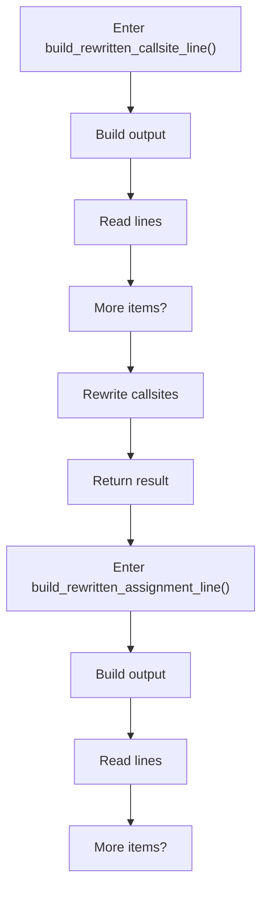
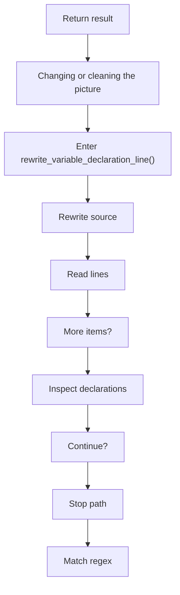
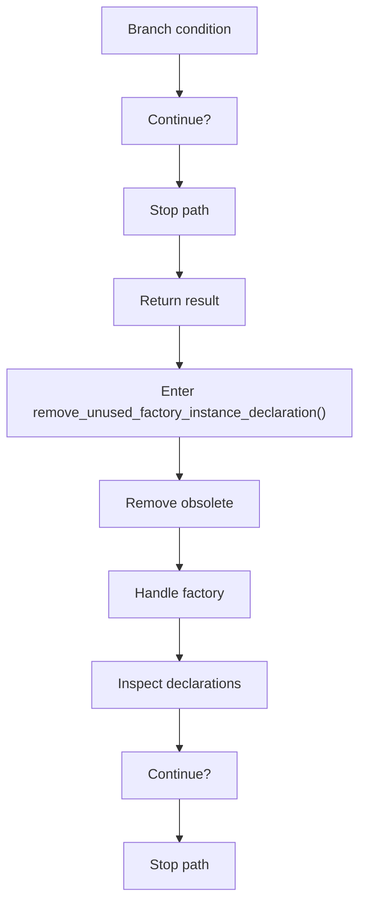
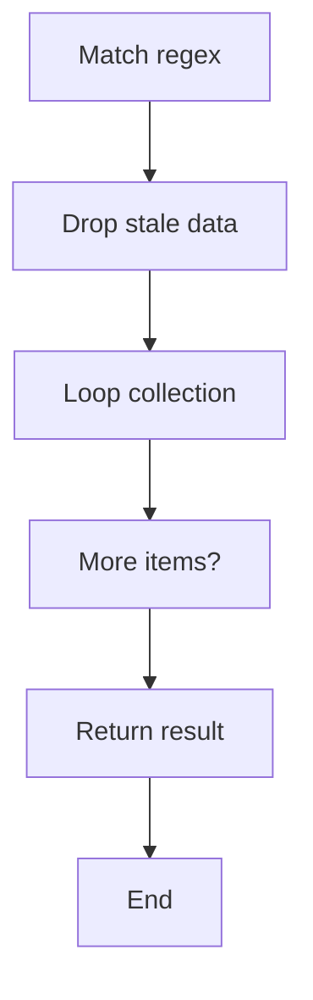

# creational_transform_factory_reverse_rewrite_program_flow_02.cpp

- Source document: [creational_transform_factory_reverse_rewrite.cpp.md](../creational_transform_factory_reverse_rewrite.cpp.md)
- Purpose: decoupled implementation logic for a future code unit.

#### Part 9

#### Part 10

#### Part 11

#### Part 12

