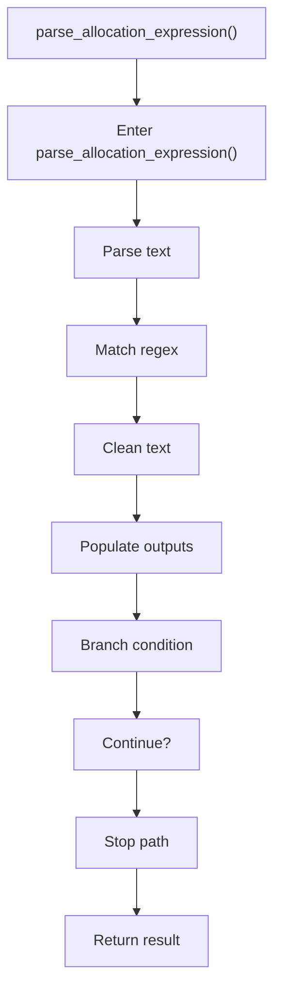

# parse_allocation_expression.cpp

- Source document: [creational_transform_factory_reverse_rewrite.cpp.md](../../creational_transform_factory_reverse_rewrite.cpp.md)
- Purpose: decoupled implementation logic for a future code unit.

### parse_allocation_expression()
This routine ingests source content and turns it into a more useful structured form. It appears near line 70.

Inside the body, it mainly handles parse source text into structured values, match source text with regular expressions, normalize raw text before later parsing, and populate output fields or accumulators.

It branches on runtime conditions instead of following one fixed path. The caller receives a computed result or status from this step.

What it does:
- parse source text into structured values
- match source text with regular expressions
- normalize raw text before later parsing
- populate output fields or accumulators
- branch on runtime conditions

Flow:

### Block 4 - parse_allocation_expression() Details
#### Part 1

#### Part 2

