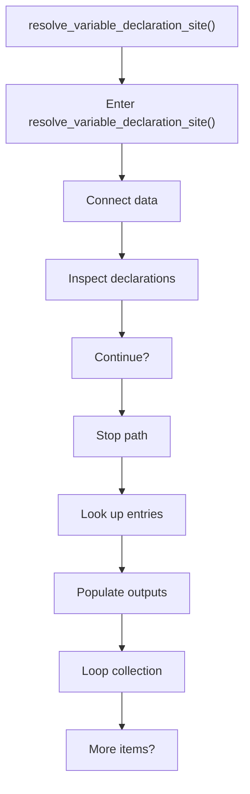
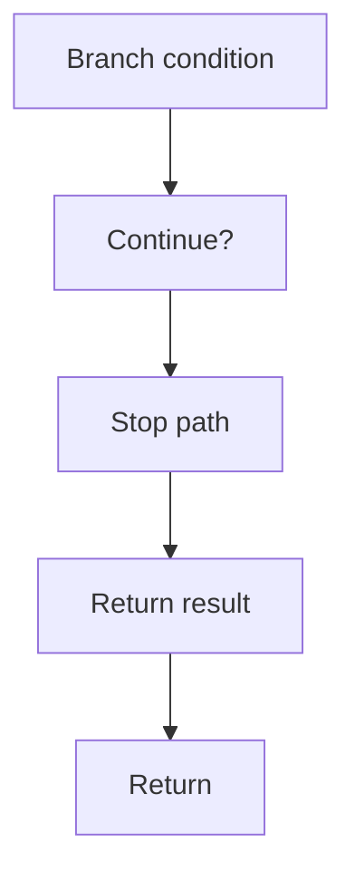

# resolve_variable_declaration_site.cpp

- Source document: [creational_transform_factory_reverse_rewrite.cpp.md](../../creational_transform_factory_reverse_rewrite.cpp.md)
- Purpose: decoupled implementation logic for a future code unit.

### resolve_variable_declaration_site()
This routine connects discovered items back into the broader model owned by the file. It appears near line 217.

Inside the body, it mainly handles connect discovered data back into the shared model, inspect or rewrite declarations, look up entries in previously collected maps or sets, and populate output fields or accumulators.

The implementation iterates over a collection or repeated workload. It branches on runtime conditions instead of following one fixed path. The caller receives a computed result or status from this step.

What it does:
- connect discovered data back into the shared model
- inspect or rewrite declarations
- look up entries in previously collected maps or sets
- populate output fields or accumulators
- iterate over the active collection
- branch on runtime conditions

Flow:

### Block 6 - resolve_variable_declaration_site() Details
#### Part 1

#### Part 2

