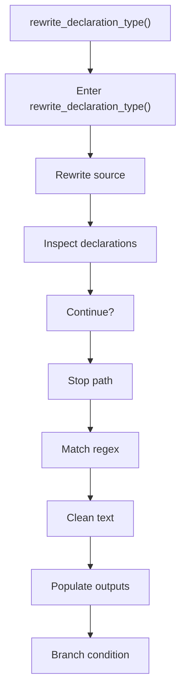
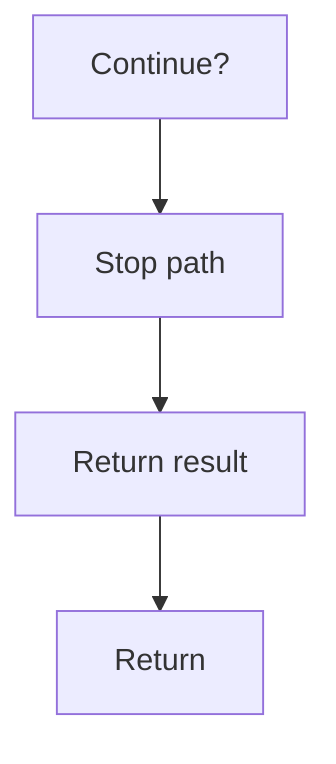

# rewrite_declaration_type.cpp

- Source document: [creational_transform_factory_reverse_rewrite.cpp.md](../../creational_transform_factory_reverse_rewrite.cpp.md)
- Purpose: decoupled implementation logic for a future code unit.

### rewrite_declaration_type()
This routine owns one focused piece of the file's behavior. It appears near line 116.

Inside the body, it mainly handles rewrite source text or model state, inspect or rewrite declarations, match source text with regular expressions, and normalize raw text before later parsing.

It branches on runtime conditions instead of following one fixed path. The caller receives a computed result or status from this step.

What it does:
- rewrite source text or model state
- inspect or rewrite declarations
- match source text with regular expressions
- normalize raw text before later parsing
- populate output fields or accumulators
- branch on runtime conditions

Flow:

### Block 5 - rewrite_declaration_type() Details
#### Part 1

#### Part 2

