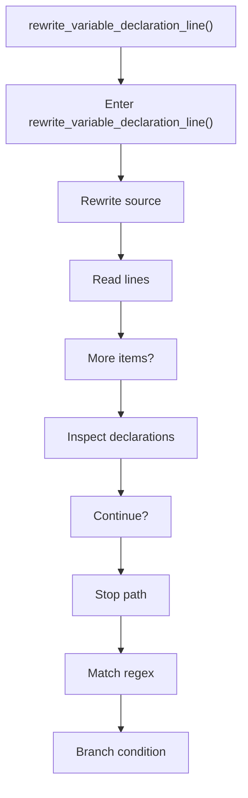
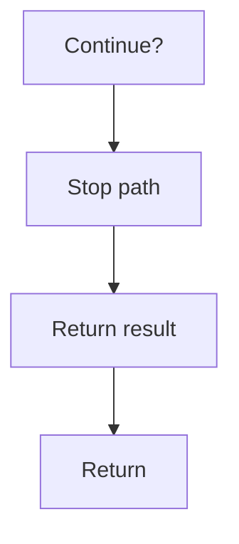

# rewrite_variable_declaration_line.cpp

- Source document: [creational_transform_factory_reverse_rewrite.cpp.md](../../creational_transform_factory_reverse_rewrite.cpp.md)
- Purpose: decoupled implementation logic for a future code unit.

### rewrite_variable_declaration_line()
This routine owns one focused piece of the file's behavior. It appears near line 436.

Inside the body, it mainly handles rewrite source text or model state, work one source line at a time, inspect or rewrite declarations, and match source text with regular expressions.

It branches on runtime conditions instead of following one fixed path. The caller receives a computed result or status from this step.

What it does:
- rewrite source text or model state
- work one source line at a time
- inspect or rewrite declarations
- match source text with regular expressions
- branch on runtime conditions

Flow:

### Block 8 - rewrite_variable_declaration_line() Details
#### Part 1

#### Part 2

