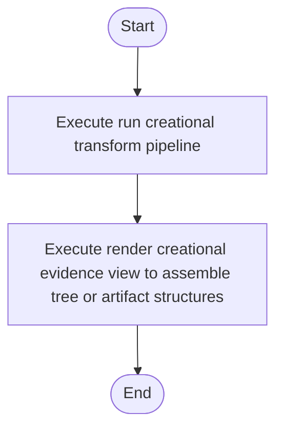

# creational_transform_pipeline.cpp

- Source: Microservice/Modules/Source/Creational/Transform/creational_transform_pipeline.cpp
- Kind: C++ implementation
- Lines: 33
- Role: Implements creational transform dispatch, evidence rendering, and rewrite helpers.
- Chronology: Runs after the generic parse tree exists so creational detection or transformation can operate on it.

## Notable Symbols
- run_creational_transform_pipeline
- render_creational_evidence_view
- creational_codegen_internal::build_monolithic_evidence_view

## Direct Dependencies
- Transform/creational_transform_pipeline.hpp
- Transform/creational_code_generator_internal.hpp

## File Outline
### Responsibility

This source file implements a creational transform or evidence-rendering stage. It runs after the generic parse tree has been built and focuses on turning detected structure into rewritten code or explanatory evidence views. This source file implements creational-pattern analysis over the generic parse tree. It inspects parsed structure, applies pattern-specific rules, and emits detector results that later appear in the creational tree or transform decisions.

### Position In The Flow

Runs after the generic parse tree exists so creational detection or transformation can operate on it.

### Main Surface Area

Implements creational transform dispatch, evidence rendering, and rewrite helpers. The main surface area is easiest to track through symbols such as run_creational_transform_pipeline, render_creational_evidence_view, and creational_codegen_internal::build_monolithic_evidence_view. It collaborates directly with Transform/creational_transform_pipeline.hpp and Transform/creational_code_generator_internal.hpp.

## File Activity


## Function Walkthrough

### run_creational_transform_pipeline
This routine prepares or drives one of the main execution paths in the file. It appears near line 4.

The caller receives a computed result or status from this step.

Key operations:
- This routine is primarily structural and does not expose obvious runtime operations from static inspection.

Activity:
```mermaid
flowchart TD
    Start([run_creational_transform_pipeline()])
    N0[Enter run_creational_transform_pipeline()]
    N1[Apply the routine's local logic]
    N2[Return the result to the caller]
    End([Return])
    Start --> N0
    N0 --> N1
    N1 --> N2
    N2 --> End
```

### render_creational_evidence_view
This routine materializes internal state into an output format that later stages can consume. It appears near line 18.

Inside the body, it mainly handles assemble tree or artifact structures.

The caller receives a computed result or status from this step.

Key operations:
- assemble tree or artifact structures

Activity:
```mermaid
flowchart TD
    Start([render_creational_evidence_view()])
    N0[Enter render_creational_evidence_view()]
    N1[Assemble tree or artifact structures]
    N2[Return the result to the caller]
    End([Return])
    Start --> N0
    N0 --> N1
    N1 --> N2
    N2 --> End
```

## Documentation Note
- This markdown file is part of the generated docs/Codebase mirror.
- It was generated from the repository state on 2026-04-23 after reading the existing docs corpus and the current source tree.

