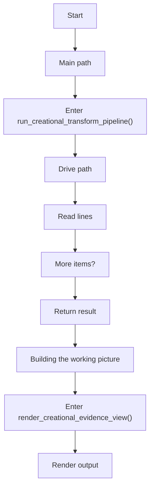
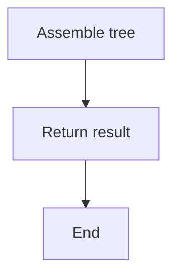
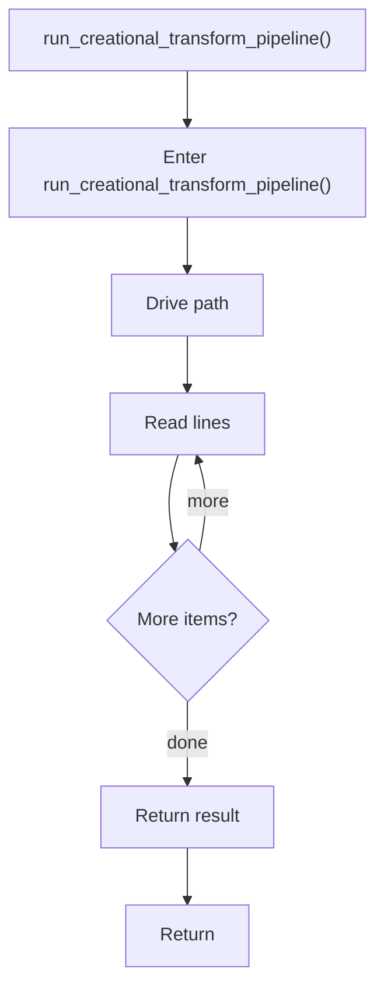
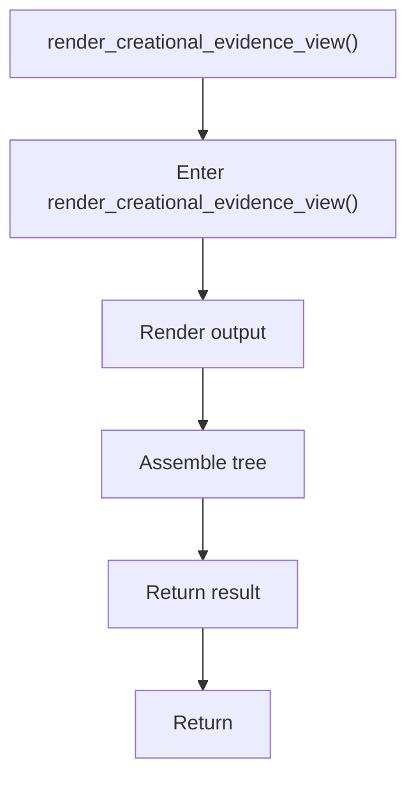

# creational_transform_pipeline.cpp

- Source: Microservice/Modules/Source/Creational/Transform/creational_transform_pipeline.cpp
- Kind: C++ implementation
- Lines: 33

## Story
### What Happens Here

This source file belongs to the older creational transform support path. It is useful for understanding previous rewrite behavior, but the current analyzer runtime focuses on tagging evidence instead of generating replacement code. This source file implements creational-pattern analysis over the generic parse tree. It inspects parsed structure, applies pattern-specific rules, and emits detector results that later appear in the creational tree or documentation tags.

### Why It Matters In The Flow

Runs after the generic parse tree exists so creational detection can label the structure.

### What To Watch While Reading

Implements creational transform dispatch, evidence rendering, and rewrite helpers. The main surface area is easiest to track through symbols such as run_creational_transform_pipeline, render_creational_evidence_view, and creational_codegen_internal::build_monolithic_evidence_view. It collaborates directly with Transform/creational_transform_pipeline.hpp and Transform/creational_code_generator_internal.hpp.

## Program Flow
This diagram follows the action path in plain words. Decision diamonds show where the file can stop, branch, or repeat work instead of simply passing through a straight line.

### Block 1 - Program Flow Details
#### Part 1

#### Part 2

## Reading Map
Read this file as: Implements creational transform dispatch, evidence rendering, and rewrite helpers.

Where it sits in the run: Runs after the generic parse tree exists so creational detection can label the structure.

Names worth recognizing while reading: run_creational_transform_pipeline, render_creational_evidence_view, and creational_codegen_internal::build_monolithic_evidence_view.

It leans on nearby contracts or tools such as Transform/creational_transform_pipeline.hpp and Transform/creational_code_generator_internal.hpp.

## Story Groups

### Building The Working Picture
These steps assemble the trees, models, or bundles used by the rest of the file.
- render_creational_evidence_view() (line 18): Render or serialize the result and assemble tree or artifact structures

### Main Path
These steps drive the main execution path by calling the supporting work in order.
- run_creational_transform_pipeline() (line 4): Drive the main execution path and work one source line at a time

## Function Stories

### run_creational_transform_pipeline()
This routine prepares or drives one of the main execution paths in the file. It appears near line 4.

Inside the body, it mainly handles drive the main execution path and work one source line at a time.

The caller receives a computed result or status from this step.

What it does:
- drive the main execution path
- work one source line at a time

Flow:

### render_creational_evidence_view()
This routine materializes internal state into an output format that later stages can consume. It appears near line 18.

Inside the body, it mainly handles render or serialize the result and assemble tree or artifact structures.

The caller receives a computed result or status from this step.

What it does:
- render or serialize the result
- assemble tree or artifact structures

Flow:

## Documentation Note
- This markdown file is part of the generated docs/Codebase mirror.
- It was generated from the repository state on 2026-04-23 after reading the existing docs corpus and the current source tree.
