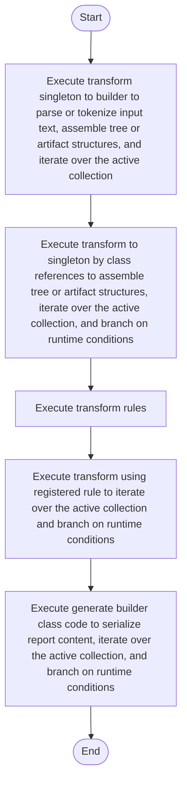

# creational_transform_rules.cpp

- Source: Microservice/Modules/Source/Creational/Transform/creational_transform_rules.cpp
- Kind: C++ implementation
- Lines: 543
- Role: Implements creational transform dispatch, evidence rendering, and rewrite helpers.
- Chronology: Runs after the generic parse tree exists so creational detection or transformation can operate on it.

## Notable Symbols
- ConfigMethodModel
- ClassBuilderModel
- TransformRule
- derive_field_base_name
- collect_config_methods_for_class
- generate_builder_class_code
- inject_builder_class
- rewrite_simple_singleton_callsite_to_builder
- decl_regex
- method_call_regex
- transform_to_singleton_by_class_references
- transform_factory_to_base

## Direct Dependencies
- Transform/creational_code_generator_internal.hpp
- Transform/creational_transform_factory_reverse.hpp
- parse_tree_symbols.hpp
- cctype
- regex
- sstream
- string
- unordered_map
- unordered_set
- utility
- vector

## File Outline
### Responsibility

This source file implements a creational transform or evidence-rendering stage. It runs after the generic parse tree has been built and focuses on turning detected structure into rewritten code or explanatory evidence views. This source file implements creational-pattern analysis over the generic parse tree. It inspects parsed structure, applies pattern-specific rules, and emits detector results that later appear in the creational tree or transform decisions.

### Position In The Flow

Runs after the generic parse tree exists so creational detection or transformation can operate on it.

### Main Surface Area

Implements creational transform dispatch, evidence rendering, and rewrite helpers. The main surface area is easiest to track through symbols such as ConfigMethodModel, ClassBuilderModel, TransformRule, and derive_field_base_name. It collaborates directly with Transform/creational_code_generator_internal.hpp, Transform/creational_transform_factory_reverse.hpp, parse_tree_symbols.hpp, and cctype.

## File Activity


## Function Walkthrough

### derive_field_base_name
This routine owns one focused piece of the file's behavior. It appears near line 32.

Inside the body, it mainly handles assemble tree or artifact structures, iterate over the active collection, and branch on runtime conditions.

The implementation iterates over a collection or repeated workload. It branches on runtime conditions instead of following one fixed path. The caller receives a computed result or status from this step.

Key operations:
- assemble tree or artifact structures
- iterate over the active collection
- branch on runtime conditions

Activity:
```mermaid
flowchart TD
    Start([derive_field_base_name()])
    N0[Enter derive_field_base_name()]
    N1[Assemble tree or artifact structures]
    N2[Iterate over the active collection]
    N3[Branch on runtime conditions]
    N4[Return the result to the caller]
    End([Return])
    Start --> N0
    N0 --> N1
    N1 --> N2
    N2 --> N3
    N3 --> N4
    N4 --> End
```

### collect_config_methods_for_class
This routine connects discovered items back into the broader model owned by the file. It appears near line 72.

Inside the body, it mainly handles parse or tokenize input text, assemble tree or artifact structures, iterate over the active collection, and branch on runtime conditions.

The implementation iterates over a collection or repeated workload. It branches on runtime conditions instead of following one fixed path. The caller receives a computed result or status from this step.

Key operations:
- parse or tokenize input text
- assemble tree or artifact structures
- iterate over the active collection
- branch on runtime conditions

Activity:
```mermaid
flowchart TD
    Start([collect_config_methods_for_class()])
    N0[Enter collect_config_methods_for_class()]
    N1[Parse or tokenize input text]
    N2[Assemble tree or artifact structures]
    N3[Iterate over the active collection]
    N4[Branch on runtime conditions]
    N5[Return the result to the caller]
    End([Return])
    Start --> N0
    N0 --> N1
    N1 --> N2
    N2 --> N3
    N3 --> N4
    N4 --> N5
    N5 --> End
```

### generate_builder_class_code
This routine owns one focused piece of the file's behavior. It appears near line 177.

Inside the body, it mainly handles serialize report content, iterate over the active collection, and branch on runtime conditions.

The implementation iterates over a collection or repeated workload. It branches on runtime conditions instead of following one fixed path. The caller receives a computed result or status from this step.

Key operations:
- serialize report content
- iterate over the active collection
- branch on runtime conditions

Activity:
```mermaid
flowchart TD
    Start([generate_builder_class_code()])
    N0[Enter generate_builder_class_code()]
    N1[Serialize report content]
    N2[Iterate over the active collection]
    N3[Branch on runtime conditions]
    N4[Return the result to the caller]
    End([Return])
    Start --> N0
    N0 --> N1
    N1 --> N2
    N2 --> N3
    N3 --> N4
    N4 --> End
```

### inject_builder_class
This routine owns one focused piece of the file's behavior. It appears near line 230.

Inside the body, it mainly handles parse or tokenize input text, assemble tree or artifact structures, serialize report content, and generate code or evidence output.

The implementation iterates over a collection or repeated workload. It branches on runtime conditions instead of following one fixed path. The caller receives a computed result or status from this step.

Key operations:
- parse or tokenize input text
- assemble tree or artifact structures
- serialize report content
- generate code or evidence output
- iterate over the active collection
- branch on runtime conditions

Activity:
```mermaid
flowchart TD
    Start([inject_builder_class()])
    N0[Enter inject_builder_class()]
    N1[Parse or tokenize input text]
    N2[Assemble tree or artifact structures]
    N3[Serialize report content]
    N4[Generate code or evidence output]
    N5[Iterate over the active collection]
    N6[Return the result to the caller]
    End([Return])
    Start --> N0
    N0 --> N1
    N1 --> N2
    N2 --> N3
    N3 --> N4
    N4 --> N5
    N5 --> N6
    N6 --> End
```

### rewrite_simple_singleton_callsite_to_builder
This routine owns one focused piece of the file's behavior. It appears near line 275.

Inside the body, it mainly handles parse or tokenize input text, assemble tree or artifact structures, serialize report content, and iterate over the active collection.

The implementation iterates over a collection or repeated workload. It branches on runtime conditions instead of following one fixed path. The caller receives a computed result or status from this step.

Key operations:
- parse or tokenize input text
- assemble tree or artifact structures
- serialize report content
- iterate over the active collection
- branch on runtime conditions

Activity:
```mermaid
flowchart TD
    Start([rewrite_simple_singleton_callsite_to_builder()])
    N0[Enter rewrite_simple_singleton_callsite_to_builder()]
    N1[Parse or tokenize input text]
    N2[Assemble tree or artifact structures]
    N3[Serialize report content]
    N4[Iterate over the active collection]
    N5[Branch on runtime conditions]
    N6[Return the result to the caller]
    End([Return])
    Start --> N0
    N0 --> N1
    N1 --> N2
    N2 --> N3
    N3 --> N4
    N4 --> N5
    N5 --> N6
    N6 --> End
```

### transform_to_singleton_by_class_references
This routine owns one focused piece of the file's behavior. It appears near line 345.

Inside the body, it mainly handles assemble tree or artifact structures, iterate over the active collection, and branch on runtime conditions.

The implementation iterates over a collection or repeated workload. It branches on runtime conditions instead of following one fixed path. The caller receives a computed result or status from this step.

Key operations:
- assemble tree or artifact structures
- iterate over the active collection
- branch on runtime conditions

Activity:
```mermaid
flowchart TD
    Start([transform_to_singleton_by_class_references()])
    N0[Enter transform_to_singleton_by_class_references()]
    N1[Assemble tree or artifact structures]
    N2[Iterate over the active collection]
    N3[Branch on runtime conditions]
    N4[Return the result to the caller]
    End([Return])
    Start --> N0
    N0 --> N1
    N1 --> N2
    N2 --> N3
    N3 --> N4
    N4 --> End
```

### transform_factory_to_base
This routine owns one focused piece of the file's behavior. It appears near line 388.

The caller receives a computed result or status from this step.

Key operations:
- This routine is primarily structural and does not expose obvious runtime operations from static inspection.

Activity:
```mermaid
flowchart TD
    Start([transform_factory_to_base()])
    N0[Enter transform_factory_to_base()]
    N1[Apply the routine's local logic]
    N2[Return the result to the caller]
    End([Return])
    Start --> N0
    N0 --> N1
    N1 --> N2
    N2 --> End
```

### transform_singleton_to_builder
This routine owns one focused piece of the file's behavior. It appears near line 402.

Inside the body, it mainly handles parse or tokenize input text, assemble tree or artifact structures, iterate over the active collection, and branch on runtime conditions.

The implementation iterates over a collection or repeated workload. It branches on runtime conditions instead of following one fixed path. The caller receives a computed result or status from this step.

Key operations:
- parse or tokenize input text
- assemble tree or artifact structures
- iterate over the active collection
- branch on runtime conditions

Activity:
```mermaid
flowchart TD
    Start([transform_singleton_to_builder()])
    N0[Enter transform_singleton_to_builder()]
    N1[Parse or tokenize input text]
    N2[Assemble tree or artifact structures]
    N3[Iterate over the active collection]
    N4[Branch on runtime conditions]
    N5[Return the result to the caller]
    End([Return])
    Start --> N0
    N0 --> N1
    N1 --> N2
    N2 --> N3
    N3 --> N4
    N4 --> N5
    N5 --> End
```

### pattern_matches
This routine owns one focused piece of the file's behavior. It appears near line 497.

The caller receives a computed result or status from this step.

Key operations:
- This routine is primarily structural and does not expose obvious runtime operations from static inspection.

Activity:
```mermaid
flowchart TD
    Start([pattern_matches()])
    N0[Enter pattern_matches()]
    N1[Apply the routine's local logic]
    N2[Return the result to the caller]
    End([Return])
    Start --> N0
    N0 --> N1
    N1 --> N2
    N2 --> End
```

### transform_rules
This routine owns one focused piece of the file's behavior. It appears near line 503.

The caller receives a computed result or status from this step.

Key operations:
- This routine is primarily structural and does not expose obvious runtime operations from static inspection.

Activity:
```mermaid
flowchart TD
    Start([transform_rules()])
    N0[Enter transform_rules()]
    N1[Apply the routine's local logic]
    N2[Return the result to the caller]
    End([Return])
    Start --> N0
    N0 --> N1
    N1 --> N2
    N2 --> End
```

### transform_using_registered_rule
This routine owns one focused piece of the file's behavior. It appears near line 513.

Inside the body, it mainly handles iterate over the active collection and branch on runtime conditions.

The implementation iterates over a collection or repeated workload. It branches on runtime conditions instead of following one fixed path. The caller receives a computed result or status from this step.

Key operations:
- iterate over the active collection
- branch on runtime conditions

Activity:
```mermaid
flowchart TD
    Start([transform_using_registered_rule()])
    N0[Enter transform_using_registered_rule()]
    N1[Iterate over the active collection]
    N2[Branch on runtime conditions]
    N3[Return the result to the caller]
    End([Return])
    Start --> N0
    N0 --> N1
    N1 --> N2
    N2 --> N3
    N3 --> End
```

## Documentation Note
- This markdown file is part of the generated docs/Codebase mirror.
- It was generated from the repository state on 2026-04-23 after reading the existing docs corpus and the current source tree.

