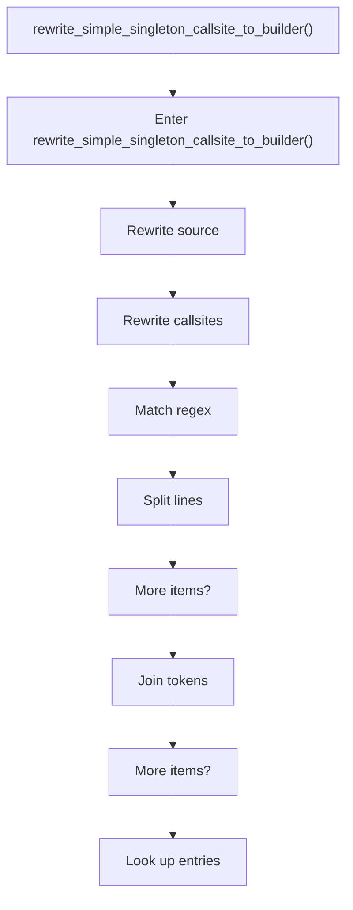
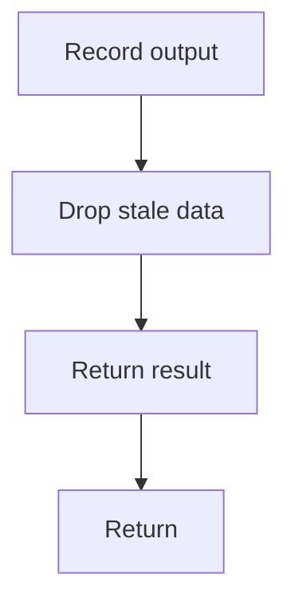

# rewrite_simple_singleton_callsite_to_builder.cpp

- Source document: [creational_transform_rules.cpp.md](../../creational_transform_rules.cpp.md)
- Purpose: decoupled implementation logic for a future code unit.

### rewrite_simple_singleton_callsite_to_builder()
This routine owns one focused piece of the file's behavior. It appears near line 275.

Inside the body, it mainly handles rewrite source text or model state, recognize or rewrite callsite structure, match source text with regular expressions, and split the source into individual lines.

The implementation iterates over a collection or repeated workload. It branches on runtime conditions instead of following one fixed path. The caller receives a computed result or status from this step.

What it does:
- rewrite source text or model state
- recognize or rewrite callsite structure
- match source text with regular expressions
- split the source into individual lines
- reassemble token or line collections into text
- look up entries in previously collected maps or sets
- record derived output into collections
- drop stale entries or obsolete source fragments
- normalize raw text before later parsing
- parse or tokenize input text
- assemble tree or artifact structures
- serialize report content
- iterate over the active collection
- branch on runtime conditions

Flow:

### Block 6 - rewrite_simple_singleton_callsite_to_builder() Details
#### Part 1

#### Part 2

